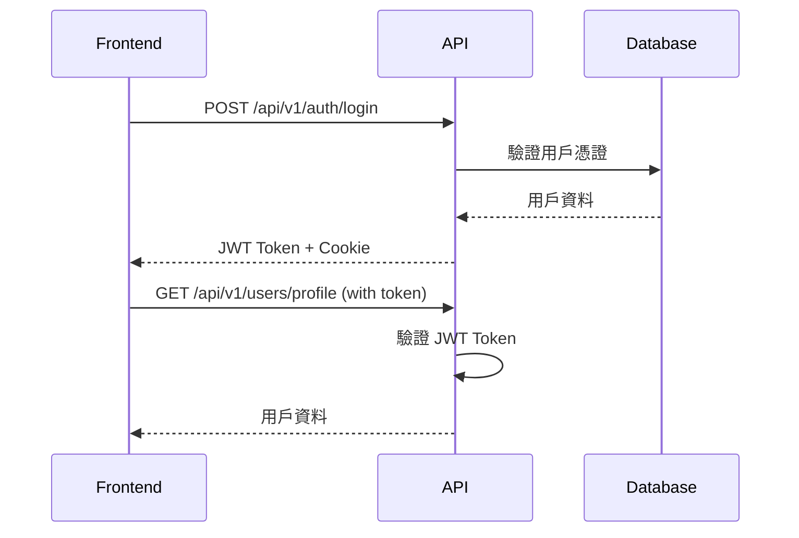

# LineBot-Web Backend-v1 API 文檔

> 供前端開發者使用的完整API集成指南

## 📋 系統概覽

### 架構介紹

Backend-v1 是 LineBot-Web 專案的重構版本，採用現代化的統一 API 架構：

- **框架**: FastAPI (Python 3.8+)
- **資料庫**: PostgreSQL + SQLAlchemy ORM
- **認證**: JWT Token + Cookie
- **文檔**: 自動生成 OpenAPI/Swagger
- **部署**: Docker + Uvicorn

### 基本資訊

| 項目 | 值 |
|------|-----|
| **基本URL** | `http://localhost:8000` |
| **API版本** | v1 |
| **API前綴** | `/api/v1` |
| **文檔URL** | `/docs` (開發環境) |
| **健康檢查** | `/health` |

### 與舊版差異

```mermaid
graph LR
    A[舊版微服務架構] --> B[Backend-v1 統一架構]
    
    subgraph "舊版 (4個服務)"
        C[LoginAPI :5501]
        D[LINEloginAPI :5502]
        E[PuzzleAPI :5503]
        F[SettingAPI :5504]
    end
    
    subgraph "新版 (1個服務)"
        G[FastAPI :8000]
        H[/api/v1/auth/*]
        I[/api/v1/users/*]
        J[/api/v1/bots/*]
    end
    
    C --> H
    D --> H
    E --> J
    F --> I
```

## 🔐 認證機制

### JWT Token 結構

```json
{
  "username": "用戶名稱",
  "login_type": "general|line",
  "line_id": "LINE用戶ID (僅LINE登入)",
  "exp": 1640995200,
  "iat": 1640908800
}
```

### 認證方式

Backend-v1 支援兩種認證方式：

#### 1. Authorization Header (推薦)
```http
Authorization: Bearer <jwt_token>
```

#### 2. Cookie (瀏覽器自動處理)
```http
Cookie: token=<jwt_token>
```

### 認證流程



## 🌐 API 端點詳解

### 認證相關 API (`/api/v1/auth`)

#### 用戶註冊

```http
POST /api/v1/auth/register
Content-Type: application/json

{
  "username": "john_doe",
  "password": "password123",
  "email": "john@example.com"
}
```

**回應 (200 OK):**
```json
{
  "message": "註冊成功，請檢查您的郵箱進行驗證"
}
```

**cURL 範例:**
```bash
curl -X POST "http://localhost:8000/api/v1/auth/register" \
  -H "Content-Type: application/json" \
  -d '{
    "username": "john_doe",
    "password": "password123",
    "email": "john@example.com"
  }'
```

**JavaScript 範例:**
```javascript
const registerUser = async (userData) => {
  try {
    const response = await fetch('http://localhost:8000/api/v1/auth/register', {
      method: 'POST',
      headers: {
        'Content-Type': 'application/json',
      },
      body: JSON.stringify(userData)
    });

    if (!response.ok) {
      const error = await response.json();
      throw new Error(error.detail || '註冊失敗');
    }

    return await response.json();
  } catch (error) {
    console.error('註冊錯誤:', error);
    throw error;
  }
};
```

#### 用戶登入

```http
POST /api/v1/auth/login
Content-Type: application/x-www-form-urlencoded

username=john_doe&password=password123
```

**回應 (200 OK):**
```json
{
  "access_token": "eyJhbGciOiJIUzI1NiIsInR5cCI6IkpXVCJ9...",
  "token_type": "bearer",
  "user": {
    "id": "550e8400-e29b-41d4-a716-446655440000",
    "username": "john_doe",
    "email": "john@example.com"
  }
}
```

**JavaScript 範例:**
```javascript
const loginUser = async (username, password) => {
  const formData = new FormData();
  formData.append('username', username);
  formData.append('password', password);

  try {
    const response = await fetch('http://localhost:8000/api/v1/auth/login', {
      method: 'POST',
      body: formData,
      credentials: 'include' // 重要：處理 Cookie
    });

    if (!response.ok) {
      const error = await response.json();
      throw new Error(error.detail || '登入失敗');
    }

    const data = await response.json();

    // 使用統一認證管理器處理認證資料（自動使用 HTTP-only cookies）
    // 不需要手動儲存 token，後端會自動設定 HTTP-only cookies

    return data;
  } catch (error) {
    console.error('登入錯誤:', error);
    throw error;
  }
};
```

#### LINE 登入

```http
POST /api/v1/auth/line-login
```

**回應 (200 OK):**
```json
{
  "login_url": "https://access.line.me/oauth2/v2.1/authorize?response_type=code&client_id=..."
}
```

**JavaScript 範例:**
```javascript
const initiateLineLogin = async () => {
  try {
    const response = await fetch('http://localhost:8000/api/v1/auth/line-login', {
      method: 'POST'
    });

    if (!response.ok) {
      throw new Error('無法取得 LINE 登入 URL');
    }

    const data = await response.json();
    
    // 重導向到 LINE 登入頁面
    window.location.href = data.login_url;
  } catch (error) {
    console.error('LINE 登入錯誤:', error);
    throw error;
  }
};
```

#### 檢查登入狀態

```http
GET /api/v1/auth/check-login
Authorization: Bearer <token>
```

**回應 (200 OK):**
```json
{
  "authenticated": true,
  "user": {
    "id": "550e8400-e29b-41d4-a716-446655440000",
    "username": "john_doe",
    "email": "john@example.com"
  }
}
```

**JavaScript 範例:**
```javascript
const checkAuthStatus = async (token) => {
  try {
    const response = await fetch('http://localhost:8000/api/v1/auth/check-login', {
      headers: {
        'Authorization': `Bearer ${token}`
      },
      credentials: 'include'
    });

    if (!response.ok) {
      return { authenticated: false };
    }

    return await response.json();
  } catch (error) {
    console.error('認證檢查錯誤:', error);
    return { authenticated: false };
  }
};
```

#### 用戶登出

```http
POST /api/v1/auth/logout
```

**回應 (200 OK):**
```json
{
  "message": "登出成功"
}
```

### 用戶管理 API (`/api/v1/users`)

#### 取得用戶檔案

```http
GET /api/v1/users/profile
Authorization: Bearer <token>
```

**回應 (200 OK):**
```json
{
  "id": "550e8400-e29b-41d4-a716-446655440000",
  "username": "john_doe",
  "email": "john@example.com",
  "email_verified": true,
  "avatar_updated_at": "2024-01-15T10:30:00Z",
  "created_at": "2024-01-01T00:00:00Z"
}
```

**JavaScript 範例:**
```javascript
const getUserProfile = async (token) => {
  try {
    const response = await fetch('http://localhost:8000/api/v1/users/profile', {
      headers: {
        'Authorization': `Bearer ${token}`,
        'Content-Type': 'application/json'
      },
      credentials: 'include'
    });

    if (!response.ok) {
      const error = await response.json();
      throw new Error(error.detail || '無法取得用戶資料');
    }

    return await response.json();
  } catch (error) {
    console.error('取得用戶資料錯誤:', error);
    throw error;
  }
};
```

#### 更新用戶檔案

```http
PUT /api/v1/users/profile
Authorization: Bearer <token>
Content-Type: application/json

{
  "username": "new_username",
  "email": "newemail@example.com"
}
```

**回應 (200 OK):**
```json
{
  "id": "550e8400-e29b-41d4-a716-446655440000",
  "username": "new_username",
  "email": "newemail@example.com",
  "email_verified": false,
  "avatar_updated_at": "2024-01-15T10:30:00Z",
  "created_at": "2024-01-01T00:00:00Z"
}
```

#### 頭像管理

##### 取得頭像

```http
GET /api/v1/users/avatar
Authorization: Bearer <token>
```

**回應 (200 OK):**
```json
{
  "avatar": "data:image/jpeg;base64,/9j/4AAQSkZJRgABAQAAAQABAAD...",
  "updated_at": "2024-01-15T10:30:00Z"
}
```

##### 更新頭像

```http
PUT /api/v1/users/avatar
Authorization: Bearer <token>
Content-Type: application/json

{
  "avatar_base64": "data:image/jpeg;base64,/9j/4AAQSkZJRgABAQAAAQABAAD..."
}
```

**JavaScript 範例:**
```javascript
const updateAvatar = async (token, imageFile) => {
  // 將檔案轉換為 Base64
  const base64 = await new Promise((resolve) => {
    const reader = new FileReader();
    reader.onload = () => resolve(reader.result);
    reader.readAsDataURL(imageFile);
  });

  try {
    const response = await fetch('http://localhost:8000/api/v1/users/avatar', {
      method: 'PUT',
      headers: {
        'Authorization': `Bearer ${token}`,
        'Content-Type': 'application/json'
      },
      credentials: 'include',
      body: JSON.stringify({
        avatar_base64: base64
      })
    });

    if (!response.ok) {
      const error = await response.json();
      throw new Error(error.detail || '頭像更新失敗');
    }

    return await response.json();
  } catch (error) {
    console.error('頭像更新錯誤:', error);
    throw error;
  }
};
```

### Bot 管理 API (`/api/v1/bots`)

#### 建立 Bot

```http
POST /api/v1/bots/
Authorization: Bearer <token>
Content-Type: application/json

{
  "name": "My LINE Bot",
  "channel_token": "YOUR_CHANNEL_ACCESS_TOKEN",
  "channel_secret": "YOUR_CHANNEL_SECRET"
}
```

**回應 (201 Created):**
```json
{
  "id": "550e8400-e29b-41d4-a716-446655440001",
  "name": "My LINE Bot",
  "channel_token": "YOUR_CHANNEL_ACCESS_TOKEN",
  "channel_secret": "YOUR_CHANNEL_SECRET",
  "user_id": "550e8400-e29b-41d4-a716-446655440000",
  "created_at": "2024-01-15T10:30:00Z",
  "updated_at": "2024-01-15T10:30:00Z"
}
```

**JavaScript 範例:**
```javascript
const createBot = async (token, botData) => {
  try {
    const response = await fetch('http://localhost:8000/api/v1/bots/', {
      method: 'POST',
      headers: {
        'Authorization': `Bearer ${token}`,
        'Content-Type': 'application/json'
      },
      credentials: 'include',
      body: JSON.stringify(botData)
    });

    if (!response.ok) {
      const error = await response.json();
      throw new Error(error.detail || 'Bot 建立失敗');
    }

    return await response.json();
  } catch (error) {
    console.error('建立 Bot 錯誤:', error);
    throw error;
  }
};
```

#### 取得所有 Bot

```http
GET /api/v1/bots/
Authorization: Bearer <token>
```

**回應 (200 OK):**
```json
[
  {
    "id": "550e8400-e29b-41d4-a716-446655440001",
    "name": "My LINE Bot",
    "channel_token": "YOUR_CHANNEL_ACCESS_TOKEN",
    "channel_secret": "YOUR_CHANNEL_SECRET",
    "user_id": "550e8400-e29b-41d4-a716-446655440000",
    "created_at": "2024-01-15T10:30:00Z",
    "updated_at": "2024-01-15T10:30:00Z"
  }
]
```

#### Flex 訊息管理

##### 建立 Flex 訊息

```http
POST /api/v1/bots/messages
Authorization: Bearer <token>
Content-Type: application/json

{
  "content": {
    "type": "flex",
    "altText": "Hello Flex Message",
    "contents": {
      "type": "bubble",
      "body": {
        "type": "box",
        "layout": "vertical",
        "contents": [
          {
            "type": "text",
            "text": "Hello World"
          }
        ]
      }
    }
  }
}
```

**回應 (201 Created):**
```json
{
  "id": "550e8400-e29b-41d4-a716-446655440002",
  "content": {
    "type": "flex",
    "altText": "Hello Flex Message",
    "contents": {
      "type": "bubble",
      "body": {
        "type": "box",
        "layout": "vertical",
        "contents": [
          {
            "type": "text",
            "text": "Hello World"
          }
        ]
      }
    }
  },
  "user_id": "550e8400-e29b-41d4-a716-446655440000",
  "created_at": "2024-01-15T10:30:00Z",
  "updated_at": "2024-01-15T10:30:00Z"
}
```

## 📊 資料Schema定義

### 認證相關

#### UserRegister
```typescript
interface UserRegister {
  username: string;        // 3-50字元
  password: string;        // 最少8字元
  email?: string;          // 可選，有效的Email格式
}
```

#### Token
```typescript
interface Token {
  access_token: string;
  token_type: "bearer";
  user?: {
    id: string;
    username: string;
    email: string;
  };
}
```

### 用戶相關

#### UserProfile
```typescript
interface UserProfile {
  id: string;                      // UUID
  username: string;
  email?: string;
  email_verified: boolean;
  avatar_updated_at?: string;      // ISO 8601
  created_at: string;              // ISO 8601
}
```

#### AvatarUpload
```typescript
interface AvatarUpload {
  avatar_base64: string;          // data:image/jpeg;base64,... 格式
}
```

### Bot相關

#### BotCreate
```typescript
interface BotCreate {
  name: string;                   // 1-100字元
  channel_token: string;          // LINE Channel Access Token
  channel_secret: string;         // LINE Channel Secret
}
```

#### BotResponse
```typescript
interface BotResponse {
  id: string;                     // UUID
  name: string;
  channel_token: string;
  channel_secret: string;
  user_id: string;               // UUID
  created_at: string;            // ISO 8601
  updated_at: string;            // ISO 8601
}
```

## 🎯 前端整合指南

### React Hook 範例

```typescript
// hooks/useAuth.ts
import { useState, useEffect } from 'react';

interface User {
  id: string;
  username: string;
  email: string;
}

interface AuthState {
  user: User | null;
  token: string | null;
  isAuthenticated: boolean;
  isLoading: boolean;
}

export const useAuth = () => {
  const [authState, setAuthState] = useState<AuthState>({
    user: null,
    isAuthenticated: false,
    isLoading: true
  });

  useEffect(() => {
    checkAuthStatus();
  }, []);

  const checkAuthStatus = async () => {
    try {
      // 使用統一認證管理器檢查認證狀態（自動處理 HTTP-only cookies）
      const isAuthenticated = await authManager.isAuthenticated();

      if (isAuthenticated) {
        const userInfo = authManager.getUserInfo();
        setAuthState({
          user: userInfo,
          isAuthenticated: true,
          isLoading: false
        });
      } else {
        setAuthState({
          user: null,
          isAuthenticated: false,
          isLoading: false
        });
      }
    } catch (error) {
      console.error('認證檢查失敗:', error);
      setAuthState({
        user: null,
        isAuthenticated: false,
        isLoading: false
      });
    }
  };

  const login = async (username: string, password: string, rememberMe = false) => {
    const formData = new FormData();
    formData.append('username', username);
    formData.append('password', password);
    formData.append('remember_me', rememberMe);

    const response = await fetch('http://localhost:8000/api/v1/auth/login', {
      method: 'POST',
      body: formData,
      credentials: 'include' // 重要：處理 HTTP-only cookies
    });

    if (!response.ok) {
      const error = await response.json();
      throw new Error(error.detail || '登入失敗');
    }

    const data = await response.json();

    // 後端會自動設定 HTTP-only cookies，前端不需要手動處理 token
    setAuthState({
      user: data.user,
      isAuthenticated: true,
      isLoading: false
    });

    return data;
  };

  const logout = async () => {
    try {
      await fetch('http://localhost:8000/api/v1/auth/logout', {
        method: 'POST',
        credentials: 'include'
      });

      // 使用統一認證管理器清除本地認證資料
      authManager.clearAuth('logout');
    } catch (error) {
      console.error('登出請求失敗:', error);
      // 即使後端請求失敗，也要清除本地認證資料
      authManager.clearAuth('logout');
    } finally {
      setAuthState({
        user: null,
        isAuthenticated: false,
        isLoading: false
      });
    }
  };

  return {
    ...authState,
    login,
    logout,
    checkAuthStatus
  };
};
```

### Vue 3 Composable 範例

```typescript
// composables/useAuth.ts
import { ref, reactive } from 'vue';

interface User {
  id: string;
  username: string;
  email: string;
}

export const useAuth = () => {
  const user = ref<User | null>(null);
  const isAuthenticated = ref(false);
  const isLoading = ref(true);

  const checkAuthStatus = async () => {
    try {
      // 使用統一認證管理器檢查認證狀態（自動處理 HTTP-only cookies）
      const isAuth = await authManager.isAuthenticated();

      if (isAuth) {
        const userInfo = authManager.getUserInfo();
        user.value = userInfo;
        isAuthenticated.value = true;
      } else {
        user.value = null;
        isAuthenticated.value = false;
      }
    } catch (error) {
      console.error('認證檢查失敗:', error);
      user.value = null;
      isAuthenticated.value = false;
    } finally {
      isLoading.value = false;
    }
  };

  const login = async (username: string, password: string, rememberMe = false) => {
    const formData = new FormData();
    formData.append('username', username);
    formData.append('password', password);
    formData.append('remember_me', rememberMe);

    const response = await fetch('http://localhost:8000/api/v1/auth/login', {
      method: 'POST',
      body: formData,
      credentials: 'include' // 重要：處理 HTTP-only cookies
    });

    if (!response.ok) {
      const error = await response.json();
      throw new Error(error.detail || '登入失敗');
    }

    const data = await response.json();

    // 後端會自動設定 HTTP-only cookies，前端不需要手動處理 token
    user.value = data.user;
    isAuthenticated.value = true;

    return data;
  };

  const logout = async () => {
    try {
      await fetch('http://localhost:8000/api/v1/auth/logout', {
        method: 'POST',
        credentials: 'include'
      });

      // 使用統一認證管理器清除本地認證資料
      authManager.clearAuth('logout');
    } catch (error) {
      console.error('登出請求失敗:', error);
      // 即使後端請求失敗，也要清除本地認證資料
      authManager.clearAuth('logout');
    } finally {
      user.value = null;
      isAuthenticated.value = false;
    }
  };

  return {
    user: readonly(user),
    token: readonly(token),
    isAuthenticated: readonly(isAuthenticated),
    isLoading: readonly(isLoading),
    login,
    logout,
    checkAuthStatus
  };
};
```

### API 客戶端類別

```typescript
// api/client.ts
class ApiClient {
  private baseURL: string;
  private token: string | null;

  constructor(baseURL: string = 'http://localhost:8000') {
    this.baseURL = baseURL;
    // 不再需要手動管理 token，使用 HTTP-only cookies
  }

  // 不再需要這些方法，認證由 HTTP-only cookies 自動處理
  // setToken 和 clearToken 方法已移除

  private async request<T>(
    endpoint: string,
    options: RequestInit = {}
  ): Promise<T> {
    const url = `${this.baseURL}${endpoint}`;
    const headers: HeadersInit = {
      'Content-Type': 'application/json',
      ...options.headers,
    };

    if (this.token) {
      headers.Authorization = `Bearer ${this.token}`;
    }

    const response = await fetch(url, {
      ...options,
      headers,
      credentials: 'include',
    });

    if (!response.ok) {
      const error = await response.json();
      throw new Error(error.detail || `HTTP ${response.status}`);
    }

    return response.json();
  }

  // 認證相關
  async register(userData: UserRegister) {
    return this.request('/api/v1/auth/register', {
      method: 'POST',
      body: JSON.stringify(userData),
    });
  }

  async login(username: string, password: string): Promise<Token> {
    const formData = new FormData();
    formData.append('username', username);
    formData.append('password', password);

    return this.request('/api/v1/auth/login', {
      method: 'POST',
      body: formData,
      headers: {}, // 清除 Content-Type，讓瀏覽器自動設定
    });
  }

  async checkAuth() {
    return this.request('/api/v1/auth/check-login');
  }

  async logout() {
    return this.request('/api/v1/auth/logout', {
      method: 'POST',
    });
  }

  // 用戶相關
  async getUserProfile(): Promise<UserProfile> {
    return this.request('/api/v1/users/profile');
  }

  async updateUserProfile(userData: Partial<UserProfile>) {
    return this.request('/api/v1/users/profile', {
      method: 'PUT',
      body: JSON.stringify(userData),
    });
  }

  async getUserAvatar() {
    return this.request('/api/v1/users/avatar');
  }

  async updateUserAvatar(avatarData: AvatarUpload) {
    return this.request('/api/v1/users/avatar', {
      method: 'PUT',
      body: JSON.stringify(avatarData),
    });
  }

  // Bot 相關
  async getBots(): Promise<BotResponse[]> {
    return this.request('/api/v1/bots/');
  }

  async createBot(botData: BotCreate): Promise<BotResponse> {
    return this.request('/api/v1/bots/', {
      method: 'POST',
      body: JSON.stringify(botData),
    });
  }

  async getBot(botId: string): Promise<BotResponse> {
    return this.request(`/api/v1/bots/${botId}`);
  }

  async updateBot(botId: string, botData: Partial<BotCreate>) {
    return this.request(`/api/v1/bots/${botId}`, {
      method: 'PUT',
      body: JSON.stringify(botData),
    });
  }

  async deleteBot(botId: string) {
    return this.request(`/api/v1/bots/${botId}`, {
      method: 'DELETE',
    });
  }
}

export default ApiClient;
```

## 🚫 錯誤處理

### 統一錯誤格式

Backend-v1 使用 FastAPI 的標準錯誤回應格式：

```json
{
  "detail": "錯誤描述信息"
}
```

### HTTP 狀態碼

| 狀態碼 | 說明 | 使用情境 |
|--------|------|----------|
| `200 OK` | 請求成功 | 正常的GET、PUT請求 |
| `201 Created` | 資源建立成功 | POST建立資源 |
| `204 No Content` | 成功但無內容 | DELETE操作 |
| `400 Bad Request` | 請求參數錯誤 | 驗證失敗、格式錯誤 |
| `401 Unauthorized` | 未認證 | Token缺失或無效 |
| `403 Forbidden` | 權限不足 | Email未驗證等 |
| `404 Not Found` | 資源不存在 | Bot、用戶不存在 |
| `409 Conflict` | 資源衝突 | 用戶名稱重複 |
| `422 Unprocessable Entity` | 資料驗證失敗 | Pydantic驗證錯誤 |
| `500 Internal Server Error` | 伺服器錯誤 | 系統異常 |

### 錯誤處理最佳實踐

```typescript
// utils/errorHandler.ts
export class ApiError extends Error {
  constructor(
    message: string,
    public status: number,
    public code?: string
  ) {
    super(message);
    this.name = 'ApiError';
  }
}

export const handleApiError = (error: any): ApiError => {
  if (error instanceof ApiError) {
    return error;
  }

  if (error.response) {
    // HTTP 錯誤回應
    const status = error.response.status;
    const message = error.response.data?.detail || error.message;
    return new ApiError(message, status);
  }

  if (error.request) {
    // 網路錯誤
    return new ApiError('Network error', 0, 'NETWORK_ERROR');
  }

  // 其他錯誤
  return new ApiError(error.message || 'Unknown error', 0, 'UNKNOWN_ERROR');
};

// React 錯誤處理 Hook
export const useErrorHandler = () => {
  const [error, setError] = useState<ApiError | null>(null);

  const handleError = (error: any) => {
    const apiError = handleApiError(error);
    setError(apiError);

    // 根據不同錯誤類型進行處理
    switch (apiError.status) {
      case 401:
        // 使用統一認證管理器處理認證錯誤
        authManager.handleAuthError(apiError, true);
        break;
      case 403:
        // 顯示權限不足信息
        alert('權限不足，請檢查您的帳號狀態');
        break;
      default:
        // 顯示一般錯誤信息
        console.error('API Error:', apiError);
    }
  };

  const clearError = () => setError(null);

  return { error, handleError, clearError };
};
```

## 🔧 開發環境設定

### 環境變數

Backend-v1 需要以下環境變數：

```bash
# .env
# 基本設定
DEBUG=true
ENVIRONMENT=development

# 資料庫設定
DB_HOST=localhost
DB_PORT=5432
DB_NAME=LineBot_01
DB_USER=your_db_user
DB_PASSWORD=your_db_password

# JWT 設定
JWT_SECRET=your-super-secret-jwt-key
JWT_ALGORITHM=HS256
JWT_EXPIRE_MINUTES=30

# LINE 設定
LINE_CHANNEL_ID=your_line_channel_id
LINE_CHANNEL_SECRET=your_line_channel_secret
LINE_REDIRECT_URI=http://localhost:8000/api/v1/auth/line/callback

# 前端 URL
FRONTEND_URL=http://localhost:5173

# 郵件設定
MAIL_SERVER=smtp.gmail.com
MAIL_PORT=587
MAIL_USERNAME=your_email@gmail.com
MAIL_PASSWORD=your_app_password
```

### CORS 設定

Backend-v1 預設允許以下來源：

```python
ALLOWED_ORIGINS = [
    "http://localhost:8080",
    "http://localhost:3000", 
    "http://localhost:5173",
    "https://localhost:5173",
    "http://127.0.0.1:5173",
    "https://127.0.0.1:5173",
    # ... 更多域名
]
```

### 啟動開發伺服器

```bash
# 安裝依賴
pip install -r requirements.txt

# 啟動開發伺服器
uvicorn app.main:app --reload --host 0.0.0.0 --port 8000
```

### API 文檔

開發環境中可以通過以下 URL 訪問 API 文檔：

- **Swagger UI**: `http://localhost:8000/docs`
- **ReDoc**: `http://localhost:8000/redoc`

## 📈 效能優化建議

### 前端快取策略

```typescript
// utils/cache.ts
class ApiCache {
  private cache = new Map<string, { data: any; timestamp: number }>();
  private ttl = 5 * 60 * 1000; // 5分鐘

  set(key: string, data: any) {
    this.cache.set(key, { data, timestamp: Date.now() });
  }

  get(key: string) {
    const cached = this.cache.get(key);
    if (!cached) return null;

    if (Date.now() - cached.timestamp > this.ttl) {
      this.cache.delete(key);
      return null;
    }

    return cached.data;
  }

  clear() {
    this.cache.clear();
  }
}

export const apiCache = new ApiCache();
```

### 請求批次處理

```typescript
// 批次取得多個 Bot 的詳細資料
const getBotsBatch = async (botIds: string[], token: string) => {
  const promises = botIds.map(id => 
    fetch(`http://localhost:8000/api/v1/bots/${id}`, {
      headers: { 'Authorization': `Bearer ${token}` }
    })
  );

  const responses = await Promise.allSettled(promises);
  
  return responses.map((response, index) => ({
    id: botIds[index],
    data: response.status === 'fulfilled' ? response.value : null,
    error: response.status === 'rejected' ? response.reason : null
  }));
};
```

## 🔒 安全性考量

### Token 安全性

1. **儲存安全**: ✅ 已使用 HTTP-only Cookie 取代 localStorage，提供更好的 XSS 防護
2. **自動刷新**: ✅ 已實作統一認證管理器的自動 Token 刷新機制
3. **HTTPS**: 生產環境必須使用 HTTPS
4. **統一管理**: ✅ 使用 UnifiedAuthManager 統一處理所有認證相關操作

### 資料驗證

```typescript
// 前端輸入驗證
const validateUserInput = (userData: UserRegister) => {
  const errors: string[] = [];

  if (!userData.username || userData.username.length < 3) {
    errors.push('用戶名稱至少需要3個字元');
  }

  if (!userData.password || userData.password.length < 8) {
    errors.push('密碼至少需要8個字元');
  }

  if (userData.email && !/^[^\s@]+@[^\s@]+\.[^\s@]+$/.test(userData.email)) {
    errors.push('請輸入有效的電子郵件地址');
  }

  return errors;
};
```

---

*此文檔基於 LineBot-Web Backend-v1 的實際代碼結構編寫，提供完整的前端整合指南。如有問題或需要更新，請參考最新的源代碼。*