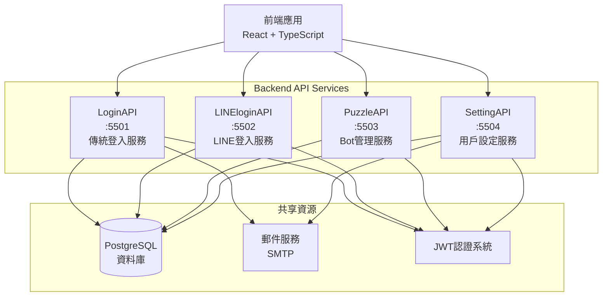
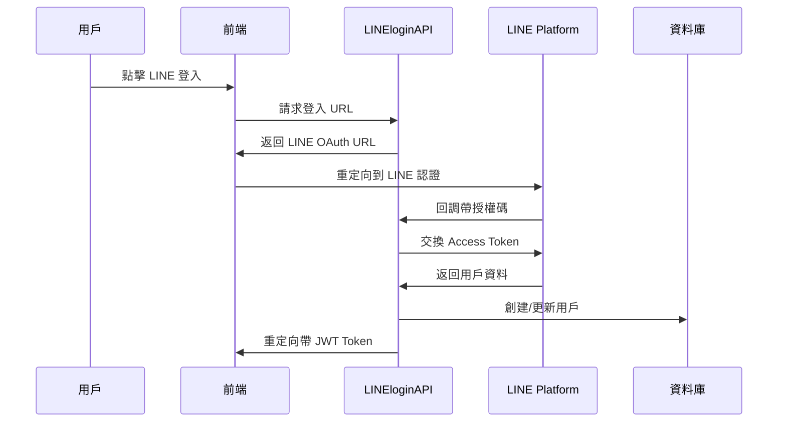
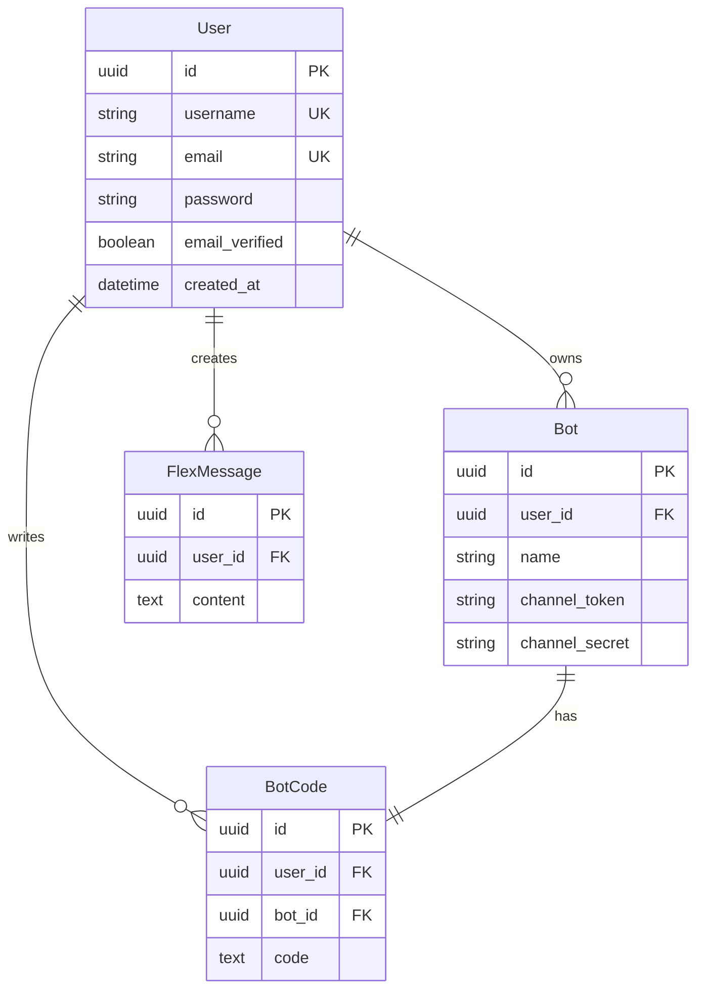
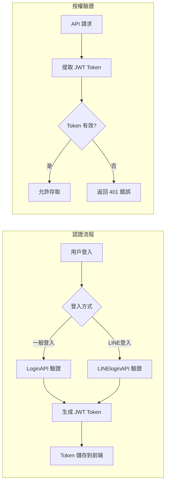

# LineBot-Web Backend API 架構分析

## 系統架構概覽

LineBot-Web 採用微服務架構設計，將系統功能拆分為四個獨立的 API 服務，每個服務負責特定的業務領域，透過 HTTP API 進行通信。

## 核心 API 服務分析

### 1. LINEloginAPI (Port: 5502)
**技術框架**: Flask + SQLAlchemy  
**主要職責**: LINE OAuth 2.0 認証整合與 LINE 用戶管理

#### 核心功能
- **LINE 登入流程**: 完整的 OAuth 2.0 認證流程實現
- **用戶自動創建**: 支援 LINE 用戶首次登入時自動創建帳號
- **帳號連結**: 允許現有用戶連結 LINE 帳號
- **雙重認證**: 同時支援 LINE 登入和一般帳號登入的 Token 驗證

#### 技術重點

#### 資料模型
- **User**: 基本用戶資料
- **LineUser**: LINE 帳號連結資料，包含 LINE ID、顯示名稱、頭像等

### 2. LoginAPI (Port: 5501)
**技術框架**: Flask + psycopg2  
**主要職責**: 傳統帳號註冊、登入與認證管理

#### 核心功能
- **用戶註冊**: 支援用戶名稱和 Email 註冊
- **Email 驗證**: 完整的 Email 驗證流程
- **密碼管理**: 密碼重設、修改密碼功能
- **多元登入**: 支援用戶名稱或 Email 登入
- **Token 管理**: JWT Token 生成、驗證與刷新

#### 安全特色
- 密碼雜湊儲存 (Werkzeug security)
- Email 驗證 token 時效控制 (24小時)
- 密碼重設 token 時效控制 (1小時)
- 重送驗證郵件冷卻機制 (60秒)

### 3. PuzzleAPI (Port: 5503)
**技術框架**: FastAPI + SQLAlchemy  
**主要職責**: LINE Bot 管理與程式碼編輯平台

#### 核心功能
- **Bot 管理**: Bot 的 CRUD 操作，每用戶限制 3 個 Bot
- **Flex Message 管理**: LINE Flex Message 的建立、編輯、儲存
- **Bot 程式碼管理**: Bot 程式碼的儲存與版本管理
- **資源限制**: 用戶資源使用限制 (Bot: 3個, Flex Messages: 10個, Bot Codes: 3個)

#### 資料模型設計

### 4. SettingAPI (Port: 5504)
**技術框架**: Flask + psycopg2  
**主要職責**: 用戶個人設定與資料管理

#### 核心功能
- **個人資料管理**: 用戶名稱、Email 修改
- **頭像管理**: Base64 頭像上傳、更新、刪除
- **Email 再驗證**: 更改 Email 後的重新驗證流程
- **設定同步**: 跨服務的用戶設定同步

#### 頭像處理機制
- **格式驗證**: 支援 JPEG、PNG、GIF 格式
- **大小限制**: 限制 500KB 以內
- **Base64 儲存**: 直接儲存 Base64 編碼的圖片資料
- **完整性檢查**: Base64 解碼驗證確保資料完整性

## 技術架構重點

### 認證授權機制

### 共享認證服務 (`auth_service.py`)
每個 API 服務都包含共享的認證服務模組，提供：
- **JWT Token 生成**: `create_access_token()`
- **Token 驗證**: `verify_token()`
- **密碼處理**: `get_password_hash()`, `verify_password()`
- **Cookie 設定**: `get_cookie_settings()`

### 資料庫架構
- **統一資料庫**: 所有服務共用同一個 PostgreSQL 資料庫
- **UUID 主鍵**: 使用 UUID 作為主鍵，確保分散式環境下的唯一性
- **關聯設計**: 適當的外鍵關聯確保資料一致性
- **擴展支援**: 啟用 `uuid-ossp` 擴展支援 UUID 生成

### CORS 跨域處理
所有服務統一配置：
- **允許來源**: 開發環境 (localhost) 和生產環境域名
- **認證支援**: `supports_credentials: true`
- **自定義標頭**: 支援 JWT Authorization 標頭
- **預檢處理**: 完整的 OPTIONS 請求處理

### 錯誤處理策略
- **統一錯誤格式**: JSON 格式的錯誤回應
- **狀態碼規範**: HTTP 狀態碼的一致性使用
- **詳細錯誤信息**: 開發模式下提供詳細錯誤堆疊
- **優雅降級**: 服務不可用時的備用處理

## 服務部署架構

### 容器化部署
每個 API 服務都包含獨立的 `Dockerfile`：
- **環境隔離**: 每個服務有獨立的 Python 環境
- **依賴管理**: 各自的 `requirements.txt` 管理依賴
- **配置管理**: 透過環境變數進行配置

### 環境配置
- **開發環境**: 支援本地開發的多端口配置
- **生產環境**: 支援容器編排和負載均衡
- **配置分離**: 使用 `.env` 檔案管理環境變數

## 系統優勢與特色

### 1. 微服務架構優勢
- **獨立部署**: 各服務可獨立部署和擴展
- **技術多樣性**: 不同服務可使用適合的技術棧
- **故障隔離**: 單一服務故障不影響整體系統
- **開發效率**: 團隊可並行開發不同服務

### 2. 統一認證系統
- **單點登入**: JWT Token 跨服務使用
- **多元登入**: 支援傳統登入和 LINE 登入
- **安全機制**: 完整的 Token 驗證和過期處理

### 3. 資源管理機制
- **使用限制**: 防止濫用的資源限制
- **數據完整性**: 完善的資料驗證和約束
- **性能優化**: 適當的索引和查詢優化

### 4. 用戶體驗導向
- **無縫整合**: LINE 登入的無縫體驗
- **即時回饋**: 完整的錯誤處理和用戶提示
- **跨平台支援**: CORS 配置支援多平台存取

## 發展建議

### 短期優化
1. **API 文檔**: 使用 Swagger/OpenAPI 生成統一文檔
2. **監控系統**: 加入健康檢查和監控端點
3. **快取機制**: 引入 Redis 快取常用資料

### 長期規劃
1. **服務發現**: 引入服務註冊和發現機制
2. **API Gateway**: 統一的 API 閘道管理
3. **事件驅動**: 服務間的非同步通信機制

---

*本文檔基於 LineBot-Web 後端代碼分析，詳細展示了系統的微服務架構設計與技術實現重點。*