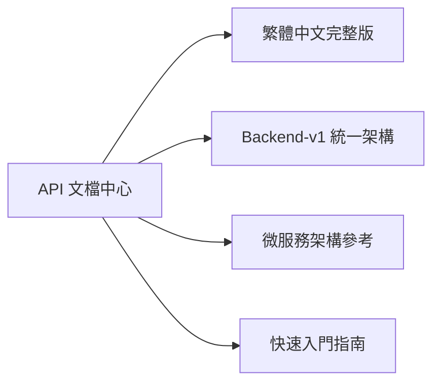
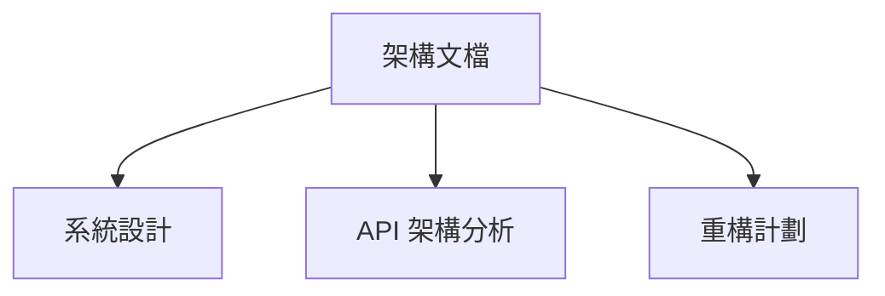
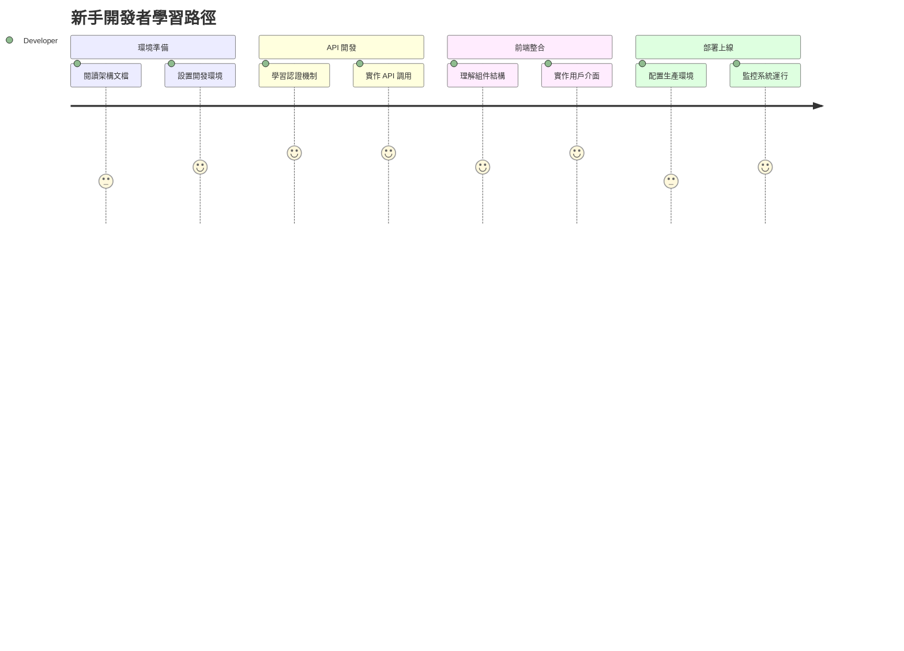

# LineBot-Web 文檔中心 📚

> 🎯 **一站式技術文檔導覽**  
> 歡迎來到 LineBot-Web 的完整文檔庫！這裡提供專案的所有技術文檔、架構說明和開發指南。

## 🌟 熱門文檔

| 文檔 | 說明 | 更新時間 | 推薦指數 |
|------|------|----------|----------|
| [**API 文檔中心**](./api/) | 完整的 API 參考和使用指南 | 2024-01-15 | ⭐⭐⭐⭐⭐ |
| [架構設計文檔](./architecture/) | 系統架構和技術決策 | 2024-01-10 | ⭐⭐⭐⭐ |
| [部署指南](./deployment/) | 系統部署和運維手冊 | 2024-01-12 | ⭐⭐⭐⭐ |

## 📖 文檔分類

### 🔌 API 開發



- **[API 文檔中心](./api/)** - API 端點完整參考
  - [繁體中文完整版](./api/LineBot-Web_API文檔_繁體中文完整版.md) ⭐ **推薦**
  - [Backend-v1 API](./api/API_Documentation.md) - 新版統一架構
  - [微服務架構 API](./api/LineBot-Web_Backend_API_完整文檔.md) - 舊版參考

### 🏗️ 系統架構



- **[架構設計](./architecture/)** - 系統架構和設計決策
  - [LINE Bot 管理介面架構](./architecture/LINE_Bot_管理介面_完整架構計劃.md)
  - [Backend API 架構分析](./architecture/LineBot-Web_Backend_API_架構分析.md)
  - [後端重構計劃](./architecture/後端重構計劃_統一API架構.md)

### 💻 前端開發

- **[前端開發指南](./frontend/)** - React 應用開發
  - [前端配置調整說明](./frontend/前端配置調整說明.md)

### 📦 部署運維

- **[部署指南](./deployment/)** - 系統部署和維護
  - [完整部署指南](./deployment/DEPLOYMENT_GUIDE.md)
  - [郵件服務配置](./deployment/郵件服務配置指南.md)

### 📊 程式碼分析

- **[程式碼分析](./code-analysis/)** - 程式碼品質和統計
  - [大型檔案統計報告](./code-analysis/大型檔案統計報告.md)

### 📱 LINE Bot 專題

- **[LINEBOT 專題文檔](./LINEBOT/)** - LINE Bot 相關技術文檔

## 🚀 快速開始

### 新手入門路徑



1. **📋 了解系統** - 從 [架構文檔](./architecture/) 開始
2. **🔌 學習 API** - 閱讀 [API 文檔中心](./api/)
3. **💻 前端開發** - 參考 [前端指南](./frontend/)
4. **🚀 部署上線** - 跟隨 [部署指南](./deployment/)

### 經驗開發者快速參考

| 需求 | 推薦文檔 | 時間估計 |
|------|----------|----------|
| API 整合 | [繁體中文完整版 API 文檔](./api/LineBot-Web_API文檔_繁體中文完整版.md) | 15 分鐘 |
| 系統架構了解 | [架構分析文檔](./architecture/) | 30 分鐘 |
| 快速部署 | [部署指南](./deployment/DEPLOYMENT_GUIDE.md) | 45 分鐘 |

## 🔍 搜尋指南

### 常見開發任務

| 任務 | 關鍵字 | 相關文檔 |
|------|--------|----------|
| 用戶認證 | `JWT`, `登入`, `Token` | [API 認證章節](./api/LineBot-Web_API文檔_繁體中文完整版.md#認證機制) |
| Bot 管理 | `Bot`, `LINE`, `Flex Message` | [Bot 管理 API](./api/LineBot-Web_API文檔_繁體中文完整版.md#bot-管理-api) |
| 資料庫設計 | `PostgreSQL`, `Schema`, `資料表` | [架構文檔](./architecture/) |
| 系統部署 | `Docker`, `部署`, `環境配置` | [部署指南](./deployment/) |

### 疑難排解

| 問題類型 | 查找位置 | 解決方案 |
|----------|----------|----------|
| API 錯誤 | [錯誤處理章節](./api/LineBot-Web_API文檔_繁體中文完整版.md#錯誤處理) | HTTP 狀態碼說明 |
| 認證問題 | [認證機制說明](./api/LineBot-Web_API文檔_繁體中文完整版.md#認證機制) | Token 管理最佳實踐 |
| 部署問題 | [部署指南](./deployment/DEPLOYMENT_GUIDE.md) | 環境配置檢查清單 |

## 📋 專案狀態

此專案已完成重構，採用清晰的目錄架構：

```
linebot-web/
├── backend/          # FastAPI 後端服務
├── frontend/         # React TypeScript 前端
├── docs/            # 專案文檔 (本目錄)
├── tests/           # 整合測試
├── scripts/         # 構建腳本
├── configs/         # 配置文件
├── assets/          # 靜態資源
├── README.md        # 專案說明
├── Makefile         # 構建工具
├── docker-compose.yml # Docker 編排
└── LICENSE          # 授權文件
```

## 📞 獲取支援

### 開發者社群

- **💬 討論區**: [GitHub Discussions](https://github.com/your-repo/discussions)
- **🐛 問題回報**: [GitHub Issues](https://github.com/your-repo/issues)
- **📧 技術支援**: support@linebot-web.com

### 貢獻指南

- **📝 文檔改進**: [提交 Pull Request](https://github.com/your-repo/pulls)
- **🔧 程式碼貢獻**: 參考 [貢獻指南](../CONTRIBUTING.md)
- **🎨 設計建議**: [設計討論區](https://github.com/your-repo/discussions/categories/design)

## 🔗 外部資源

### 官方文檔

- [LINE Developers](https://developers.line.biz/zh-hant/)
- [FastAPI 官方文檔](https://fastapi.tiangolo.com/zh/)
- [React 官方文檔](https://zh-hant.reactjs.org/)
- [PostgreSQL 文檔](https://www.postgresql.org/docs/)

### 學習資源

- [LINE Bot 開發教學](https://developers.line.biz/zh-hant/docs/)
- [現代 Web 開發實踐](https://web.dev/)
- [API 設計最佳實踐](https://restfulapi.net/)

## 📚 相關連結

- [專案根目錄](../) - 返回專案根目錄
- [後端服務](../backend/) - FastAPI 後端代碼
- [前端應用](../frontend/) - React TypeScript 前端代碼
- [測試套件](../tests/) - 整合測試代碼

---

## 📈 文檔統計

| 統計項目 | 數值 | 最後更新 |
|----------|------|----------|
| 📄 總文檔數 | 15+ | 2024-01-15 |
| 🔌 API 端點 | 25+ | 2024-01-15 |
| 💻 程式範例 | 50+ | 2024-01-15 |
| 🌐 支援語言 | 繁體中文 | 2024-01-15 |

---

*📅 最後更新：2024年1月15日*  
*👥 維護團隊：LineBot-Web 開發團隊*  
*📧 聯絡我們：docs@linebot-web.com*