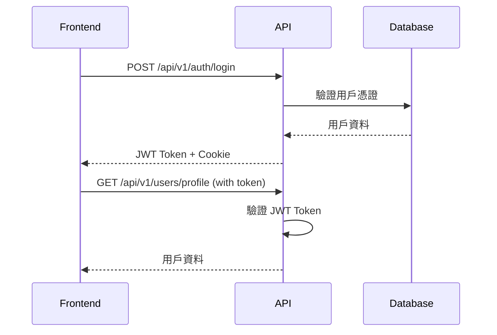

# LineBot-Web Backend-v1 API 文檔

> 供前端開發者使用的完整API集成指南

## 📋 系統概覽

### 架構介紹

Backend-v1 是 LineBot-Web 專案的重構版本，採用現代化的統一 API 架構：

- **框架**: FastAPI (Python 3.8+)
- **資料庫**: PostgreSQL + SQLAlchemy ORM
- **認證**: JWT Token + Cookie
- **文檔**: 自動生成 OpenAPI/Swagger
- **部署**: Docker + Uvicorn

### 基本資訊

| 項目 | 值 |
|------|-----|
| **基本URL** | `http://localhost:8000` |
| **API版本** | v1 |
| **API前綴** | `/api/v1` |
| **文檔URL** | `/docs` (開發環境) |
| **健康檢查** | `/health` |

### 與舊版差異

```mermaid
graph LR
    A[舊版微服務架構] --> B[Backend-v1 統一架構]
    
    subgraph "舊版 (4個服務)"
        C[LoginAPI :5501]
        D[LINEloginAPI :5502]
        E[PuzzleAPI :5503]
        F[SettingAPI :5504]
    end
    
    subgraph "新版 (1個服務)"
        G[FastAPI :8000]
        H[/api/v1/auth/*]
        I[/api/v1/users/*]
        J[/api/v1/bots/*]
    end
    
    C --> H
    D --> H
    E --> J
    F --> I
```

## 🔐 認證機制

### JWT Token 結構

```json
{
  "username": "用戶名稱",
  "login_type": "general|line",
  "line_id": "LINE用戶ID (僅LINE登入)",
  "exp": 1640995200,
  "iat": 1640908800
}
```

### 認證方式

Backend-v1 支援兩種認證方式：

#### 1. Authorization Header (推薦)
```http
Authorization: Bearer <jwt_token>
```

#### 2. Cookie (瀏覽器自動處理)
```http
Cookie: token=<jwt_token>
```

### 認證流程



## 🌐 API 端點詳解

### 認證相關 API (`/api/v1/auth`)

#### 用戶註冊

```http
POST /api/v1/auth/register
Content-Type: application/json

{
  "username": "john_doe",
  "password": "password123",
  "email": "john@example.com"
}
```

**回應 (200 OK):**
```json
{
  "message": "註冊成功，請檢查您的郵箱進行驗證"
}
```

**cURL 範例:**
```bash
curl -X POST "http://localhost:8000/api/v1/auth/register" \
  -H "Content-Type: application/json" \
  -d '{
    "username": "john_doe",
    "password": "password123",
    "email": "john@example.com"
  }'
```

**JavaScript 範例:**
```javascript
const registerUser = async (userData) => {
  try {
    const response = await fetch('http://localhost:8000/api/v1/auth/register', {
      method: 'POST',
      headers: {
        'Content-Type': 'application/json',
      },
      body: JSON.stringify(userData)
    });

    if (!response.ok) {
      const error = await response.json();
      throw new Error(error.detail || '註冊失敗');
    }

    return await response.json();
  } catch (error) {
    console.error('註冊錯誤:', error);
    throw error;
  }
};
```

#### 用戶登入

```http
POST /api/v1/auth/login
Content-Type: application/x-www-form-urlencoded

username=john_doe&password=password123
```

**回應 (200 OK):**
```json
{
  "access_token": "eyJhbGciOiJIUzI1NiIsInR5cCI6IkpXVCJ9...",
  "token_type": "bearer",
  "user": {
    "id": "550e8400-e29b-41d4-a716-446655440000",
    "username": "john_doe",
    "email": "john@example.com"
  }
}
```

**JavaScript 範例:**
```javascript
const loginUser = async (username, password) => {
  const formData = new FormData();
  formData.append('username', username);
  formData.append('password', password);

  try {
    const response = await fetch('http://localhost:8000/api/v1/auth/login', {
      method: 'POST',
      body: formData,
      credentials: 'include' // 重要：處理 Cookie
    });

    if (!response.ok) {
      const error = await response.json();
      throw new Error(error.detail || '登入失敗');
    }

    const data = await response.json();

    // 使用統一認證管理器處理認證資料（自動使用 HTTP-only cookies）
    // 不需要手動儲存 token，後端會自動設定 HTTP-only cookies

    return data;
  } catch (error) {
    console.error('登入錯誤:', error);
    throw error;
  }
};
```

#### LINE 登入

```http
POST /api/v1/auth/line-login
```

**回應 (200 OK):**
```json
{
  "login_url": "https://access.line.me/oauth2/v2.1/authorize?response_type=code&client_id=..."
}
```

**JavaScript 範例:**
```javascript
const initiateLineLogin = async () => {
  try {
    const response = await fetch('http://localhost:8000/api/v1/auth/line-login', {
      method: 'POST'
    });

    if (!response.ok) {
      throw new Error('無法取得 LINE 登入 URL');
    }

    const data = await response.json();
    
    // 重導向到 LINE 登入頁面
    window.location.href = data.login_url;
  } catch (error) {
    console.error('LINE 登入錯誤:', error);
    throw error;
  }
};
```

#### 檢查登入狀態

```http
GET /api/v1/auth/check-login
Authorization: Bearer <token>
```

**回應 (200 OK):**
```json
{
  "authenticated": true,
  "user": {
    "id": "550e8400-e29b-41d4-a716-446655440000",
    "username": "john_doe",
    "email": "john@example.com"
  }
}
```

**JavaScript 範例:**
```javascript
const checkAuthStatus = async (token) => {
  try {
    const response = await fetch('http://localhost:8000/api/v1/auth/check-login', {
      headers: {
        'Authorization': `Bearer ${token}`
      },
      credentials: 'include'
    });

    if (!response.ok) {
      return { authenticated: false };
    }

    return await response.json();
  } catch (error) {
    console.error('認證檢查錯誤:', error);
    return { authenticated: false };
  }
};
```

#### 用戶登出

```http
POST /api/v1/auth/logout
```

**回應 (200 OK):**
```json
{
  "message": "登出成功"
}
```

### 用戶管理 API (`/api/v1/users`)

#### 取得用戶檔案

```http
GET /api/v1/users/profile
Authorization: Bearer <token>
```

**回應 (200 OK):**
```json
{
  "id": "550e8400-e29b-41d4-a716-446655440000",
  "username": "john_doe",
  "email": "john@example.com",
  "email_verified": true,
  "avatar_updated_at": "2024-01-15T10:30:00Z",
  "created_at": "2024-01-01T00:00:00Z"
}
```

**JavaScript 範例:**
```javascript
const getUserProfile = async (token) => {
  try {
    const response = await fetch('http://localhost:8000/api/v1/users/profile', {
      headers: {
        'Authorization': `Bearer ${token}`,
        'Content-Type': 'application/json'
      },
      credentials: 'include'
    });

    if (!response.ok) {
      const error = await response.json();
      throw new Error(error.detail || '無法取得用戶資料');
    }

    return await response.json();
  } catch (error) {
    console.error('取得用戶資料錯誤:', error);
    throw error;
  }
};
```

#### 更新用戶檔案

```http
PUT /api/v1/users/profile
Authorization: Bearer <token>
Content-Type: application/json

{
  "username": "new_username",
  "email": "newemail@example.com"
}
```

**回應 (200 OK):**
```json
{
  "id": "550e8400-e29b-41d4-a716-446655440000",
  "username": "new_username",
  "email": "newemail@example.com",
  "email_verified": false,
  "avatar_updated_at": "2024-01-15T10:30:00Z",
  "created_at": "2024-01-01T00:00:00Z"
}
```

#### 頭像管理

##### 取得頭像

```http
GET /api/v1/users/avatar
Authorization: Bearer <token>
```

**回應 (200 OK):**
```json
{
  "avatar": "data:image/jpeg;base64,/9j/4AAQSkZJRgABAQAAAQABAAD...",
  "updated_at": "2024-01-15T10:30:00Z"
}
```

##### 更新頭像

```http
PUT /api/v1/users/avatar
Authorization: Bearer <token>
Content-Type: application/json

{
  "avatar_base64": "data:image/jpeg;base64,/9j/4AAQSkZJRgABAQAAAQABAAD..."
}
```

**JavaScript 範例:**
```javascript
const updateAvatar = async (token, imageFile) => {
  // 將檔案轉換為 Base64
  const base64 = await new Promise((resolve) => {
    const reader = new FileReader();
    reader.onload = () => resolve(reader.result);
    reader.readAsDataURL(imageFile);
  });

  try {
    const response = await fetch('http://localhost:8000/api/v1/users/avatar', {
      method: 'PUT',
      headers: {
        'Authorization': `Bearer ${token}`,
        'Content-Type': 'application/json'
      },
      credentials: 'include',
      body: JSON.stringify({
        avatar_base64: base64
      })
    });

    if (!response.ok) {
      const error = await response.json();
      throw new Error(error.detail || '頭像更新失敗');
    }

    return await response.json();
  } catch (error) {
    console.error('頭像更新錯誤:', error);
    throw error;
  }
};
```

### Bot 管理 API (`/api/v1/bots`)

#### 建立 Bot

```http
POST /api/v1/bots/
Authorization: Bearer <token>
Content-Type: application/json

{
  "name": "My LINE Bot",
  "channel_token": "YOUR_CHANNEL_ACCESS_TOKEN",
  "channel_secret": "YOUR_CHANNEL_SECRET"
}
```

**回應 (201 Created):**
```json
{
  "id": "550e8400-e29b-41d4-a716-446655440001",
  "name": "My LINE Bot",
  "channel_token": "YOUR_CHANNEL_ACCESS_TOKEN",
  "channel_secret": "YOUR_CHANNEL_SECRET",
  "user_id": "550e8400-e29b-41d4-a716-446655440000",
  "created_at": "2024-01-15T10:30:00Z",
  "updated_at": "2024-01-15T10:30:00Z"
}
```

**JavaScript 範例:**
```javascript
const createBot = async (token, botData) => {
  try {
    const response = await fetch('http://localhost:8000/api/v1/bots/', {
      method: 'POST',
      headers: {
        'Authorization': `Bearer ${token}`,
        'Content-Type': 'application/json'
      },
      credentials: 'include',
      body: JSON.stringify(botData)
    });

    if (!response.ok) {
      const error = await response.json();
      throw new Error(error.detail || 'Bot 建立失敗');
    }

    return await response.json();
  } catch (error) {
    console.error('建立 Bot 錯誤:', error);
    throw error;
  }
};
```

#### 取得所有 Bot

```http
GET /api/v1/bots/
Authorization: Bearer <token>
```

**回應 (200 OK):**
```json
[
  {
    "id": "550e8400-e29b-41d4-a716-446655440001",
    "name": "My LINE Bot",
    "channel_token": "YOUR_CHANNEL_ACCESS_TOKEN",
    "channel_secret": "YOUR_CHANNEL_SECRET",
    "user_id": "550e8400-e29b-41d4-a716-446655440000",
    "created_at": "2024-01-15T10:30:00Z",
    "updated_at": "2024-01-15T10:30:00Z"
  }
]
```

#### Flex 訊息管理

##### 建立 Flex 訊息

```http
POST /api/v1/bots/messages
Authorization: Bearer <token>
Content-Type: application/json

{
  "content": {
    "type": "flex",
    "altText": "Hello Flex Message",
    "contents": {
      "type": "bubble",
      "body": {
        "type": "box",
        "layout": "vertical",
        "contents": [
          {
            "type": "text",
            "text": "Hello World"
          }
        ]
      }
    }
  }
}
```

**回應 (201 Created):**
```json
{
  "id": "550e8400-e29b-41d4-a716-446655440002",
  "content": {
    "type": "flex",
    "altText": "Hello Flex Message",
    "contents": {
      "type": "bubble",
      "body": {
        "type": "box",
        "layout": "vertical",
        "contents": [
          {
            "type": "text",
            "text": "Hello World"
          }
        ]
      }
    }
  },
  "user_id": "550e8400-e29b-41d4-a716-446655440000",
  "created_at": "2024-01-15T10:30:00Z",
  "updated_at": "2024-01-15T10:30:00Z"
}
```

## 📊 資料Schema定義

### 認證相關

#### UserRegister
```typescript
interface UserRegister {
  username: string;        // 3-50字元
  password: string;        // 最少8字元
  email?: string;          // 可選，有效的Email格式
}
```

#### Token
```typescript
interface Token {
  access_token: string;
  token_type: "bearer";
  user?: {
    id: string;
    username: string;
    email: string;
  };
}
```

### 用戶相關

#### UserProfile
```typescript
interface UserProfile {
  id: string;                      // UUID
  username: string;
  email?: string;
  email_verified: boolean;
  avatar_updated_at?: string;      // ISO 8601
  created_at: string;              // ISO 8601
}
```

#### AvatarUpload
```typescript
interface AvatarUpload {
  avatar_base64: string;          // data:image/jpeg;base64,... 格式
}
```

### Bot相關

#### BotCreate
```typescript
interface BotCreate {
  name: string;                   // 1-100字元
  channel_token: string;          // LINE Channel Access Token
  channel_secret: string;         // LINE Channel Secret
}
```

#### BotResponse
```typescript
interface BotResponse {
  id: string;                     // UUID
  name: string;
  channel_token: string;
  channel_secret: string;
  user_id: string;               // UUID
  created_at: string;            // ISO 8601
  updated_at: string;            // ISO 8601
}
```

## 🎯 前端整合指南

### React Hook 範例

```typescript
// hooks/useAuth.ts
import { useState, useEffect } from 'react';
import { authManager } from '../services/UnifiedAuthManager';

interface User {
  id: string;
  username: string;
  email?: string;
  display_name: string;
  login_type: 'traditional' | 'line' | 'oauth';
}

interface AuthState {
  user: User | null;
  isAuthenticated: boolean;
  isLoading: boolean;
}

export const useAuth = () => {
  const [authState, setAuthState] = useState<AuthState>({
    user: null,
    isAuthenticated: false,
    isLoading: true
  });

  useEffect(() => {
    checkAuthStatus();
  }, []);

  const checkAuthStatus = async () => {
    try {
      // Use unified auth manager to check authentication status (automatically handles HTTP-only cookies)
      const isAuthenticated = await authManager.isAuthenticated();

      if (isAuthenticated) {
        const userInfo = authManager.getUserInfo();
        setAuthState({
          user: userInfo,
          isAuthenticated: true,
          isLoading: false
        });
      } else {
        setAuthState({
          user: null,
          isAuthenticated: false,
          isLoading: false
        });
      }
    } catch (error) {
      console.error('Authentication check failed:', error);
      setAuthState({
        user: null,
        isAuthenticated: false,
        isLoading: false
      });
    }
  };

  const login = async (username: string, password: string, rememberMe = false) => {
    const formData = new FormData();
    formData.append('username', username);
    formData.append('password', password);
    formData.append('remember_me', rememberMe);

    const response = await fetch('http://localhost:8000/api/v1/auth/login', {
      method: 'POST',
      body: formData,
      credentials: 'include' // Important: handle HTTP-only cookies
    });

    if (!response.ok) {
      const error = await response.json();
      throw new Error(error.detail || 'Login failed');
    }

    const data = await response.json();

    // Backend automatically sets HTTP-only cookies, frontend doesn't need to handle tokens manually
    // Update local state
    setAuthState({
      user: data.user,
      isAuthenticated: true,
      isLoading: false
    });

    return data;
  };

  const logout = async () => {
    try {
      // Call backend logout API (clears HTTP-only cookies)
      await fetch('http://localhost:8000/api/v1/auth/logout', {
        method: 'POST',
        credentials: 'include'
      });

      // Use unified auth manager to clear local authentication data
      authManager.clearAuth('logout');
    } catch (error) {
      console.error('Logout request failed:', error);
      // Even if backend request fails, clear local authentication data
      authManager.clearAuth('logout');
    } finally {
      setAuthState({
        user: null,
        isAuthenticated: false,
        isLoading: false
      });
    }
  };

  return { ...authState, login, logout, checkAuthStatus };
};
```

