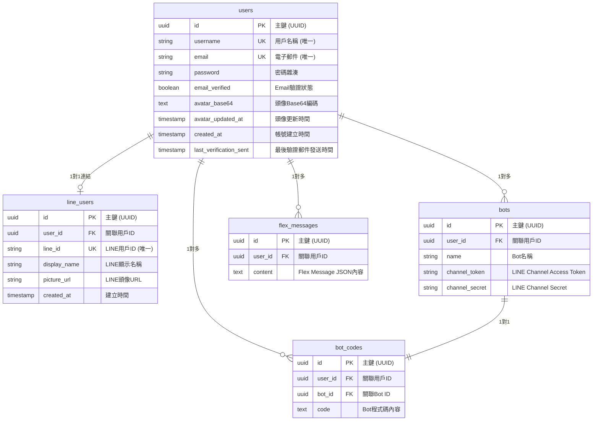

# LineBot-Web Backend API 完整文檔

## 📋 系統概覽

LineBot-Web 採用微服務架構，包含四個獨立的 API 服務：

| 服務名稱 | 端口 | 技術框架 | 主要功能 |
|---------|------|----------|----------|
| LoginAPI | 5501 | Flask + psycopg2 | 傳統帳號認證、密碼管理 |
| LINEloginAPI | 5502 | Flask + SQLAlchemy | LINE OAuth 登入、帳號連結 |
| PuzzleAPI | 5503 | FastAPI + SQLAlchemy | Bot 管理、Flex Message、程式碼管理 |
| SettingAPI | 5504 | Flask + psycopg2 | 個人設定、頭像管理 |

## 🗄️ 資料庫架構

### 資料表關係圖



### 資料表詳細結構

#### users 表
```sql
CREATE TABLE users (
    id UUID PRIMARY KEY DEFAULT uuid_generate_v4(),
    username VARCHAR(255) NOT NULL UNIQUE,
    password VARCHAR(255) NOT NULL,
    email VARCHAR(255) UNIQUE,
    email_verified BOOLEAN DEFAULT FALSE,
    avatar_base64 TEXT,
    avatar_updated_at TIMESTAMP,
    created_at TIMESTAMP DEFAULT CURRENT_TIMESTAMP,
    last_verification_sent TIMESTAMP,
    CONSTRAINT check_avatar_size CHECK (LENGTH(avatar_base64) <= 2097152)
);
```

#### line_users 表
```sql
CREATE TABLE line_users (
    id UUID PRIMARY KEY DEFAULT uuid_generate_v4(),
    user_id UUID NOT NULL REFERENCES users(id) ON DELETE CASCADE,
    line_id VARCHAR(255) UNIQUE NOT NULL,
    display_name VARCHAR(255),
    picture_url VARCHAR(255),
    created_at TIMESTAMP DEFAULT CURRENT_TIMESTAMP
);
```

#### bots 表
```sql
CREATE TABLE bots (
    id UUID PRIMARY KEY DEFAULT uuid_generate_v4(),
    user_id UUID NOT NULL REFERENCES users(id),
    name VARCHAR(255) NOT NULL,
    channel_token VARCHAR(255) NOT NULL,
    channel_secret VARCHAR(255) NOT NULL,
    CONSTRAINT unique_bot_name_per_user UNIQUE (user_id, name)
);
```

#### flex_messages 表
```sql
CREATE TABLE flex_messages (
    id UUID PRIMARY KEY DEFAULT uuid_generate_v4(),
    user_id UUID NOT NULL REFERENCES users(id),
    content TEXT NOT NULL
);
```

#### bot_codes 表
```sql
CREATE TABLE bot_codes (
    id UUID PRIMARY KEY DEFAULT uuid_generate_v4(),
    user_id UUID NOT NULL REFERENCES users(id),
    bot_id UUID NOT NULL REFERENCES bots(id),
    code TEXT NOT NULL
);
```

## 🔐 認證機制

### JWT Token 結構
```json
{
  "username": "用戶名稱",
  "login_type": "general|line",
  "line_id": "LINE用戶ID (僅LINE登入時)",
  "exp": "過期時間",
  "iat": "簽發時間"
}
```

### 認證方式
1. **Authorization Header**: `Authorization: Bearer <token>`
2. **Cookie**: `token=<token>`

## 🌐 API 端點清單

### 1. LoginAPI (Port: 5501) - 傳統認證服務

#### 用戶註冊
```http
POST /register
Content-Type: application/json

{
  "username": "string",
  "password": "string (最少8字元)",
  "email": "string"
}
```

**回應:**
```json
{
  "message": "User registered successfully! Please check your email to verify."
}
```

#### 用戶登入
```http
POST /login
Content-Type: application/json

{
  "username": "string (用戶名稱或Email)",
  "password": "string"
}
```

**回應:**
```json
{
  "message": "Login successful!",
  "username": "string",
  "email": "string",
  "token": "string",
  "login_type": "general",
  "login_method": "email|username"
}
```

#### Email 驗證
```http
POST /verify-email
Content-Type: application/json

{
  "token": "string"
}
```

#### 忘記密碼
```http
POST /forgot_password
Content-Type: application/json

{
  "email": "string"
}
```

#### 重設密碼
```http
POST /reset_password/<token>
Content-Type: application/json

{
  "new_password": "string (最少8字元)"
}
```

#### 修改密碼 (需認證)
```http
POST /change_password
Authorization: Bearer <token>
Content-Type: application/json

{
  "old_password": "string",
  "new_password": "string (最少8字元)"
}
```

#### 檢查登入狀態 (需認證)
```http
GET /check_login
Authorization: Bearer <token>
```

**回應:**
```json
{
  "message": "User {username} is logged in",
  "username": "string",
  "email": "string",
  "login_type": "general"
}
```

#### 重新發送驗證郵件
```http
POST /resend_verification
Content-Type: application/json

{
  "username": "string (用戶名稱或Email)"
}
```

#### 登出
```http
POST /logout
```

### 2. LINEloginAPI (Port: 5502) - LINE OAuth 服務

#### 取得 LINE 登入 URL
```http
GET /api/line-login
```

**回應:**
```json
{
  "login_url": "https://access.line.me/oauth2/v2.1/authorize?..."
}
```

#### LINE 回調處理
```http
GET /line/callback?code=<auth_code>&state=<state>
```

#### 驗證 Token (需認證)
```http
POST /api/verify-token
Content-Type: application/json

{
  "token": "string"
}
```

**回應 (LINE 登入):**
```json
{
  "line_id": "string",
  "display_name": "string",
  "picture_url": "string",
  "username": "string",
  "email": "string",
  "login_type": "line"
}
```

**回應 (一般登入):**
```json
{
  "display_name": "string",
  "username": "string",
  "email": "string",
  "login_type": "general"
}
```

#### 資料庫狀態檢查
```http
GET /api/database-status
```

### 3. PuzzleAPI (Port: 5503) - Bot 管理服務

#### Bot 管理

##### 建立 Bot (需認證)
```http
POST /api/bots
Authorization: Bearer <token>
Content-Type: application/json

{
  "name": "string",
  "channel_token": "string",
  "channel_secret": "string"
}
```

**回應:**
```json
{
  "id": "uuid",
  "name": "string",
  "channel_token": "string",
  "channel_secret": "string",
  "user_id": "uuid"
}
```

**限制:** 每用戶最多 3 個 Bot

##### 取得所有 Bot (需認證)
```http
GET /api/bots
Authorization: Bearer <token>
```

##### 取得特定 Bot (需認證)
```http
GET /api/bots/{bot_id}
Authorization: Bearer <token>
```

##### 更新 Bot (需認證)
```http
PUT /api/bots/{bot_id}
Authorization: Bearer <token>
Content-Type: application/json

{
  "name": "string (可選)",
  "channel_token": "string (可選)",
  "channel_secret": "string (可選)"
}
```

##### 刪除 Bot (需認證)
```http
DELETE /api/bots/{bot_id}
Authorization: Bearer <token>
```

#### Flex Message 管理

##### 建立 Flex Message (需認證)
```http
POST /api/messages
Authorization: Bearer <token>
Content-Type: application/json

{
  "content": {
    "type": "flex",
    "altText": "string",
    "contents": {}
  }
}
```

**限制:** 每用戶最多 10 個 Flex Message

##### 取得所有 Flex Message (需認證)
```http
GET /api/messages
Authorization: Bearer <token>
```

##### 取得特定 Flex Message (需認證)
```http
GET /api/messages/{message_id}
Authorization: Bearer <token>
```

##### 更新 Flex Message (需認證)
```http
PUT /api/messages/{message_id}
Authorization: Bearer <token>
Content-Type: application/json

{
  "content": {
    "type": "flex",
    "altText": "string",
    "contents": {}
  }
}
```

##### 刪除 Flex Message (需認證)
```http
DELETE /api/messages/{message_id}
Authorization: Bearer <token>
```

##### 發送 Flex Message (需認證)
```http
POST /api/messages/{message_id}/send?bot_id={bot_id}
Authorization: Bearer <token>
```

#### Bot 程式碼管理

##### 建立 Bot 程式碼 (需認證)
```http
POST /api/codes
Authorization: Bearer <token>
Content-Type: application/json

{
  "bot_id": "uuid",
  "code": "string"
}
```

**限制:** 每用戶最多 3 個 Bot Code，每個 Bot 只能有一個程式碼

##### 取得所有 Bot 程式碼 (需認證)
```http
GET /api/codes
Authorization: Bearer <token>
```

##### 取得特定 Bot 程式碼 (需認證)
```http
GET /api/codes/{code_id}
Authorization: Bearer <token>
```

##### 更新 Bot 程式碼 (需認證)
```http
PUT /api/codes/{code_id}
Authorization: Bearer <token>
Content-Type: application/json

{
  "code": "string"
}
```

##### 刪除 Bot 程式碼 (需認證)
```http
DELETE /api/codes/{code_id}
Authorization: Bearer <token>
```

#### 用戶管理

##### 建立用戶
```http
POST /api/users
Content-Type: application/json

{
  "username": "string",
  "password": "string",
  "email": "string"
}
```

### 4. SettingAPI (Port: 5504) - 用戶設定服務

#### 個人資料管理

##### 取得個人資料 (需認證)
```http
GET /profile
Authorization: Bearer <token>
```

**回應:**
```json
{
  "username": "string",
  "email": "string",
  "email_verified": boolean,
  "created_at": "ISO 8601 timestamp",
  "avatar": "base64 data URL or null",
  "avatar_updated_at": "ISO 8601 timestamp or null"
}
```

##### 更新個人資料 (需認證)
```http
PUT /profile
Authorization: Bearer <token>
Content-Type: application/json

{
  "username": "string (可選)",
  "email": "string (可選)"
}
```

**回應:**
```json
{
  "username": "string",
  "email": "string",
  "email_verified": boolean,
  "message": "Profile updated successfully",
  "email_verification_sent": boolean,
  "username_changed": boolean,
  "new_token": "string (如果用戶名稱有變更)"
}
```

#### 頭像管理

##### 取得頭像 (需認證)
```http
GET /avatar
Authorization: Bearer <token>
```

**回應:**
```json
{
  "avatar": "data:image/jpeg;base64,... or null",
  "updated_at": "ISO 8601 timestamp or null",
  "message": "Avatar retrieved successfully"
}
```

##### 更新頭像 (需認證)
```http
PUT /avatar
Authorization: Bearer <token>
Content-Type: application/json

{
  "avatar": "data:image/jpeg;base64,..."
}
```

**限制:**
- 支援格式：JPEG、PNG、GIF
- 最大大小：500KB
- Base64 編碼格式

**回應:**
```json
{
  "message": "Avatar updated successfully",
  "avatar": "data:image/jpeg;base64,...",
  "updated_at": "ISO 8601 timestamp"
}
```

##### 刪除頭像 (需認證)
```http
DELETE /avatar
Authorization: Bearer <token>
```

#### Email 驗證

##### 重新發送 Email 驗證 (需認證)
```http
POST /resend-email-verification
Authorization: Bearer <token>
```

##### 驗證 Email Token
```http
POST /verify-email
Content-Type: application/json

{
  "token": "string"
}
```

#### 健康檢查
```http
GET /health
```

**回應:**
```json
{
  "status": "healthy",
  "service": "Setting API",
  "timestamp": "ISO 8601 timestamp"
}
```

## 🚫 錯誤處理

### 統一錯誤格式
```json
{
  "error": "錯誤描述",
  "details": "詳細錯誤信息 (可選)"
}
```

### 常見 HTTP 狀態碼
- `200 OK` - 請求成功
- `201 Created` - 資源建立成功
- `204 No Content` - 刪除成功
- `400 Bad Request` - 請求參數錯誤
- `401 Unauthorized` - 未認證或 Token 無效
- `403 Forbidden` - 權限不足 (如 Email 未驗證)
- `404 Not Found` - 資源不存在
- `409 Conflict` - 資源衝突 (如用戶名稱已存在)
- `429 Too Many Requests` - 請求過於頻繁
- `500 Internal Server Error` - 伺服器內部錯誤

## 🌍 CORS 設定

### 允許的來源
```javascript
const allowedOrigins = [
  "http://localhost:8080",
  "http://localhost:3000", 
  "http://localhost:5173",
  "https://localhost:5173",
  "http://127.0.0.1:5173",
  "https://127.0.0.1:5173",
  "http://127.0.0.1:8080",
  "https://127.0.0.1:8080",
  "https://jkl921102.org"
];
```

### CORS 標頭設定
- `Access-Control-Allow-Credentials: true`
- `Access-Control-Allow-Methods: GET, POST, PUT, DELETE, OPTIONS`
- `Access-Control-Allow-Headers: Content-Type, Authorization, X-Requested-With, Accept, Origin`

## 📝 前端整合範例

### JavaScript Fetch 範例

#### 登入請求
```javascript
const loginUser = async (username, password) => {
  try {
    const response = await fetch('http://localhost:5501/login', {
      method: 'POST',
      headers: {
        'Content-Type': 'application/json',
      },
      credentials: 'include', // 重要：包含 cookies
      body: JSON.stringify({
        username,
        password
      })
    });

    if (!response.ok) {
      const error = await response.json();
      throw new Error(error.error);
    }

    return await response.json();
  } catch (error) {
    console.error('Login failed:', error);
    throw error;
  }
};
```

#### 認證請求 (使用 Token)
```javascript
const getBots = async (token) => {
  try {
    const response = await fetch('http://localhost:5503/api/bots', {
      method: 'GET',
      headers: {
        'Authorization': `Bearer ${token}`,
        'Content-Type': 'application/json',
      },
      credentials: 'include'
    });

    if (!response.ok) {
      const error = await response.json();
      throw new Error(error.error);
    }

    return await response.json();
  } catch (error) {
    console.error('Get bots failed:', error);
    throw error;
  }
};
```

#### 頭像上傳
```javascript
const uploadAvatar = async (token, imageFile) => {
  // 將檔案轉換為 Base64
  const base64 = await new Promise((resolve) => {
    const reader = new FileReader();
    reader.onload = () => resolve(reader.result);
    reader.readAsDataURL(imageFile);
  });

  try {
    const response = await fetch('http://localhost:5504/avatar', {
      method: 'PUT',
      headers: {
        'Authorization': `Bearer ${token}`,
        'Content-Type': 'application/json',
      },
      credentials: 'include',
      body: JSON.stringify({
        avatar: base64
      })
    });

    if (!response.ok) {
      const error = await response.json();
      throw new Error(error.error);
    }

    return await response.json();
  } catch (error) {
    console.error('Avatar upload failed:', error);
    throw error;
  }
};
```

## 📊 資源限制總覽

| 資源類型 | 每用戶限制 | 說明 |
|---------|-----------|------|
| Bot | 3 個 | 每個用戶最多可建立 3 個 LINE Bot |
| Flex Message | 10 個 | 每個用戶最多可儲存 10 個 Flex Message 模板 |
| Bot Code | 3 個 | 每個用戶最多可儲存 3 個 Bot 程式碼，每個 Bot 對應一個程式碼 |
| 頭像大小 | 500KB | 頭像檔案原始大小限制 |
| Email 驗證冷卻 | 60 秒 | 重新發送驗證郵件的間隔時間 |

## 🔧 開發環境設定

### 環境變數 (.env)
```bash
# 資料庫設定
DB_HOST=localhost
DB_PORT=5432
DB_NAME=LineBot_01
DB_USER=your_db_user
DB_PASSWORD=your_db_password

# JWT 設定
JWT_SECRET=your_jwt_secret
FLASK_SECRET_KEY=your_flask_secret

# LINE 設定
LINE_CHANNEL_ID=your_line_channel_id
LINE_CHANNEL_SECRET=your_line_channel_secret
LINE_REDIRECT_URI=http://localhost:5502/line/callback

# 郵件設定
MAIL_SERVER=smtp.gmail.com
MAIL_PORT=587
MAIL_USERNAME=your_email@gmail.com
MAIL_PASSWORD=your_app_password

# 前端 URL
FRONTEND_URL=http://localhost:8080

# 服務端口
PORT_LOGIN=5501
LINE_LOGIN_PORT=5502
PORT_PUZZLE=5503
PORT_SETTING=5504
```

### Docker 部署
每個服務都包含獨立的 `Dockerfile`，可使用 `docker-compose.yml` 進行統一部署。

---

*此文檔基於 LineBot-Web 後端代碼分析，提供完整的 API 端點和資料庫結構資訊，方便前端開發和 API 整合使用。*