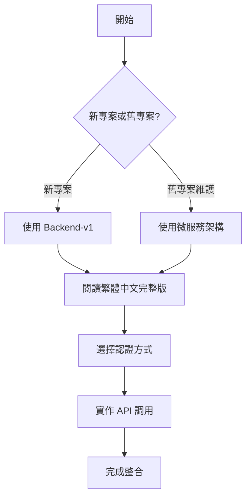

# LineBot-Web API 文檔中心

歡迎來到 LineBot-Web API 文檔中心！本頁面提供完整的 API 文檔導覽和快速入門指南。

## 📚 文檔導覽

### 🌟 主要文檔

| 文檔 | 說明 | 適用對象 | 推薦指數 |
|------|------|----------|----------|
| [**繁體中文完整版**](./LineBot-Web_API文檔_繁體中文完整版.md) | 最完整的繁體中文 API 文檔 | 所有開發者 | ⭐⭐⭐⭐⭐ |
| [Backend-v1 API 文檔](./API_Documentation.md) | 新版統一架構 API 參考 | 新專案開發者 | ⭐⭐⭐⭐ |
| [微服務架構完整文檔](./LineBot-Web_Backend_API_完整文檔.md) | 舊版微服務架構參考 | 維護舊專案 | ⭐⭐⭐ |

### 🎯 快速開始



## 🚀 快速入門

### 1. 選擇合適的架構

#### Backend-v1（推薦）
- ✅ 統一的 API 端點：`http://localhost:8000/api/v1/`
- ✅ 自動生成的 OpenAPI 文檔：`http://localhost:8000/docs`
- ✅ 現代化的 FastAPI 框架
- ✅ 更好的效能和可維護性

#### 微服務架構（維護模式）
- 🔄 多個獨立服務
- 🔄 分散式端點管理
- 🔄 適用於現有系統維護

### 2. 設定開發環境

```bash
# 安裝依賴
npm install
# 或
yarn install

# 設定環境變數
cp .env.example .env

# 啟動開發服務器
npm run dev
```

### 3. 基本認證流程

```javascript
// 1. 用戶登入
const loginResponse = await fetch('http://localhost:8000/api/v1/auth/login', {
  method: 'POST',
  body: new FormData([['username', 'your_username'], ['password', 'your_password']]),
  credentials: 'include'
});

const { access_token } = await loginResponse.json();

// 2. 儲存 Token
localStorage.setItem('token', access_token);

// 3. 使用 Token 調用 API
const response = await fetch('http://localhost:8000/api/v1/users/profile', {
  headers: {
    'Authorization': `Bearer ${access_token}`
  }
});
```

## 🔧 API 功能概覽

### 🔐 認證系統
- **傳統註冊登入**：用戶名稱/Email + 密碼
- **LINE OAuth**：LINE 帳號快速登入
- **JWT Token**：安全的認證機制
- **雙重認證**：Header + Cookie 支援

### 👤 用戶管理
- **個人檔案**：查看和編輯個人資料
- **頭像管理**：上傳和更新用戶頭像
- **Email 驗證**：Email 地址驗證機制
- **密碼管理**：密碼修改和重設

### 🤖 Bot 管理
- **Bot 建立**：建立和配置 LINE Bot
- **程式碼管理**：Bot 邏輯程式碼版本控制
- **Flex Message**：視覺化訊息模板編輯
- **訊息發送**：即時訊息推送功能

## 📋 API 端點速查表

### Backend-v1 主要端點

| 功能類別 | HTTP 方法 | 端點 | 說明 |
|---------|-----------|------|------|
| **認證** | POST | `/api/v1/auth/register` | 用戶註冊 |
| | POST | `/api/v1/auth/login` | 用戶登入 |
| | POST | `/api/v1/auth/line-login` | LINE 登入 |
| | GET | `/api/v1/auth/check-login` | 檢查登入狀態 |
| | POST | `/api/v1/auth/logout` | 用戶登出 |
| **用戶** | GET | `/api/v1/users/profile` | 取得用戶檔案 |
| | PUT | `/api/v1/users/profile` | 更新用戶檔案 |
| | GET | `/api/v1/users/avatar` | 取得頭像 |
| | PUT | `/api/v1/users/avatar` | 更新頭像 |
| **Bot** | POST | `/api/v1/bots/` | 建立 Bot |
| | GET | `/api/v1/bots/` | 取得所有 Bot |
| | POST | `/api/v1/bots/messages` | 建立 Flex Message |

### 微服務端點對照

| 服務 | 端口 | 主要功能 | 狀態 |
|------|------|----------|------|
| LoginAPI | 5501 | 傳統認證 | 🔄 維護中 |
| LINEloginAPI | 5502 | LINE OAuth | 🔄 維護中 |
| PuzzleAPI | 5503 | Bot 管理 | 🔄 維護中 |
| SettingAPI | 5504 | 用戶設定 | 🔄 維護中 |

## 💻 程式範例

### React Hook 整合

```typescript
import { useAuth } from './hooks/useAuth';

function App() {
  const { user, isAuthenticated, login, logout } = useAuth();

  if (!isAuthenticated) {
    return <LoginComponent onLogin={login} />;
  }

  return (
    <div>
      <h1>歡迎, {user?.username}!</h1>
      <button onClick={logout}>登出</button>
    </div>
  );
}
```

### API 客戶端封裝

```typescript
import { APIClient } from './services/apiClient';

const api = new APIClient();

// 用戶註冊
await api.register({
  username: 'john_doe',
  password: 'password123',
  email: 'john@example.com'
});

// 建立 Bot
await api.createBot({
  name: 'My Bot',
  channel_token: 'your_token',
  channel_secret: 'your_secret'
});
```

## 🔍 測試工具

### 1. OpenAPI 文檔（推薦）
訪問 `http://localhost:8000/docs` 進行互動式 API 測試

### 2. Postman Collection
匯入我們提供的 Postman Collection 進行測試

### 3. cURL 範例

```bash
# 用戶登入
curl -X POST "http://localhost:8000/api/v1/auth/login" \
  -H "Content-Type: application/x-www-form-urlencoded" \
  -d "username=john_doe&password=password123"

# 取得用戶檔案
curl -X GET "http://localhost:8000/api/v1/users/profile" \
  -H "Authorization: Bearer YOUR_TOKEN"
```

## 🚨 常見問題解決

### 問題 1: CORS 錯誤
**解決方案**：確保前端 URL 在 CORS 允許清單中

```javascript
const allowedOrigins = [
  "http://localhost:3000",
  "http://localhost:5173",
  "http://localhost:8080"
];
```

### 問題 2: Token 過期
**解決方案**：實作 Token 刷新機制

```javascript
if (response.status === 401) {
  localStorage.removeItem('token');
  window.location.href = '/login';
}
```

### 問題 3: 上傳檔案失敗
**解決方案**：檢查檔案大小和格式

```javascript
if (file.size > 500 * 1024) { // 500KB
  throw new Error('檔案大小超過限制');
}
```

## 📞 技術支援

### 開發團隊聯絡方式
- **Email**: support@linebot-web.com
- **GitHub Issues**: [提交問題](https://github.com/your-repo/issues)
- **文檔反饋**: [改進建議](https://github.com/your-repo/docs/issues)

### 更新通知
- 訂閱我們的 [GitHub Releases](https://github.com/your-repo/releases) 獲取最新更新
- 關注 [開發日誌](../deployment/CHANGELOG.md) 了解版本變更

## 📚 延伸學習

### 相關技術文檔
- [LINE Bot 開發指南](https://developers.line.biz/en/docs/)
- [FastAPI 官方文檔](https://fastapi.tiangolo.com/)
- [React 開發指南](https://reactjs.org/docs/)
- [PostgreSQL 文檔](https://www.postgresql.org/docs/)

### 最佳實踐指南
- [前端架構設計](../frontend/)
- [後端架構分析](../architecture/)
- [部署指南](../deployment/)
- [安全性最佳實踐](../security/)

---

*最後更新：2024年1月15日*  
*文檔版本：v2.0*  
*維護團隊：LineBot-Web 開發團隊*