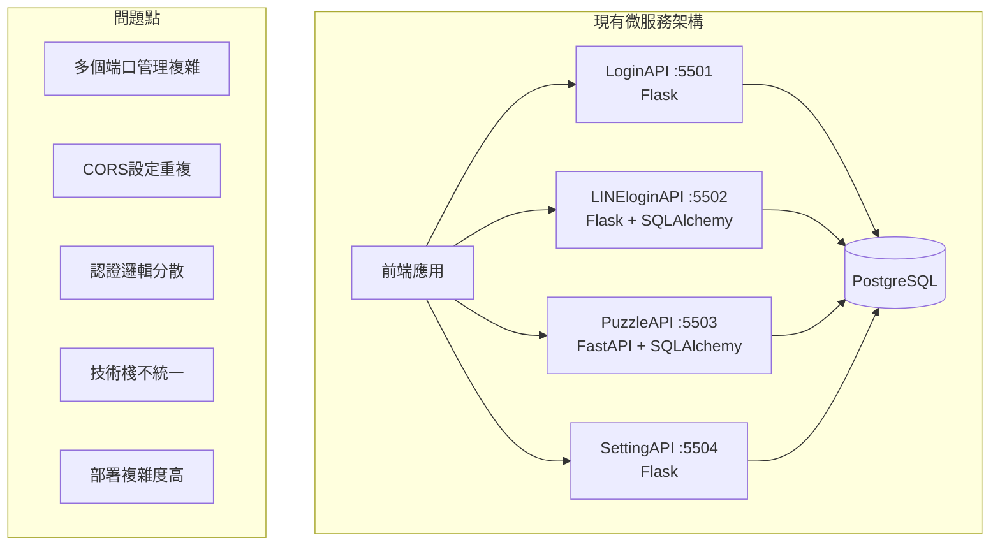
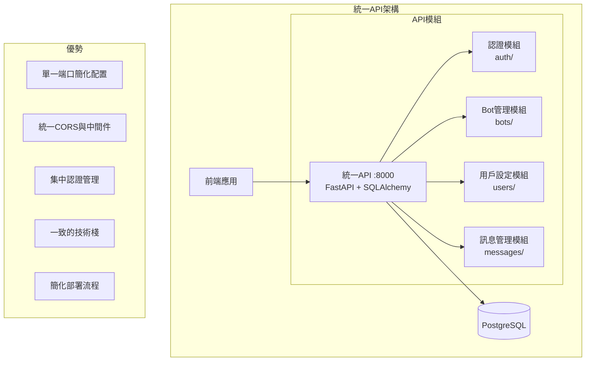
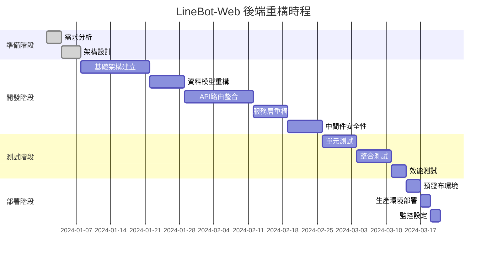

# LineBot-Web 後端重構計劃：微服務整合為統一 API

## 🎯 重構目標

將現有的四個微服務（LoginAPI、LINEloginAPI、PuzzleAPI、SettingAPI）整合為一個統一的 FastAPI 應用程式，簡化架構並提升開發效率。

## 📊 現況分析 vs 目標架構

### 現況架構問題


### 目標統一架構


## 🏗️ 重構架構設計

### 專案結構規劃
```
linebot-web/
├── backend/
│   ├── app/
│   │   ├── __init__.py
│   │   ├── main.py                 # FastAPI 主應用程式
│   │   ├── config.py               # 配置管理
│   │   ├── database.py             # 資料庫連接
│   │   ├── dependencies.py         # 依賴注入
│   │   │
│   │   ├── core/                   # 核心功能
│   │   │   ├── __init__.py
│   │   │   ├── auth.py             # 統一認證服務
│   │   │   ├── security.py         # 安全相關功能
│   │   │   ├── email.py            # 郵件服務
│   │   │   └── exceptions.py       # 自定義例外
│   │   │
│   │   ├── models/                 # 資料模型
│   │   │   ├── __init__.py
│   │   │   ├── user.py             # 用戶相關模型
│   │   │   ├── bot.py              # Bot相關模型
│   │   │   └── message.py          # 訊息相關模型
│   │   │
│   │   ├── schemas/                # Pydantic 模式
│   │   │   ├── __init__.py
│   │   │   ├── auth.py             # 認證相關schema
│   │   │   ├── user.py             # 用戶相關schema
│   │   │   ├── bot.py              # Bot相關schema
│   │   │   └── message.py          # 訊息相關schema
│   │   │
│   │   ├── api/                    # API 路由
│   │   │   ├── __init__.py
│   │   │   ├── api_v1/
│   │   │   │   ├── __init__.py
│   │   │   │   ├── api.py          # 路由聚合
│   │   │   │   ├── auth.py         # 認證相關路由
│   │   │   │   ├── users.py        # 用戶管理路由
│   │   │   │   ├── bots.py         # Bot管理路由
│   │   │   │   └── messages.py     # 訊息管理路由
│   │   │   └── deps.py             # API依賴
│   │   │
│   │   ├── services/               # 業務邏輯服務
│   │   │   ├── __init__.py
│   │   │   ├── auth_service.py     # 認證服務
│   │   │   ├── user_service.py     # 用戶服務
│   │   │   ├── bot_service.py      # Bot服務
│   │   │   ├── message_service.py  # 訊息服務
│   │   │   └── line_service.py     # LINE API整合
│   │   │
│   │   └── utils/                  # 工具函數
│   │       ├── __init__.py
│   │       ├── validators.py       # 驗證工具
│   │       ├── formatters.py       # 格式化工具
│   │       └── constants.py        # 常數定義
│   │
│   ├── requirements.txt            # 依賴列表
│   ├── Dockerfile                  # Docker配置
│   ├── .env.example               # 環境變數範例
│   └── alembic/                   # 資料庫遷移
│       ├── alembic.ini
│       └── versions/
```

## 🔧 技術棧統一

### 選擇 FastAPI 的理由
1. **高性能**: 基於 Starlette 和 Pydantic，性能優秀
2. **自動文檔**: 自動生成 OpenAPI/Swagger 文檔
3. **類型提示**: 完整的 Python 類型提示支援
4. **現代化**: 原生支援 async/await
5. **易於測試**: 內建測試支援

### 核心依賴套件
```python
# requirements.txt
fastapi==0.104.1
uvicorn[standard]==0.24.0
sqlalchemy==2.0.23
alembic==1.12.1
psycopg2-binary==2.9.7
pydantic[email]==2.5.0
python-jose[cryptography]==3.3.0
passlib[bcrypt]==1.7.4
python-multipart==0.0.6
fastapi-mail==1.4.1
python-dotenv==1.0.0
redis==5.0.1
celery==5.3.4
pytest==7.4.3
httpx==0.25.2
```

## 📝 重構實施計劃

### 階段一：基礎架構建立 (第1-2週)

#### 1.1 專案結構初始化
- [ ] 建立新的專案結構
- [ ] 設定 FastAPI 主應用程式
- [ ] 配置資料庫連接 (SQLAlchemy 2.0)
- [ ] 設定環境變數管理

#### 1.2 核心功能模組
- [ ] 統一認證系統 (`core/auth.py`)
- [ ] 安全相關功能 (`core/security.py`)
- [ ] 郵件服務整合 (`core/email.py`)
- [ ] 例外處理機制 (`core/exceptions.py`)

### 階段二：資料模型與 Schema 定義 (第2-3週)

#### 2.1 SQLAlchemy 模型統一
```python
# models/user.py
from sqlalchemy import Column, String, Boolean, DateTime, Text, UUID
from sqlalchemy.sql import func
from sqlalchemy.orm import relationship
from app.database import Base

class User(Base):
    __tablename__ = "users"
    
    id = Column(UUID(as_uuid=True), primary_key=True, server_default=func.uuid_generate_v4())
    username = Column(String(255), unique=True, nullable=False, index=True)
    email = Column(String(255), unique=True, nullable=True, index=True)
    password = Column(String(255), nullable=False)
    email_verified = Column(Boolean, default=False)
    avatar_base64 = Column(Text)
    avatar_updated_at = Column(DateTime(timezone=True))
    created_at = Column(DateTime(timezone=True), server_default=func.now())
    last_verification_sent = Column(DateTime(timezone=True))
    
    # 關聯關係
    line_account = relationship("LineUser", back_populates="user", uselist=False)
    bots = relationship("Bot", back_populates="user", cascade="all, delete-orphan")
    flex_messages = relationship("FlexMessage", back_populates="user", cascade="all, delete-orphan")
    bot_codes = relationship("BotCode", back_populates="user", cascade="all, delete-orphan")
```

#### 2.2 Pydantic Schema 設計
```python
# schemas/user.py
from pydantic import BaseModel, EmailStr, validator
from typing import Optional
from datetime import datetime

class UserBase(BaseModel):
    username: str
    email: Optional[EmailStr] = None

class UserCreate(UserBase):
    password: str
    
    @validator('password')
    def validate_password(cls, v):
        if len(v) < 8:
            raise ValueError('Password must be at least 8 characters long')
        return v

class UserUpdate(BaseModel):
    username: Optional[str] = None
    email: Optional[EmailStr] = None

class UserResponse(BaseModel):
    id: str
    username: str
    email: Optional[str]
    email_verified: bool
    created_at: datetime
    avatar_updated_at: Optional[datetime]
    
    class Config:
        from_attributes = True
```

### 階段三：API 路由整合 (第3-4週)

#### 3.1 認證相關 API
```python
# api/api_v1/auth.py
from fastapi import APIRouter, Depends, HTTPException, status
from fastapi.security import OAuth2PasswordRequestForm
from sqlalchemy.orm import Session

from app.api.deps import get_db
from app.schemas.auth import Token, UserCreate, UserLogin
from app.services.auth_service import AuthService

router = APIRouter()

@router.post("/register", response_model=dict)
async def register(
    user_data: UserCreate,
    db: Session = Depends(get_db)
):
    """用戶註冊"""
    return await AuthService.register_user(db, user_data)

@router.post("/login", response_model=Token)
async def login(
    form_data: OAuth2PasswordRequestForm = Depends(),
    db: Session = Depends(get_db)
):
    """用戶登入"""
    return await AuthService.authenticate_user(db, form_data.username, form_data.password)

@router.post("/line-login", response_model=dict)
async def line_login():
    """取得 LINE 登入 URL"""
    return await AuthService.get_line_login_url()

@router.get("/line/callback")
async def line_callback(
    code: str,
    state: str,
    db: Session = Depends(get_db)
):
    """LINE 登入回調"""
    return await AuthService.handle_line_callback(db, code, state)
```

#### 3.2 Bot 管理 API
```python
# api/api_v1/bots.py
from fastapi import APIRouter, Depends, HTTPException
from sqlalchemy.orm import Session
from typing import List

from app.api.deps import get_db, get_current_user
from app.models.user import User
from app.schemas.bot import BotCreate, BotUpdate, BotResponse
from app.services.bot_service import BotService

router = APIRouter()

@router.post("/", response_model=BotResponse)
async def create_bot(
    bot_data: BotCreate,
    db: Session = Depends(get_db),
    current_user: User = Depends(get_current_user)
):
    """建立新的 Bot"""
    return await BotService.create_bot(db, current_user.id, bot_data)

@router.get("/", response_model=List[BotResponse])
async def get_bots(
    db: Session = Depends(get_db),
    current_user: User = Depends(get_current_user)
):
    """取得用戶的所有 Bot"""
    return await BotService.get_user_bots(db, current_user.id)

@router.get("/{bot_id}", response_model=BotResponse)
async def get_bot(
    bot_id: str,
    db: Session = Depends(get_db),
    current_user: User = Depends(get_current_user)
):
    """取得特定 Bot"""
    return await BotService.get_bot(db, bot_id, current_user.id)

@router.put("/{bot_id}", response_model=BotResponse)
async def update_bot(
    bot_id: str,
    bot_data: BotUpdate,
    db: Session = Depends(get_db),
    current_user: User = Depends(get_current_user)
):
    """更新 Bot"""
    return await BotService.update_bot(db, bot_id, current_user.id, bot_data)

@router.delete("/{bot_id}")
async def delete_bot(
    bot_id: str,
    db: Session = Depends(get_db),
    current_user: User = Depends(get_current_user)
):
    """刪除 Bot"""
    return await BotService.delete_bot(db, bot_id, current_user.id)
```

### 階段四：服務層重構 (第4-5週)

#### 4.1 認證服務統一
```python
# services/auth_service.py
from sqlalchemy.orm import Session
from fastapi import HTTPException, status
from jose import JWTError, jwt
from datetime import datetime, timedelta
import secrets
import string

from app.models.user import User, LineUser
from app.core.security import verify_password, get_password_hash
from app.core.config import settings
from app.services.line_service import LineService

class AuthService:
    @staticmethod
    async def register_user(db: Session, user_data: UserCreate) -> dict:
        """用戶註冊"""
        # 檢查用戶是否已存在
        if db.query(User).filter(User.username == user_data.username).first():
            raise HTTPException(
                status_code=status.HTTP_409_CONFLICT,
                detail="Username already registered"
            )
        
        if user_data.email and db.query(User).filter(User.email == user_data.email).first():
            raise HTTPException(
                status_code=status.HTTP_409_CONFLICT,
                detail="Email already registered"
            )
        
        # 建立新用戶
        hashed_password = get_password_hash(user_data.password)
        db_user = User(
            username=user_data.username,
            email=user_data.email,
            password=hashed_password
        )
        db.add(db_user)
        db.commit()
        db.refresh(db_user)
        
        # 發送驗證郵件
        if user_data.email:
            await EmailService.send_verification_email(user_data.email)
        
        return {"message": "User registered successfully"}
    
    @staticmethod
    async def authenticate_user(db: Session, username: str, password: str) -> dict:
        """用戶認證"""
        # 支援用戶名稱或email登入
        user = db.query(User).filter(
            (User.username == username) | (User.email == username)
        ).first()
        
        if not user or not verify_password(password, user.password):
            raise HTTPException(
                status_code=status.HTTP_401_UNAUTHORIZED,
                detail="Incorrect username or password"
            )
        
        if user.email and not user.email_verified:
            raise HTTPException(
                status_code=status.HTTP_403_FORBIDDEN,
                detail="Email not verified"
            )
        
        # 生成 JWT token
        token = create_access_token(data={"sub": user.username, "login_type": "general"})
        
        return {
            "access_token": token,
            "token_type": "bearer",
            "user": {
                "username": user.username,
                "email": user.email,
                "login_type": "general"
            }
        }
```

#### 4.2 Bot 服務層
```python
# services/bot_service.py
from sqlalchemy.orm import Session
from fastapi import HTTPException, status
from typing import List
import uuid

from app.models.bot import Bot
from app.schemas.bot import BotCreate, BotUpdate, BotResponse

class BotService:
    @staticmethod
    async def create_bot(db: Session, user_id: uuid.UUID, bot_data: BotCreate) -> BotResponse:
        """建立新的 Bot"""
        # 檢查數量限制
        bot_count = db.query(Bot).filter(Bot.user_id == user_id).count()
        if bot_count >= 3:
            raise HTTPException(
                status_code=status.HTTP_400_BAD_REQUEST,
                detail="Maximum 3 bots allowed per user"
            )
        
        # 檢查名稱重複
        existing_bot = db.query(Bot).filter(
            Bot.user_id == user_id,
            Bot.name == bot_data.name
        ).first()
        if existing_bot:
            raise HTTPException(
                status_code=status.HTTP_409_CONFLICT,
                detail="Bot name already exists"
            )
        
        # 建立 Bot
        db_bot = Bot(**bot_data.dict(), user_id=user_id)
        db.add(db_bot)
        db.commit()
        db.refresh(db_bot)
        
        return BotResponse.from_orm(db_bot)
    
    @staticmethod
    async def get_user_bots(db: Session, user_id: uuid.UUID) -> List[BotResponse]:
        """取得用戶的所有 Bot"""
        bots = db.query(Bot).filter(Bot.user_id == user_id).all()
        return [BotResponse.from_orm(bot) for bot in bots]
```

### 階段五：中間件與安全性 (第5-6週)

#### 5.1 統一中間件配置
```python
# main.py
from fastapi import FastAPI
from fastapi.middleware.cors import CORSMiddleware
from fastapi.middleware.trustedhost import TrustedHostMiddleware
from contextlib import asynccontextmanager

from app.api.api_v1.api import api_router
from app.core.config import settings
from app.database import engine
from app.models import Base

@asynccontextmanager
async def lifespan(app: FastAPI):
    # 啟動時
    Base.metadata.create_all(bind=engine)
    yield
    # 關閉時清理

app = FastAPI(
    title="LineBot-Web Unified API",
    description="統一的 LINE Bot 管理 API",
    version="2.0.0",
    lifespan=lifespan
)

# CORS 中間件
app.add_middleware(
    CORSMiddleware,
    allow_origins=settings.ALLOWED_ORIGINS,
    allow_credentials=True,
    allow_methods=["*"],
    allow_headers=["*"],
)

# 信任主機中間件
app.add_middleware(
    TrustedHostMiddleware,
    allowed_hosts=settings.ALLOWED_HOSTS
)

# 包含 API 路由
app.include_router(api_router, prefix="/api/v1")

@app.get("/")
async def root():
    return {"message": "LineBot-Web Unified API"}

@app.get("/health")
async def health_check():
    return {"status": "healthy", "version": "2.0.0"}
```

### 階段六：測試與部署 (第6-7週)

#### 6.1 單元測試
```python
# tests/test_auth.py
import pytest
from fastapi.testclient import TestClient
from app.main import app

client = TestClient(app)

def test_register_user():
    response = client.post(
        "/api/v1/auth/register",
        json={
            "username": "testuser",
            "email": "test@example.com",
            "password": "testpassword123"
        }
    )
    assert response.status_code == 200
    assert response.json()["message"] == "User registered successfully"

def test_login_user():
    # 先註冊用戶
    client.post("/api/v1/auth/register", json={
        "username": "logintest",
        "email": "login@example.com", 
        "password": "testpassword123"
    })
    
    # 測試登入
    response = client.post(
        "/api/v1/auth/login",
        data={"username": "logintest", "password": "testpassword123"}
    )
    assert response.status_code == 200
    assert "access_token" in response.json()
```

#### 6.2 Docker 配置
```dockerfile
# Dockerfile
FROM python:3.11-slim

WORKDIR /app

COPY requirements.txt .
RUN pip install --no-cache-dir -r requirements.txt

COPY . .

CMD ["uvicorn", "app.main:app", "--host", "0.0.0.0", "--port", "8000"]
```

```yaml
# docker-compose.yml
version: '3.8'

services:
  api:
    build: .
    ports:
      - "8000:8000"
    environment:
      - DATABASE_URL=postgresql://postgres:password@db:5432/linebot
    depends_on:
      - db
      - redis

  db:
    image: postgres:15
    environment:
      POSTGRES_DB: linebot
      POSTGRES_USER: postgres
      POSTGRES_PASSWORD: password
    volumes:
      - postgres_data:/var/lib/postgresql/data
    ports:
      - "5432:5432"

  redis:
    image: redis:7-alpine
    ports:
      - "6379:6379"

volumes:
  postgres_data:
```

## 📈 重構效益分析

### 開發效益
| 項目 | 現況 | 重構後 | 改善幅度 |
|------|------|--------|----------|
| API 端點管理 | 4個服務分散 | 統一管理 | 75% 簡化 |
| 認證邏輯 | 4套獨立實現 | 統一認證 | 90% 減少重複 |
| CORS 配置 | 4處重複設定 | 單一配置 | 100% 統一 |
| 部署複雜度 | 4個容器 | 1個容器 | 75% 簡化 |
| 文檔維護 | 分散式文檔 | 自動生成 | 50% 減少工作量 |

### 技術效益
1. **統一技術棧**: 全面使用 FastAPI + SQLAlchemy 2.0
2. **自動文檔**: OpenAPI/Swagger 自動生成
3. **類型安全**: 完整的 Python 類型提示
4. **性能提升**: FastAPI 的非同步處理能力
5. **測試友善**: 內建測試支援和模擬

### 維護效益
1. **單一代碼庫**: 統一的版本控制和 CI/CD
2. **依賴管理**: 統一的套件管理
3. **錯誤追蹤**: 集中的日誌和監控
4. **安全更新**: 統一的安全策略

## 🚀 實施時程表



## 🔍 風險評估與對策

### 高風險項目
1. **資料遷移**: 現有資料的完整性
   - 對策：完整的備份策略和段階式遷移
2. **服務中斷**: 重構期間的服務可用性
   - 對策：藍綠部署和平滑切換
3. **功能遺漏**: 現有功能的完整移植
   - 對策：詳細的功能對照表和測試覆蓋

### 中風險項目
1. **效能回歸**: 統一服務可能的效能影響
   - 對策：效能基準測試和監控
2. **團隊適應**: 新技術棧的學習曲線
   - 對策：技術培訓和文檔支援

## 📋 檢查清單

### 開發前檢查
- [ ] 確認所有現有 API 功能清單
- [ ] 建立完整的測試資料集
- [ ] 準備開發環境和工具
- [ ] 團隊技術培訓完成

### 開發中檢查
- [ ] 每個模組的單元測試覆蓋率 > 80%
- [ ] API 文檔自動生成並更新
- [ ] 程式碼審查流程執行
- [ ] 效能基準測試通過

### 部署前檢查
- [ ] 完整的整合測試通過
- [ ] 安全性掃描無高風險問題
- [ ] 資料庫遷移腳本測試完成
- [ ] 監控和告警機制就緒
- [ ] 回滾計劃準備完整

---

*此重構計劃將 LineBot-Web 後端從微服務架構整合為統一 API，提升開發效率並簡化維護工作。*