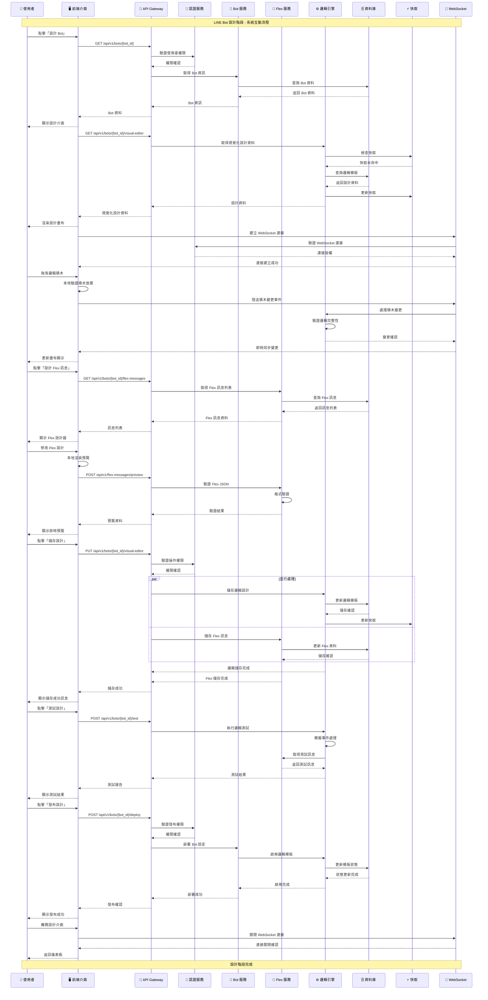
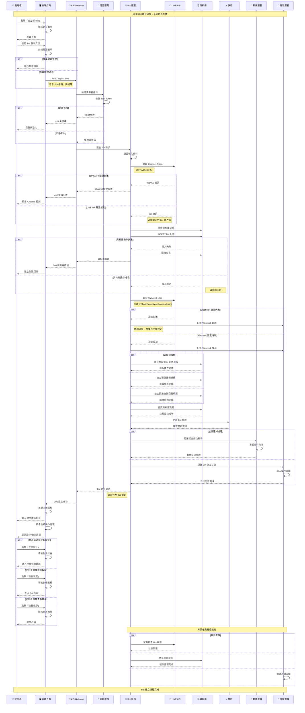

# LINE Bot 編輯設計系統 - 循序圖集合

> 系統循序圖集合，描述 LINE Bot 編輯設計系統中各元件之間的互動時序和訊息傳遞。

## 📋 目錄

1. [設計 LINE Bot 系統循序圖](#1-設計-line-bot-系統循序圖)
2. [建立 LINE Bot 系統循序圖](#2-建立-line-bot-系統循序圖)

---

## 1. 設計 LINE Bot 系統循序圖

描述設計階段中各系統元件之間的互動順序，包含前端介面、後端服務、資料庫之間的訊息傳遞。

### 設計階段互動說明

- **即時同步**: 透過 WebSocket 實現即時的設計變更同步
- **並行處理**: 邏輯設計和 Flex 訊息可以並行儲存，提高效率
- **快取機制**: 使用 Redis 快取提高設計資料的讀取速度
- **權限驗證**: 每個關鍵操作都進行權限驗證確保安全性

---

## 2. 建立 LINE Bot 系統循序圖

展示建立 Bot 時系統內部的物件互動時序，包含 API 呼叫、資料儲存、LINE 平台註冊等步驟的時間順序。

### 建立階段互動說明

- **交易管理**: 使用資料庫交易確保資料一致性
- **錯誤處理**: 完整的錯誤處理機制，包含回滾和清理
- **並行處理**: 初始化設定和通知處理採用並行方式提高效率
- **背景任務**: 建立完成後持續進行狀態監控和統計更新
- **用戶體驗**: 提供多種後續操作選項，引導用戶完成設定

---

## 📊 圖表使用說明

### 如何閱讀循序圖

1. **參與者 (Participants)**: 圖表頂部的各個系統元件
2. **生命線 (Lifelines)**: 從參與者向下延伸的垂直線
3. **訊息 (Messages)**: 參與者之間的水平箭頭
4. **啟動框 (Activation Boxes)**: 表示物件處於活躍狀態的時間
5. **替代流程 (Alt)**: 條件分支的不同執行路徑
6. **並行處理 (Par)**: 同時執行的多個操作

### 圖表更新維護

- 當系統架構變更時，請同步更新相關圖表
- 新增功能時，考慮是否需要新增對應的互動流程
- 定期檢查圖表與實際實作的一致性
