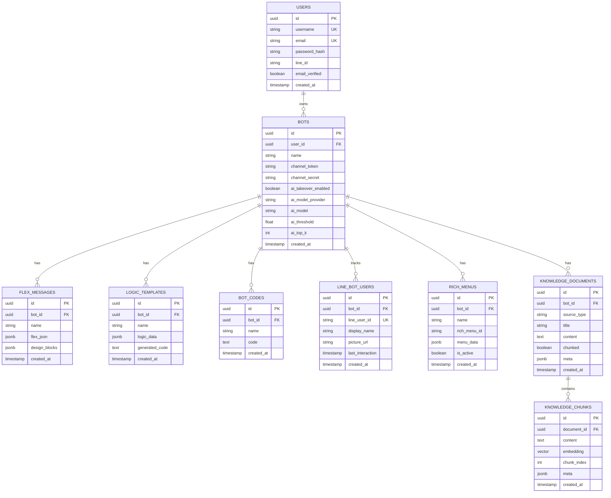

# LineBot-Web 系統架構圖

本文件說明 LineBot-Web 專案的整體系統架構，包含前端、後端、資料儲存與外部服務的關係。

## 系統總覽架構

```mermaid
graph TB
    subgraph "用戶端"
        Browser[瀏覽器<br/>Vite + React + TypeScript]
        LineUser[LINE 用戶]
    end

    subgraph "前端服務 (Port 8080/3000)"
        FE[React 應用]
        FE_Dashboard[儀表板]
        FE_BotEditor[視覺化 Bot 編輯器]
        FE_FlexDesigner[Flex 訊息設計器]
        FE_RichMenu[Rich Menu 管理]
        FE_UserList[使用者與對話清單]
    end

    subgraph "後端服務 (Port 8000/8001)"
        API[FastAPI 統一 API<br/>/api/v1]
        
        subgraph "API 路由層"
            Auth[認證 /auth]
            Users[用戶管理 /users]
            Bots[Bot 管理 /bots]
            Webhook[Webhook /webhooks]
            WebSocket[WebSocket /ws]
            Analytics[分析 /bot_analytics]
            Dashboard[儀表板 /bot_dashboard]
            AIKnowledge[AI 知識庫 /ai/knowledge]
            AIAnalysis[AI 分析 /ai/analysis]
            Batch[批次操作 /batch]
        end
        
        subgraph "服務層"
            AuthService[認證服務]
            BotService[Bot 服務]
            LineBotService[LINE Bot 服務]
            ConversationService[對話服務]
            RAGService[RAG 檢索服務]
            EmbeddingService[嵌入服務]
            MinioService[MinIO 服務]
            BackgroundTasks[背景任務]
            CacheService[快取服務]
        end
    end

    subgraph "資料儲存層"
        PostgreSQL[(PostgreSQL<br/>主要資料庫)]
        Redis[(Redis<br/>快取與 Session)]
        MongoDB[(MongoDB<br/>對話記錄)]
        MinIO[(MinIO<br/>媒體檔案)]
    end

    subgraph "外部服務"
        LINE[LINE Messaging API]
        GroqAI[Groq AI API]
        GeminiAI[Gemini AI API]
    end

    %% 用戶端連接
    Browser --> FE
    LineUser --> LINE

    %% 前端內部連接
    FE --> FE_Dashboard
    FE --> FE_BotEditor
    FE --> FE_FlexDesigner
    FE --> FE_RichMenu
    FE --> FE_UserList

    %% 前端到後端
    FE -->|HTTP/HTTPS| API
    FE <-->|WebSocket| WebSocket

    %% API 路由到服務
    Auth --> AuthService
    Users --> AuthService
    Bots --> BotService
    Webhook --> LineBotService
    Analytics --> ConversationService
    Dashboard --> BotService
    AIKnowledge --> RAGService
    AIKnowledge --> EmbeddingService
    AIAnalysis --> RAGService
    Batch --> BackgroundTasks

    %% 服務到資料庫
    AuthService --> PostgreSQL
    AuthService --> Redis
    BotService --> PostgreSQL
    BotService --> Redis
    LineBotService --> PostgreSQL
    LineBotService --> MinIO
    ConversationService --> MongoDB
    RAGService --> PostgreSQL
    EmbeddingService --> PostgreSQL
    CacheService --> Redis
    BackgroundTasks --> Redis

    %% 外部服務連接
    LINE -->|Webhook 事件| Webhook
    LineBotService -->|推送訊息| LINE
    RAGService --> GroqAI
    RAGService --> GeminiAI

    %% 樣式
    classDef frontend fill:#e1f5ff,stroke:#01579b,stroke-width:2px
    classDef backend fill:#fff3e0,stroke:#e65100,stroke-width:2px
    classDef storage fill:#f3e5f5,stroke:#4a148c,stroke-width:2px
    classDef external fill:#e8f5e9,stroke:#1b5e20,stroke-width:2px

    class Browser,LineUser,FE,FE_Dashboard,FE_BotEditor,FE_FlexDesigner,FE_RichMenu,FE_UserList frontend
    class API,Auth,Users,Bots,Webhook,WebSocket,Analytics,Dashboard,AIKnowledge,AIAnalysis,Batch,AuthService,BotService,LineBotService,ConversationService,RAGService,EmbeddingService,MinioService,BackgroundTasks,CacheService backend
    class PostgreSQL,Redis,MongoDB,MinIO storage
    class LINE,GroqAI,GeminiAI external
```



## 後端模組架構

```mermaid
graph TB
    subgraph "API 路由層 (app/api/api_v1/)"
        R_Auth[auth.py<br/>認證路由]
        R_Users[users.py<br/>用戶路由]
        R_Bots[bots.py<br/>Bot 管理路由]
        R_RichMenu[rich_menu.py<br/>Rich Menu 路由]
        R_Webhook[webhook.py<br/>Webhook 路由]
        R_WebSocket[websocket.py<br/>WebSocket 路由]
        R_Analytics[bot_analytics.py<br/>分析路由]
        R_Dashboard[bot_dashboard.py<br/>儀表板路由]
        R_AIKnowledge[ai_knowledge.py<br/>AI 知識庫路由]
        R_AIAnalysis[ai_analysis.py<br/>AI 分析路由]
        R_Batch[batch_operations.py<br/>批次操作路由]
    end

    subgraph "服務層 (app/services/)"
        S_Auth[auth_service.py<br/>認證與授權]
        S_Bot[bot_service.py<br/>Bot 業務邏輯]
        S_LineBot[line_bot_service.py<br/>LINE API 整合]
        S_Conversation[conversation_service.py<br/>對話管理]
        S_RAG[rag_service.py<br/>RAG 檢索]
        S_Embedding[embedding_service.py<br/>向量嵌入]
        S_Minio[minio_service.py<br/>檔案儲存]
        S_Cache[cache_service.py<br/>快取管理]
        S_Background[background_tasks.py<br/>背景任務]
        S_Logic[logic_engine_service.py<br/>邏輯引擎]
    end

    subgraph "資料模型層 (app/models/)"
        M_User[user.py<br/>User]
        M_Bot[bot.py<br/>Bot, FlexMessage<br/>LogicTemplate, BotCode]
        M_LineUser[line_user.py<br/>LineBotUser, RichMenu]
        M_Knowledge[knowledge.py<br/>KnowledgeDocument<br/>KnowledgeChunk]
        M_Conversation[mongodb/conversation.py<br/>ConversationDocument<br/>MessageDocument]
    end

    subgraph "資料庫層"
        DB_PostgreSQL[(PostgreSQL<br/>核心資料)]
        DB_Redis[(Redis<br/>快取)]
        DB_MongoDB[(MongoDB<br/>對話記錄)]
        DB_MinIO[(MinIO<br/>媒體檔案)]
    end

    %% 路由到服務
    R_Auth --> S_Auth
    R_Users --> S_Auth
    R_Bots --> S_Bot
    R_RichMenu --> S_Bot
    R_Webhook --> S_LineBot
    R_Webhook --> S_Logic
    R_WebSocket --> S_Conversation
    R_Analytics --> S_Conversation
    R_Dashboard --> S_Bot
    R_AIKnowledge --> S_RAG
    R_AIKnowledge --> S_Embedding
    R_AIAnalysis --> S_RAG
    R_Batch --> S_Background

    %% 服務到模型
    S_Auth --> M_User
    S_Bot --> M_Bot
    S_Bot --> M_LineUser
    S_LineBot --> M_Bot
    S_LineBot --> M_LineUser
    S_Conversation --> M_Conversation
    S_RAG --> M_Knowledge
    S_Embedding --> M_Knowledge
    S_Logic --> M_Bot

    %% 模型到資料庫
    M_User --> DB_PostgreSQL
    M_Bot --> DB_PostgreSQL
    M_LineUser --> DB_PostgreSQL
    M_Knowledge --> DB_PostgreSQL
    M_Conversation --> DB_MongoDB
    S_Cache --> DB_Redis
    S_Minio --> DB_MinIO
    S_Background --> DB_Redis

    %% 樣式
    classDef route fill:#e3f2fd,stroke:#1565c0,stroke-width:2px
    classDef service fill:#fff3e0,stroke:#ef6c00,stroke-width:2px
    classDef model fill:#f3e5f5,stroke:#6a1b9a,stroke-width:2px
    classDef database fill:#e8f5e9,stroke:#2e7d32,stroke-width:2px

    class R_Auth,R_Users,R_Bots,R_RichMenu,R_Webhook,R_WebSocket,R_Analytics,R_Dashboard,R_AIKnowledge,R_AIAnalysis,R_Batch route
    class S_Auth,S_Bot,S_LineBot,S_Conversation,S_RAG,S_Embedding,S_Minio,S_Cache,S_Background,S_Logic service
    class M_User,M_Bot,M_LineUser,M_Knowledge,M_Conversation model
    class DB_PostgreSQL,DB_Redis,DB_MongoDB,DB_MinIO database
```



## 資料模型關係圖 (ERD)



## 技術棧總覽

### 前端
- **框架**: Vite 5 + React 18 + TypeScript 5
- **UI 庫**: Tailwind CSS 3 + shadcn-ui (Radix UI)
- **狀態管理**: React Query (TanStack Query)
- **路由**: React Router
- **開發埠號**: 8080 (開發) / 3000 (Docker)

### 後端
- **框架**: FastAPI 0.115.x
- **語言**: Python 3.11
- **伺服器**: Uvicorn
- **ORM**: SQLAlchemy 2 + Alembic
- **開發埠號**: 8000 (開發) / 8001 (Docker 對外)

### 資料儲存
- **PostgreSQL**: 主要資料庫，儲存用戶、Bot、知識庫等
- **Redis**: 快取、Session、背景任務佇列
- **MongoDB**: 對話歷史記錄（選用）
- **MinIO**: 媒體檔案儲存（選用）

### AI 服務
- **Groq**: 預設 AI 提供者 (llama-3.1-70b-versatile)
- **Gemini**: 備選 AI 提供者 (gemini-1.5-flash)
- **Embedding**: all-mpnet-base-v2 (768 維向量)

### 外部服務
- **LINE Messaging API**: LINE Bot 訊息收發
- **LINE Login**: 使用者登入認證

## 部署架構

### 開發環境
```
前端: http://localhost:8080
後端: http://localhost:8000
```

### Docker Compose 部署
```
前端容器: Port 3000
後端容器: Port 8001 (對外) -> 8005 (容器內)
```

### 生產環境建議
```
前端: Nginx + SSL (Port 443)
後端: Nginx 反向代理 + SSL (Port 443)
資料庫: 外部託管服務 (AWS RDS, Google Cloud SQL 等)
快取: 外部 Redis 服務
```

## 安全性設計

1. **認證與授權**
   - JWT Token 認證
   - Cookie-based Session
   - LINE Login OAuth 2.0

2. **資料保護**
   - 密碼使用 bcrypt 雜湊
   - 環境變數儲存敏感資訊
   - CORS 白名單控制

3. **API 安全**
   - Webhook 簽名驗證
   - Rate Limiting (計畫中)
   - Input Validation (Pydantic)

4. **資料庫安全**
   - 連線池管理
   - SQL Injection 防護 (ORM)
   - 定期備份機制

---

*本文件由 LineBot-Web 專案團隊維護*
*最後更新: 2025-10-24*

