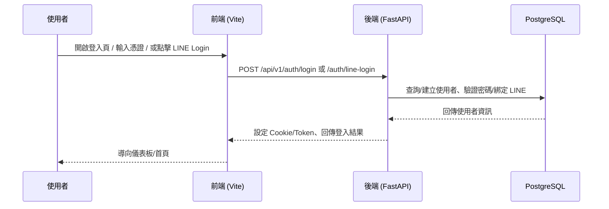
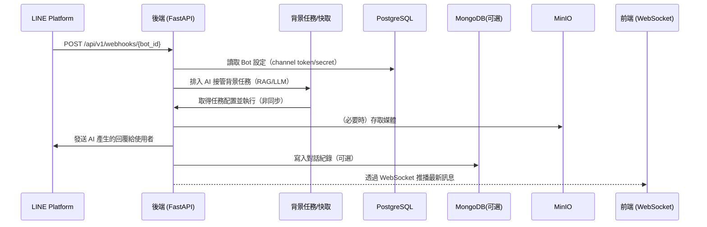

# 系統流程圖（LineBot-Web）

以下以兩個常見流程示意：使用者登入、LINE Webhook → AI 回覆流程。

## 使用者登入流程（帳密/LINE Login）

## LINE Webhook → 背景任務（AI 回覆）

備註
- 背景任務實際由後端的任務管理器與服務模組協同運作（詳見 `app/services/`）
- AI 供應商預設為 Groq，可改為 Gemini；模型與參數可在 Bot 設定或環境變數調整
