# LineBot-Web 系統流程圖

本文件說明 LineBot-Web 專案的主要業務流程，包含使用者登入、Bot 建立、Webhook 處理、AI 知識庫等核心功能流程。

## 目錄

- [使用者註冊與登入流程](#使用者註冊與登入流程)
- [LINE Login 流程](#line-login-流程)
- [Bot 建立與設定流程](#bot-建立與設定流程)
- [Webhook 事件處理流程](#webhook-事件處理流程)
- [AI 知識庫處理流程](#ai-知識庫處理流程)
- [視覺化編輯器互動流程](#視覺化編輯器互動流程)
- [訊息廣播流程](#訊息廣播流程)

---

## 使用者註冊與登入流程

### 一般帳密註冊流程

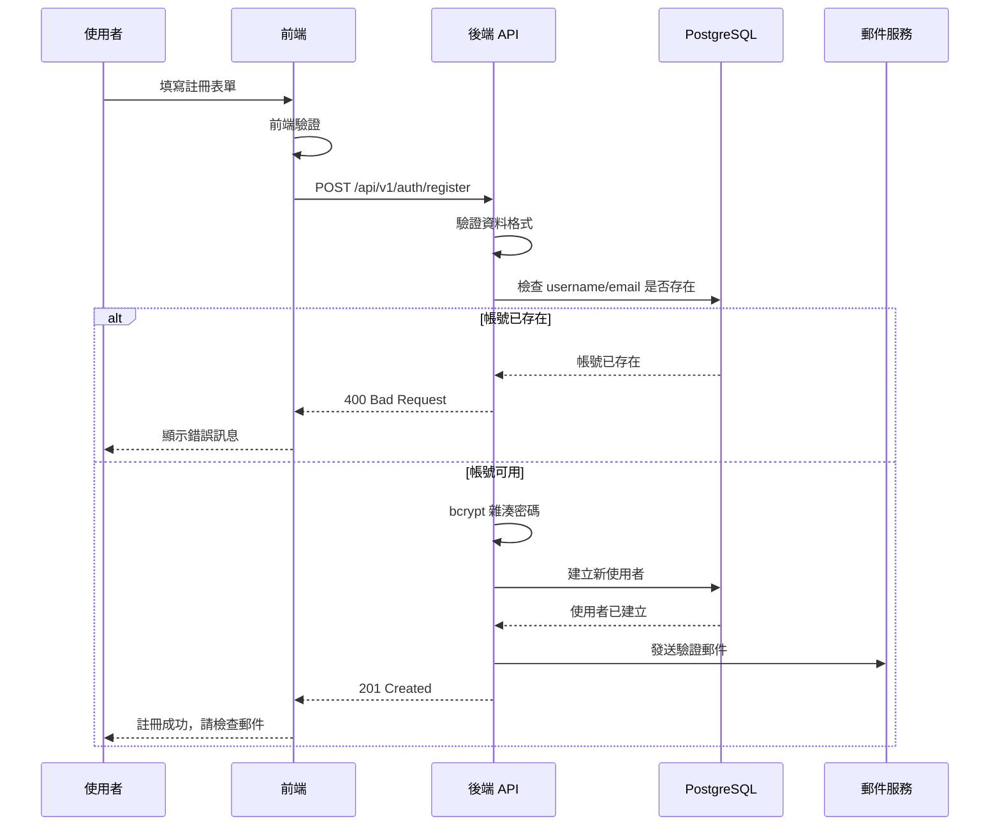

### 一般帳密登入流程

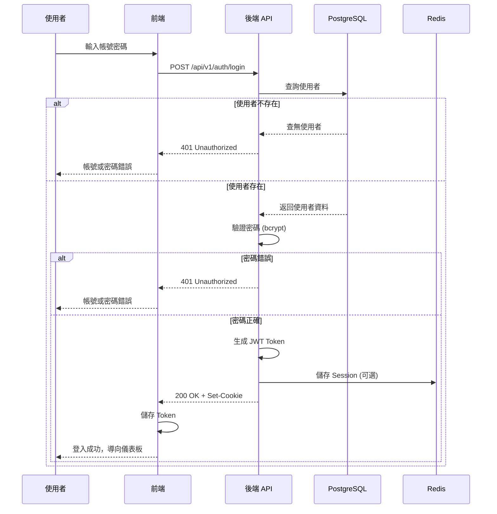

---

## LINE Login 流程

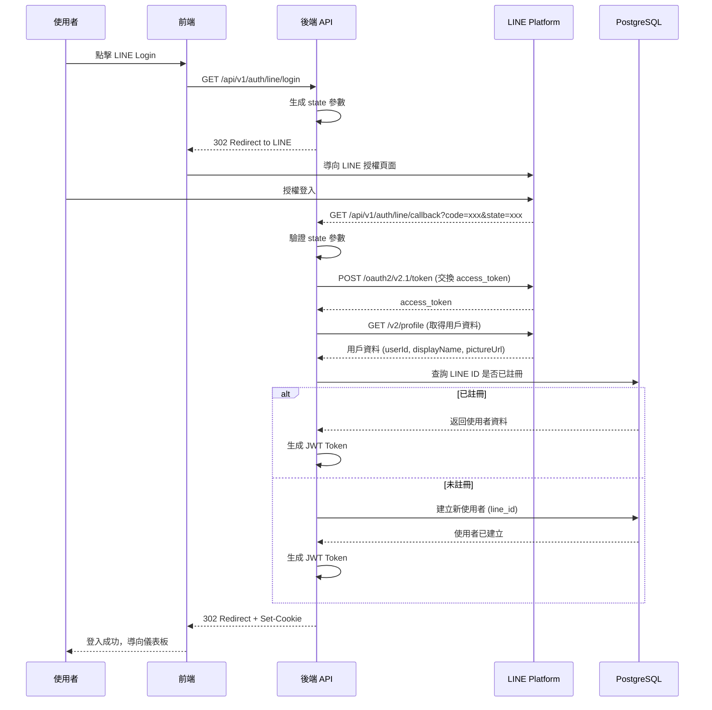

---

## Bot 建立與設定流程

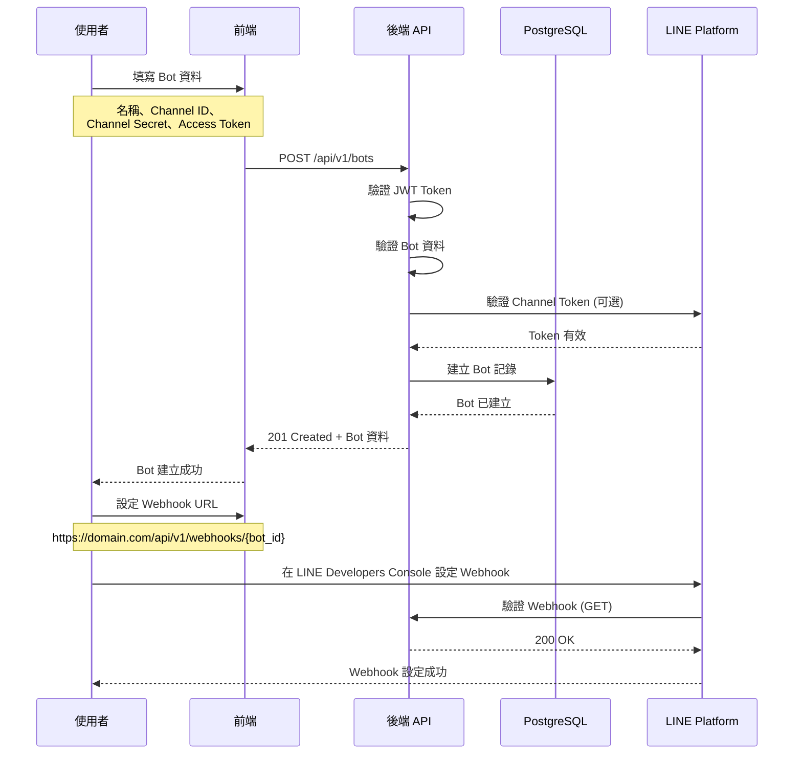

---

## Webhook 事件處理流程

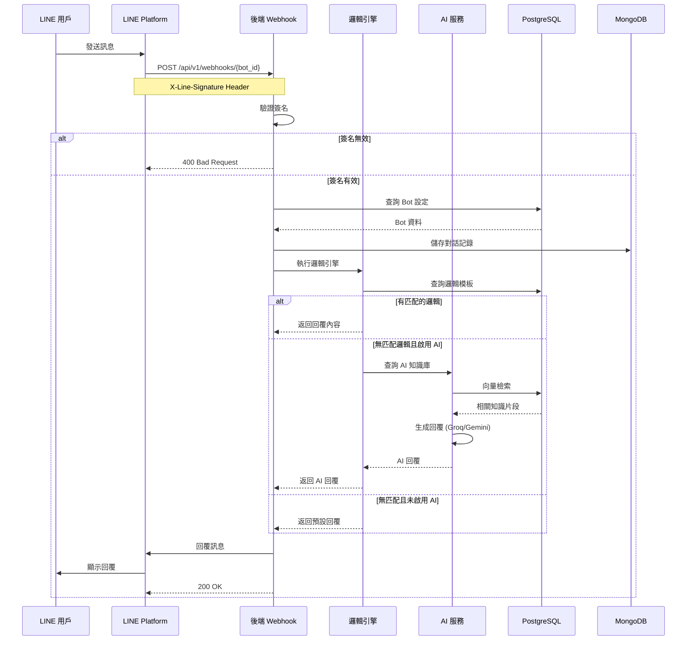

---

## AI 知識庫處理流程

### 知識上傳與處理

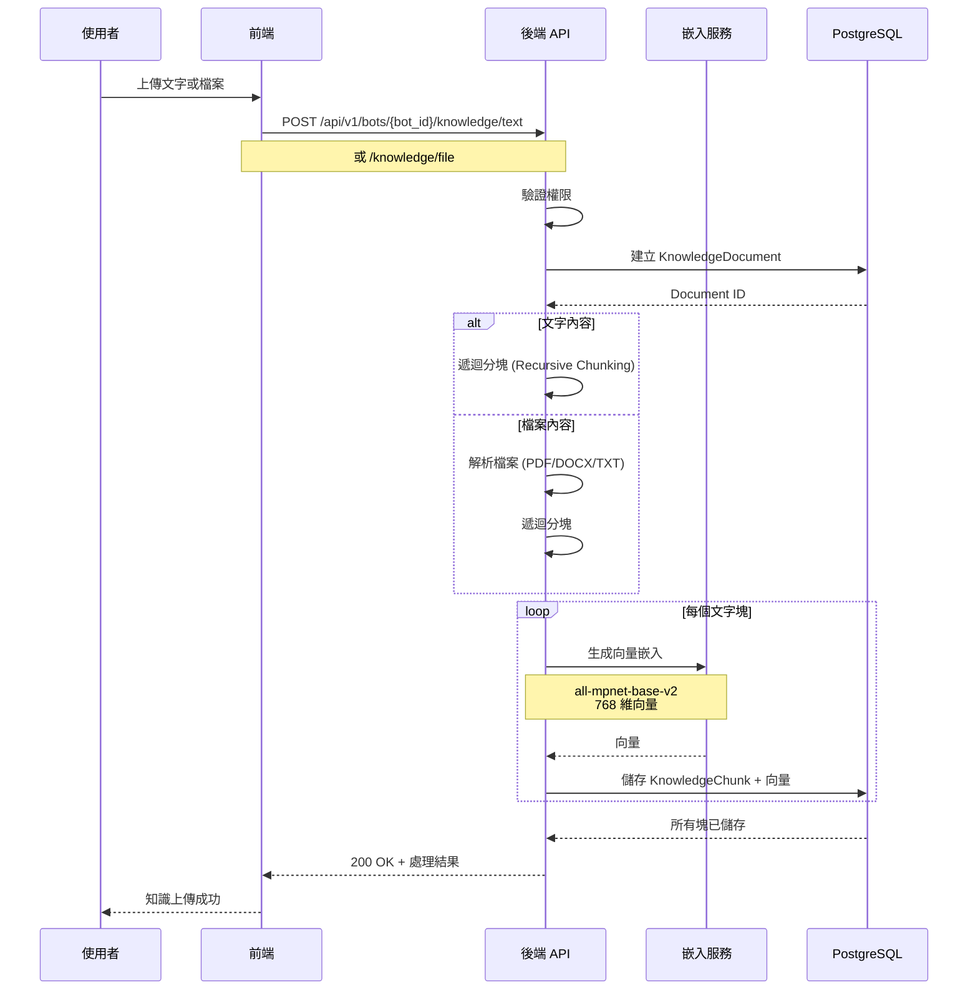

### AI 回覆生成流程

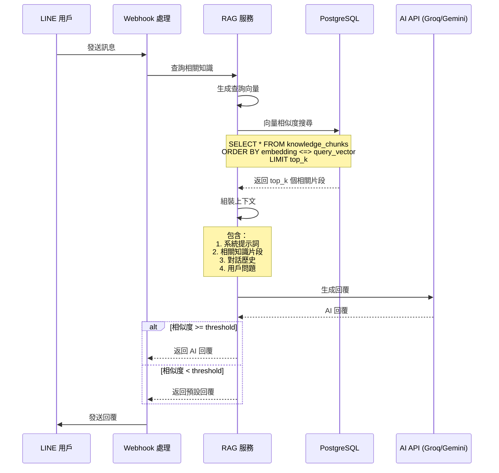

---

## 視覺化編輯器互動流程

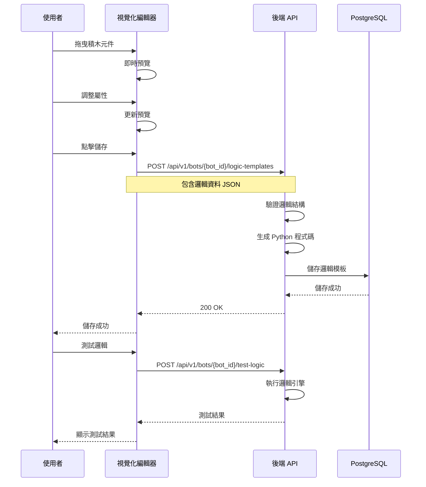

---

## 訊息廣播流程

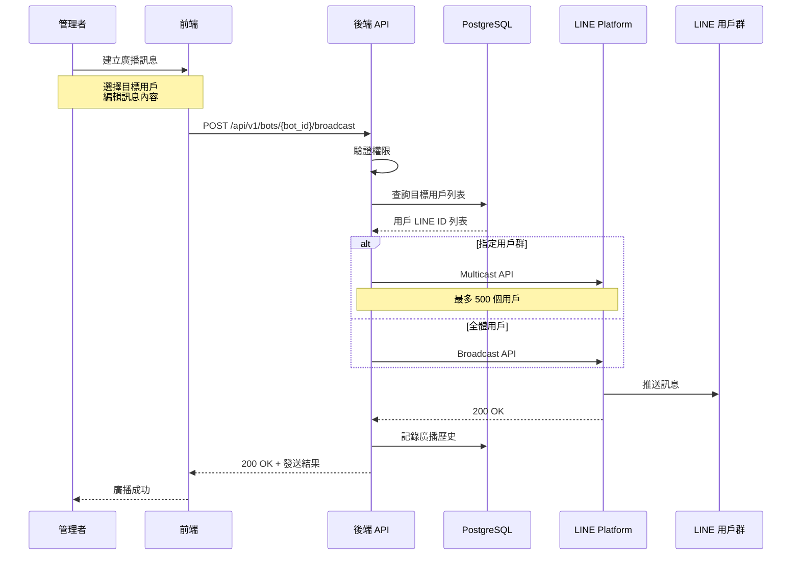

---

## Rich Menu 設定流程

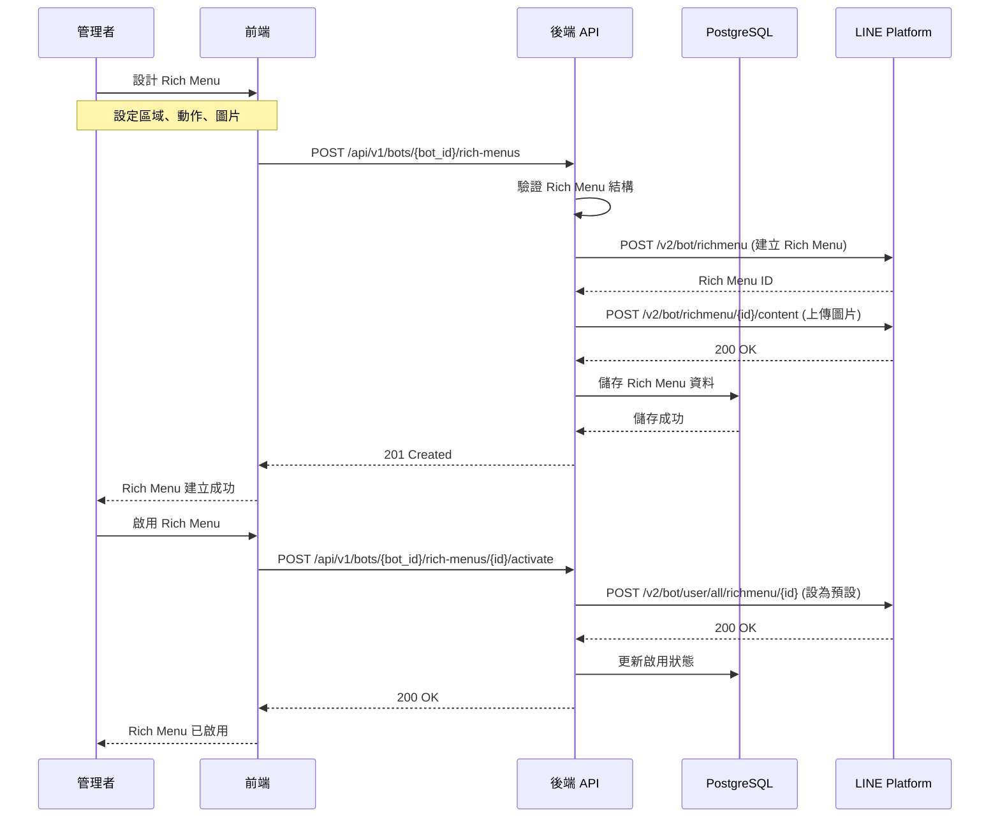

---

## 效能監控流程

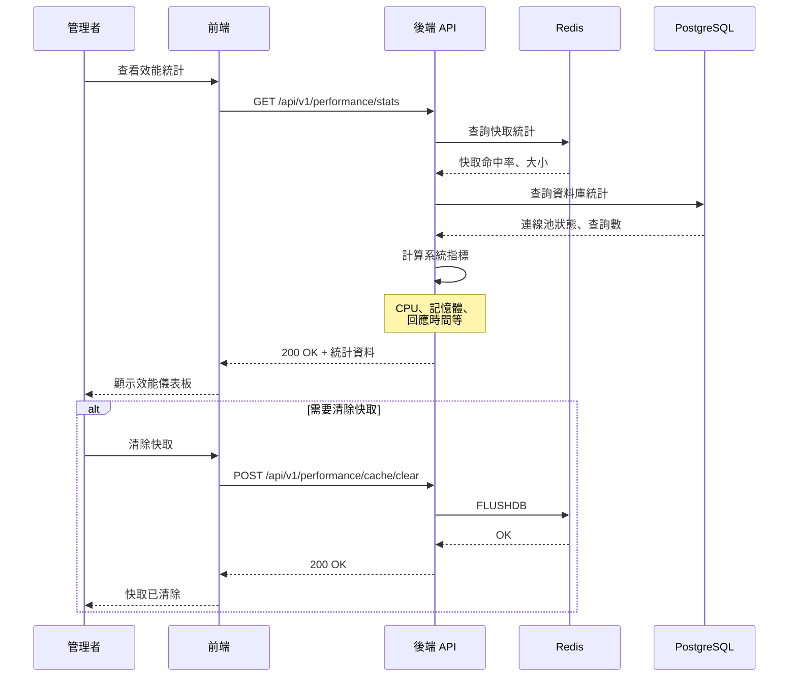

---

*本文件由 LineBot-Web 專案團隊維護*
*最後更新: 2025-10-24*

