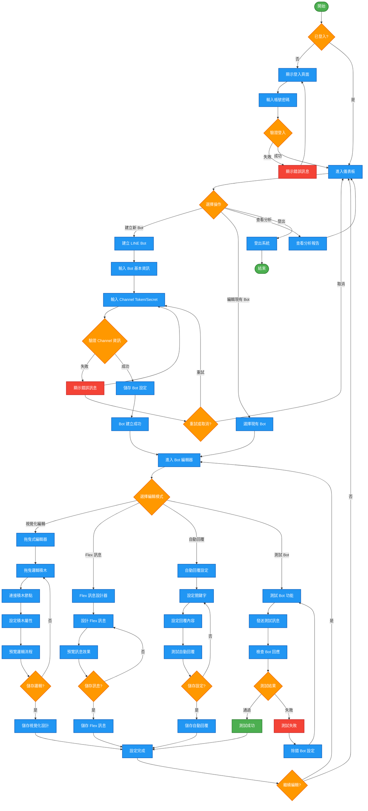
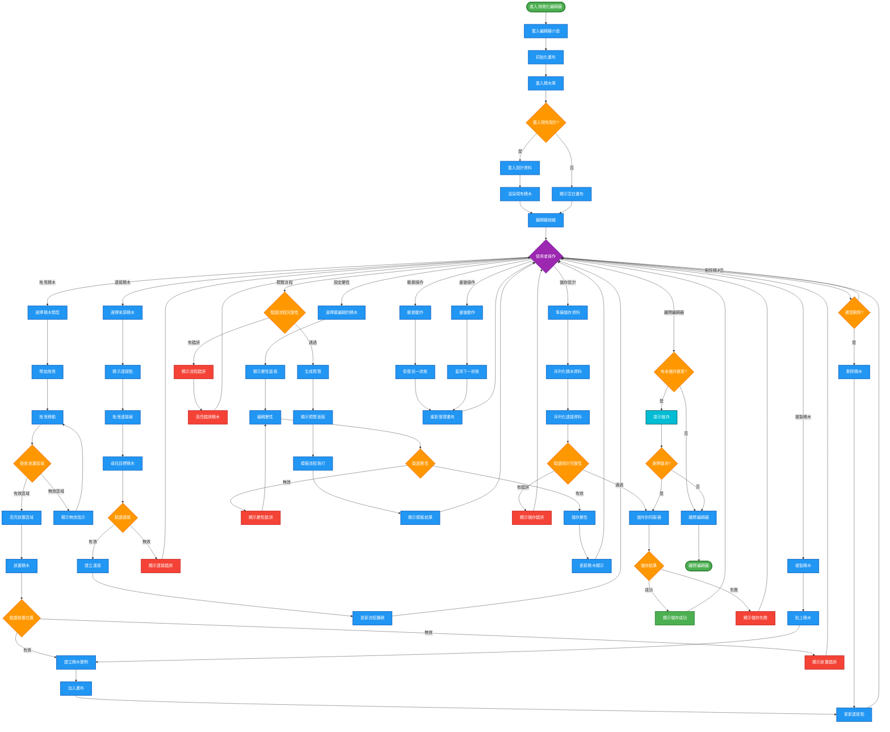

# LINE Bot 編輯設計系統 - UML 圖表集合

> 完整的 UML 圖表集合，包含使用案例圖、活動圖和循序圖，用於描述 LINE Bot 編輯設計系統的架構和流程。

## 📋 目錄

1. [使用案例圖 (Use Case Diagram)](#1-使用案例圖-use-case-diagram)
2. [用戶操作活動圖 (User Activity Diagram)](#2-用戶操作活動圖-user-activity-diagram)
3. [建立 LINE Bot 流程活動圖](#3-建立-line-bot-流程活動圖)
4. [拖曳式設計活動圖](#4-拖曳式設計活動圖)
5. [設計 LINE Bot 系統循序圖](#5-設計-line-bot-系統循序圖)
6. [建立 LINE Bot 系統循序圖](#6-建立-line-bot-系統循序圖)

---

## 1. 使用案例圖 (Use Case Diagram)

識別系統的主要參與者和核心使用案例，展示使用者、管理員、LINE 平台與系統功能之間的關係。

```mermaid
graph TB
    %% 參與者定義
    User[👤 使用者<br/>User]
    Admin[👨‍💼 管理員<br/>Admin]
    LineAPI[🤖 LINE 平台<br/>LINE API]
    System[🖥️ 系統<br/>System]

    %% 使用案例定義
    subgraph "LINE Bot 編輯設計系統"
        %% 認證相關
        UC1[登入系統<br/>Login]
        UC2[註冊帳號<br/>Register]
        UC3[忘記密碼<br/>Forget Password]
        
        %% Bot 管理
        UC4[建立 LINE Bot<br/>Create Bot]
        UC5[編輯 Bot 設定<br/>Edit Bot Settings]
        UC6[刪除 Bot<br/>Delete Bot]
        UC7[查看 Bot 列表<br/>View Bot List]
        
        %% 視覺化編輯
        UC8[拖曳式設計<br/>Drag-Drop Design]
        UC9[邏輯流程編輯<br/>Logic Flow Edit]
        UC10[Flex 訊息設計<br/>Flex Message Design]
        UC11[預覽訊息<br/>Preview Message]
        
        %% 訊息管理
        UC12[建立自動回覆<br/>Create Auto Reply]
        UC13[管理關鍵字<br/>Manage Keywords]
        UC14[發送測試訊息<br/>Send Test Message]
        
        %% 用戶管理
        UC15[查看用戶列表<br/>View Users]
        UC16[分析用戶行為<br/>Analyze User Behavior]
        UC17[管理用戶標籤<br/>Manage User Tags]
        
        %% 系統管理
        UC18[監控系統狀態<br/>Monitor System]
        UC19[管理權限<br/>Manage Permissions]
        UC20[備份資料<br/>Backup Data]
        
        %% Webhook 處理
        UC21[接收 LINE 事件<br/>Receive LINE Events]
        UC22[處理用戶訊息<br/>Process User Messages]
        UC23[發送回覆訊息<br/>Send Reply Messages]
    end

    %% 關係連接
    User --> UC1
    User --> UC2
    User --> UC3
    User --> UC4
    User --> UC5
    User --> UC6
    User --> UC7
    User --> UC8
    User --> UC9
    User --> UC10
    User --> UC11
    User --> UC12
    User --> UC13
    User --> UC14
    User --> UC15
    User --> UC16
    User --> UC17

    Admin --> UC18
    Admin --> UC19
    Admin --> UC20

    LineAPI --> UC21
    LineAPI --> UC22
    LineAPI --> UC23

    %% 包含關係
    UC4 -.->|includes| UC5
    UC8 -.->|includes| UC9
    UC8 -.->|includes| UC10
    UC10 -.->|includes| UC11
    UC12 -.->|includes| UC13

    %% 擴展關係
    UC14 -.->|extends| UC12
    UC16 -.->|extends| UC15

    %% 樣式
    classDef actor fill:#e1f5fe,stroke:#01579b,stroke-width:2px
    classDef usecase fill:#f3e5f5,stroke:#4a148c,stroke-width:1px
    classDef system fill:#e8f5e8,stroke:#1b5e20,stroke-width:2px

    class User,Admin,LineAPI actor
    class UC1,UC2,UC3,UC4,UC5,UC6,UC7,UC8,UC9,UC10,UC11,UC12,UC13,UC14,UC15,UC16,UC17,UC18,UC19,UC20,UC21,UC22,UC23 usecase
```

### 主要參與者說明

- **使用者 (User)**: 使用系統建立和管理 LINE Bot 的一般用戶
- **管理員 (Admin)**: 負責系統管理和維護的管理人員
- **LINE 平台 (LINE API)**: 提供 LINE Bot 服務的外部平台
- **系統 (System)**: LINE Bot 編輯設計系統本身

---

## 2. 用戶操作活動圖 (User Activity Diagram)

描繪使用者從登入到完成 Bot 設定的完整操作流程，包含決策點、分支流程和錯誤處理路徑。

---

## 3. 建立 LINE Bot 流程活動圖

詳細說明建立新 LINE Bot 的步驟流程，包含初始化、設定參數、連接 LINE API、測試驗證等階段。

```mermaid
flowchart TD
    Start([開始建立 LINE Bot]) --> InitForm[初始化建立表單]

    %% 基本資訊輸入
    InitForm --> InputBasicInfo[輸入 Bot 基本資訊]
    InputBasicInfo --> ValidateBasicInfo{驗證基本資訊}
    ValidateBasicInfo -->|格式錯誤| ShowBasicError[顯示格式錯誤]
    ShowBasicError --> InputBasicInfo
    ValidateBasicInfo -->|通過| InputChannelInfo[輸入 LINE Channel 資訊]

    %% Channel 資訊設定
    InputChannelInfo --> ValidateChannelFormat{驗證 Channel 格式}
    ValidateChannelFormat -->|格式錯誤| ShowChannelError[顯示格式錯誤]
    ShowChannelError --> InputChannelInfo
    ValidateChannelFormat -->|通過| TestConnection[測試 LINE API 連接]

    %% API 連接測試
    TestConnection --> APITest{API 連接測試}
    APITest -->|失敗| ConnectionError[連接失敗]
    ConnectionError --> ShowConnectionError[顯示連接錯誤訊息]
    ShowConnectionError --> RetryConnection{重試連接?}
    RetryConnection -->|是| TestConnection
    RetryConnection -->|否| InputChannelInfo

    APITest -->|成功| CreateBotRecord[建立 Bot 記錄]

    %% 資料庫操作
    CreateBotRecord --> SaveToDatabase[儲存到資料庫]
    SaveToDatabase --> DatabaseOperation{資料庫操作}
    DatabaseOperation -->|失敗| DatabaseError[資料庫錯誤]
    DatabaseError --> ShowDatabaseError[顯示資料庫錯誤]
    ShowDatabaseError --> RetryDatabase{重試儲存?}
    RetryDatabase -->|是| SaveToDatabase
    RetryDatabase -->|否| CleanupFailed[清理失敗資料]
    CleanupFailed --> End([建立失敗])

    DatabaseOperation -->|成功| SetupWebhook[設定 Webhook URL]

    %% Webhook 設定
    SetupWebhook --> ConfigureWebhook[配置 Webhook 端點]
    ConfigureWebhook --> RegisterWebhook[向 LINE 註冊 Webhook]
    RegisterWebhook --> WebhookTest{Webhook 註冊測試}
    WebhookTest -->|失敗| WebhookError[Webhook 設定失敗]
    WebhookError --> ShowWebhookError[顯示 Webhook 錯誤]
    ShowWebhookError --> RetryWebhook{重試設定?}
    RetryWebhook -->|是| SetupWebhook
    RetryWebhook -->|否| PartialSuccess[部分成功 - Bot 已建立但 Webhook 未設定]

    WebhookTest -->|成功| InitializeBot[初始化 Bot 設定]

    %% Bot 初始化
    InitializeBot --> SetDefaultSettings[設定預設參數]
    SetDefaultSettings --> CreateDefaultTemplates[建立預設模板]
    CreateDefaultTemplates --> SetupAutoReply[設定基本自動回覆]
    SetupAutoReply --> EnableBot[啟用 Bot]

    %% 驗證測試
    EnableBot --> SendWelcomeMessage[發送歡迎訊息測試]
    SendWelcomeMessage --> FinalTest{最終測試}
    FinalTest -->|失敗| FinalTestError[最終測試失敗]
    FinalTestError --> ShowFinalError[顯示測試錯誤]
    ShowFinalError --> DebugBot[進入除錯模式]
    DebugBot --> ManualFix[手動修正設定]
    ManualFix --> SendWelcomeMessage

    FinalTest -->|成功| BotCreated[Bot 建立成功]

    %% 後續設定
    BotCreated --> ShowSuccessMessage[顯示成功訊息]
    ShowSuccessMessage --> OfferNextSteps[提供後續設定選項]
    OfferNextSteps --> NextStepChoice{選擇後續動作}
    NextStepChoice -->|立即設計| GoToDesigner[前往視覺化設計器]
    NextStepChoice -->|稍後設定| GoToDashboard[返回儀表板]
    NextStepChoice -->|查看教學| ShowTutorial[顯示使用教學]

    %% 結束點
    GoToDesigner --> DesignerEnd([進入設計器])
    GoToDashboard --> DashboardEnd([返回儀表板])
    ShowTutorial --> TutorialEnd([顯示教學])
    PartialSuccess --> PartialEnd([部分成功])

    %% 並行處理
    parallel1[發送通知郵件]
    parallel2[記錄操作日誌]
    parallel3[更新使用統計]

    BotCreated --> parallel1
    BotCreated --> parallel2
    BotCreated --> parallel3

    parallel1 --> ShowSuccessMessage
    parallel2 --> ShowSuccessMessage
    parallel3 --> ShowSuccessMessage

    %% 樣式定義
    classDef startEnd fill:#4caf50,stroke:#2e7d32,stroke-width:3px,color:#fff
    classDef process fill:#2196f3,stroke:#1565c0,stroke-width:2px,color:#fff
    classDef decision fill:#ff9800,stroke:#ef6c00,stroke-width:2px,color:#fff
    classDef error fill:#f44336,stroke:#c62828,stroke-width:2px,color:#fff
    classDef success fill:#4caf50,stroke:#2e7d32,stroke-width:2px,color:#fff
    classDef parallel fill:#9c27b0,stroke:#6a1b9a,stroke-width:2px,color:#fff
    classDef warning fill:#ff5722,stroke:#d84315,stroke-width:2px,color:#fff

    class Start,End,DesignerEnd,DashboardEnd,TutorialEnd,PartialEnd startEnd
    class InitForm,InputBasicInfo,InputChannelInfo,TestConnection,CreateBotRecord,SaveToDatabase,SetupWebhook,ConfigureWebhook,RegisterWebhook,InitializeBot,SetDefaultSettings,CreateDefaultTemplates,SetupAutoReply,EnableBot,SendWelcomeMessage,ShowSuccessMessage,OfferNextSteps,GoToDesigner,GoToDashboard,ShowTutorial,CleanupFailed,DebugBot,ManualFix process
    class ValidateBasicInfo,ValidateChannelFormat,APITest,DatabaseOperation,WebhookTest,FinalTest,RetryConnection,RetryDatabase,RetryWebhook,NextStepChoice decision
    class ShowBasicError,ShowChannelError,ConnectionError,ShowConnectionError,DatabaseError,ShowDatabaseError,WebhookError,ShowWebhookError,FinalTestError,ShowFinalError error
    class BotCreated success
    class parallel1,parallel2,parallel3 parallel
    class PartialSuccess warning
```

---

## 4. 拖曳式設計活動圖

展示使用者使用拖曳介面設計對話流程的互動過程，包含元件選擇、拖曳放置、連接節點、屬性設定等操作。

---
