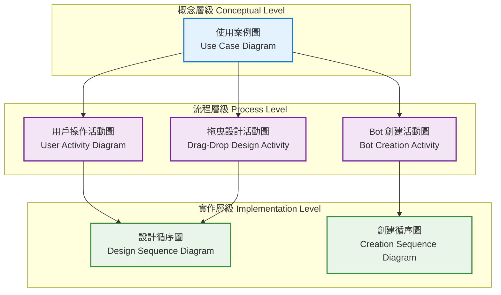

# LINE Bot 編輯設計系統 - UML 圖表總覽

> 完整的 UML 圖表總覽，提供 LINE Bot 編輯設計系統的全面視角

## 📋 圖表索引

| 圖表類型 | 圖表名稱 | 文件位置 | 描述 |
|---------|---------|---------|------|
| **使用案例圖** | Use Case Diagram | [uml-diagrams.md](./uml-diagrams.md#1-使用案例圖-use-case-diagram) | 識別系統主要參與者和核心功能 |
| **活動圖** | User Activity Diagram | [uml-diagrams.md](./uml-diagrams.md#2-用戶操作活動圖-user-activity-diagram) | 用戶從登入到完成設定的操作流程 |
| **活動圖** | Bot Creation Activity Diagram | [uml-diagrams.md](./uml-diagrams.md#3-建立-line-bot-流程活動圖) | 建立 LINE Bot 的詳細步驟流程 |
| **活動圖** | Drag-Drop Design Activity Diagram | [uml-diagrams.md](./uml-diagrams.md#4-拖曳式設計活動圖) | 視覺化編輯器的互動流程 |
| **循序圖** | Design Sequence Diagram | [sequence-diagrams.md](./sequence-diagrams.md#1-設計-line-bot-系統循序圖) | 設計階段的系統互動時序 |
| **循序圖** | Creation Sequence Diagram | [sequence-diagrams.md](./sequence-diagrams.md#2-建立-line-bot-系統循序圖) | Bot 創建時的系統互動時序 |

## 🎯 圖表關係與用途

### 1. 系統概覽層級
- **使用案例圖**: 提供系統功能的高層次概覽
- 適用於：需求分析、系統規劃、利害關係人溝通

### 2. 業務流程層級
- **用戶操作活動圖**: 展示完整的用戶操作流程
- **Bot 創建活動圖**: 詳細的 Bot 建立流程
- **拖曳設計活動圖**: 視覺化編輯器的操作流程
- 適用於：業務分析、用戶體驗設計、流程優化

### 3. 系統互動層級
- **設計循序圖**: 設計階段的系統元件互動
- **創建循序圖**: Bot 創建時的系統互動
- 適用於：系統設計、API 設計、技術實作

## 🔄 圖表間的關聯性

## 📊 圖表使用指南

### 開發階段對應

| 開發階段 | 建議使用的圖表 | 目的 |
|---------|---------------|------|
| **需求分析** | 使用案例圖 | 確定系統功能範圍 |
| **系統設計** | 活動圖 + 循序圖 | 設計業務流程和系統架構 |
| **詳細設計** | 循序圖 | 定義 API 和元件互動 |
| **開發實作** | 循序圖 | 指導程式碼實作 |
| **測試驗證** | 活動圖 | 設計測試案例 |
| **文檔撰寫** | 全部圖表 | 完整的系統說明 |

### 不同角色的使用建議

#### 🎨 產品經理 / 業務分析師
- **主要關注**: 使用案例圖、用戶操作活動圖
- **用途**: 理解業務需求、規劃產品功能

#### 🏗️ 系統架構師
- **主要關注**: 循序圖、系統架構相關活動圖
- **用途**: 設計系統架構、定義元件互動

#### 💻 開發工程師
- **主要關注**: 循序圖、詳細活動圖
- **用途**: 理解實作細節、API 設計

#### 🧪 測試工程師
- **主要關注**: 活動圖、使用案例圖
- **用途**: 設計測試案例、驗證業務流程

#### 📚 技術文件撰寫者
- **主要關注**: 全部圖表
- **用途**: 撰寫完整的系統文檔

## 🔧 維護與更新

### 更新時機
- 新增功能時：更新相關的使用案例圖和活動圖
- 架構變更時：更新循序圖和系統互動流程
- API 變更時：更新循序圖中的訊息傳遞
- 流程優化時：更新對應的活動圖

### 維護原則
1. **一致性**: 確保圖表間的一致性
2. **即時性**: 隨系統變更即時更新
3. **完整性**: 保持圖表的完整性和準確性
4. **可讀性**: 維持圖表的清晰度和可讀性

### 版本控制
- 圖表文件納入版本控制系統
- 重大變更時建立版本標籤
- 保留變更歷史記錄

## 📝 相關文檔

- [系統架構文檔](../architecture/)
- [API 文檔](../api/)
- [部署指南](../deployment/)
- [前端開發指南](../frontend/)

---

> 💡 **提示**: 這些 UML 圖表是理解和開發 LINE Bot 編輯設計系統的重要工具。建議開發團隊定期檢視和更新這些圖表，確保它們與實際系統保持同步。
