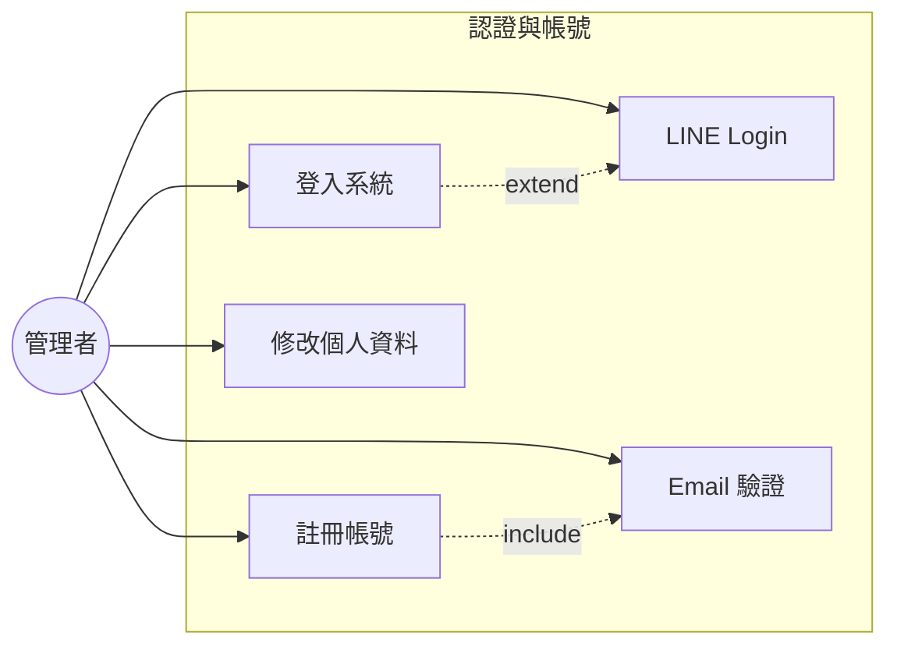
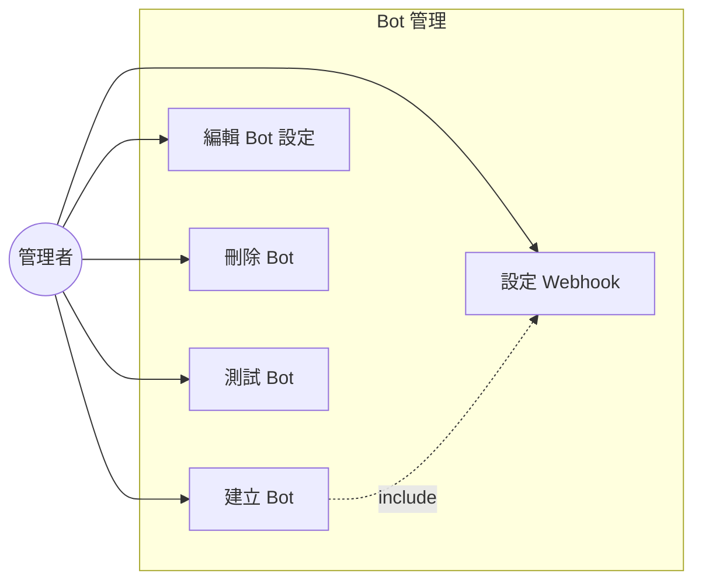
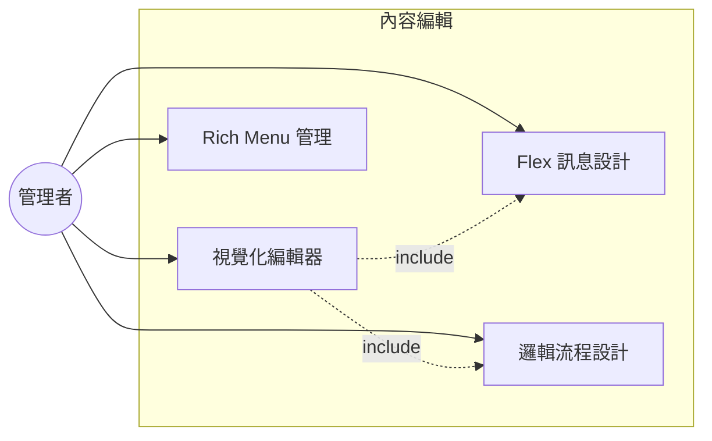
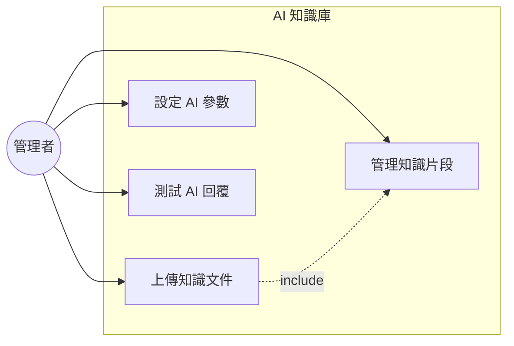
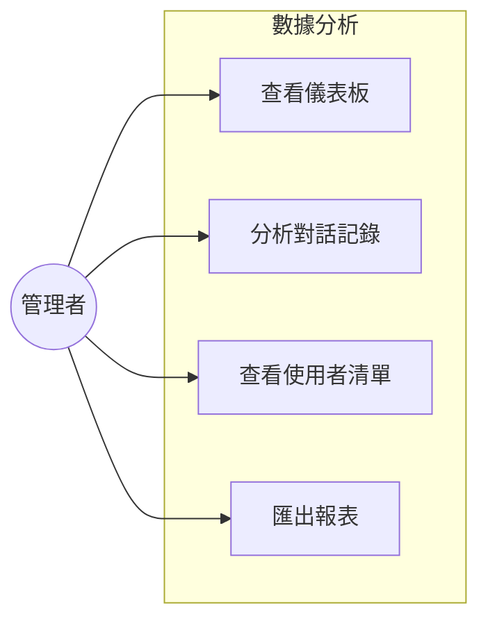
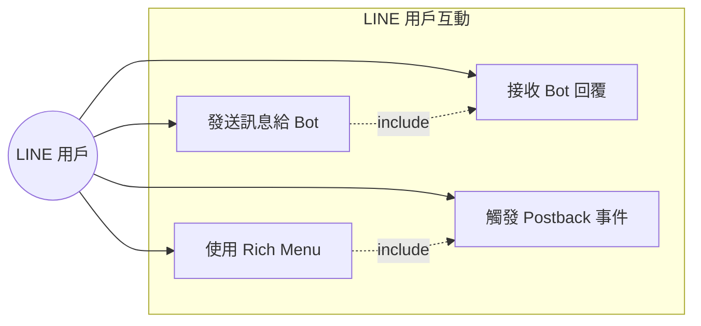
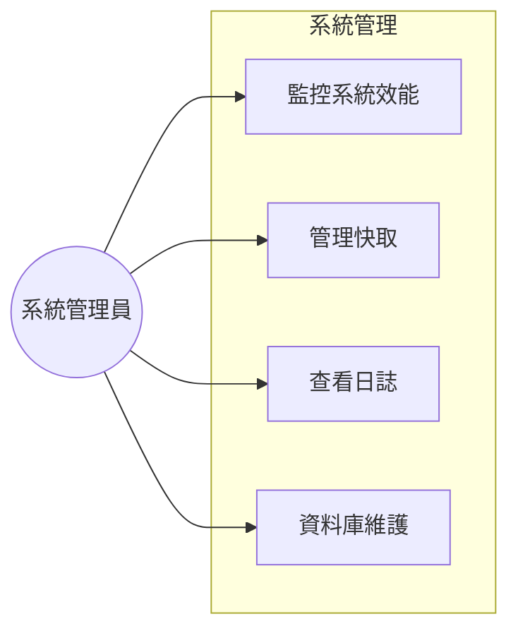

# LineBot-Web 使用案例圖

本文件說明 LineBot-Web 專案的主要使用案例，包含不同角色的使用情境與功能。

## 目錄

- [系統角色定義](#系統角色定義)
- [整體使用案例圖](#整體使用案例圖)
- [管理者使用案例](#管理者使用案例)
- [LINE 用戶使用案例](#line-用戶使用案例)
- [系統管理員使用案例](#系統管理員使用案例)

---

## 系統角色定義

| 角色 | 說明 | 主要功能 |
|------|------|----------|
| **管理者** | Bot 擁有者，負責建立與管理 LINE Bot | Bot 管理、內容編輯、數據分析 |
| **LINE 用戶** | 與 LINE Bot 互動的終端使用者 | 發送訊息、接收回覆、使用 Rich Menu |
| **系統管理員** | 平台維運人員 | 系統監控、效能優化、資料庫管理 |

---

## 整體使用案例圖

```mermaid
graph TB
    subgraph "LineBot-Web 系統"
        subgraph "認證與帳號管理"
            UC1[註冊帳號]
            UC2[登入系統]
            UC3[LINE Login]
            UC4[Email 驗證]
            UC5[修改個人資料]
        end

        subgraph "Bot 管理"
            UC6[建立 Bot]
            UC7[編輯 Bot 設定]
            UC8[刪除 Bot]
            UC9[設定 Webhook]
            UC10[測試 Bot]
        end

        subgraph "內容編輯"
            UC11[視覺化編輯器]
            UC12[Flex 訊息設計]
            UC13[Rich Menu 管理]
            UC14[邏輯流程設計]
        end

        subgraph "AI 知識庫"
            UC15[上傳知識文件]
            UC16[管理知識片段]
            UC17[設定 AI 參數]
            UC18[測試 AI 回覆]
        end

        subgraph "數據分析"
            UC19[查看儀表板]
            UC20[分析對話記錄]
            UC21[查看使用者清單]
            UC22[匯出報表]
        end

        subgraph "訊息管理"
            UC23[廣播訊息]
            UC24[推送訊息給特定用戶]
            UC25[查看訊息歷史]
        end

        subgraph "LINE 用戶互動"
            UC26[發送訊息給 Bot]
            UC27[接收 Bot 回覆]
            UC28[使用 Rich Menu]
            UC29[觸發 Postback 事件]
        end

        subgraph "系統管理"
            UC30[監控系統效能]
            UC31[管理快取]
            UC32[查看日誌]
            UC33[資料庫維護]
        end
    end

    %% 角色
    Admin((管理者))
    LineUser((LINE 用戶))
    SysAdmin((系統管理員))

    %% 管理者使用案例
    Admin --> UC1
    Admin --> UC2
    Admin --> UC3
    Admin --> UC4
    Admin --> UC5
    Admin --> UC6
    Admin --> UC7
    Admin --> UC8
    Admin --> UC9
    Admin --> UC10
    Admin --> UC11
    Admin --> UC12
    Admin --> UC13
    Admin --> UC14
    Admin --> UC15
    Admin --> UC16
    Admin --> UC17
    Admin --> UC18
    Admin --> UC19
    Admin --> UC20
    Admin --> UC21
    Admin --> UC22
    Admin --> UC23
    Admin --> UC24
    Admin --> UC25

    %% LINE 用戶使用案例
    LineUser --> UC26
    LineUser --> UC27
    LineUser --> UC28
    LineUser --> UC29

    %% 系統管理員使用案例
    SysAdmin --> UC30
    SysAdmin --> UC31
    SysAdmin --> UC32
    SysAdmin --> UC33

    %% 樣式
    classDef adminUC fill:#e3f2fd,stroke:#1565c0,stroke-width:2px
    classDef userUC fill:#fff3e0,stroke:#ef6c00,stroke-width:2px
    classDef sysUC fill:#f3e5f5,stroke:#6a1b9a,stroke-width:2px

    class UC1,UC2,UC3,UC4,UC5,UC6,UC7,UC8,UC9,UC10,UC11,UC12,UC13,UC14,UC15,UC16,UC17,UC18,UC19,UC20,UC21,UC22,UC23,UC24,UC25 adminUC
    class UC26,UC27,UC28,UC29 userUC
    class UC30,UC31,UC32,UC33 sysUC
```

---

## 管理者使用案例

### 1. 認證與帳號管理

**使用案例說明：**

- **UC1: 註冊帳號**
  - **前置條件**: 無
  - **主要流程**: 
    1. 填寫 username、email、password
    2. 系統驗證資料格式
    3. 發送驗證郵件
    4. 完成註冊
  - **後置條件**: 帳號已建立，等待 Email 驗證

- **UC2: 登入系統**
  - **前置條件**: 已註冊帳號
  - **主要流程**:
    1. 輸入帳號密碼
    2. 系統驗證身份
    3. 生成 JWT Token
    4. 導向儀表板
  - **後置條件**: 已登入，可使用系統功能

- **UC3: LINE Login**
  - **前置條件**: 無
  - **主要流程**:
    1. 點擊 LINE Login
    2. 導向 LINE 授權頁面
    3. 授權後返回系統
    4. 自動建立或登入帳號
  - **後置條件**: 已登入，LINE ID 已綁定

### 2. Bot 管理

**使用案例說明：**

- **UC6: 建立 Bot**
  - **前置條件**: 已登入，已在 LINE Developers 建立 Channel
  - **主要流程**:
    1. 填寫 Bot 名稱
    2. 輸入 Channel ID、Secret、Access Token
    3. 系統驗證 Token 有效性
    4. 建立 Bot 記錄
  - **後置條件**: Bot 已建立，可進行設定

- **UC9: 設定 Webhook**
  - **前置條件**: Bot 已建立
  - **主要流程**:
    1. 複製 Webhook URL
    2. 在 LINE Developers Console 設定
    3. LINE 驗證 Webhook
    4. 啟用 Webhook
  - **後置條件**: Webhook 已啟用，可接收事件

### 3. 內容編輯

**使用案例說明：**

- **UC11: 視覺化編輯器**
  - **前置條件**: Bot 已建立
  - **主要流程**:
    1. 拖曳積木元件
    2. 設定事件觸發條件
    3. 設定回覆內容
    4. 預覽與測試
    5. 儲存邏輯
  - **後置條件**: 邏輯已儲存，可在 Webhook 中執行

- **UC12: Flex 訊息設計**
  - **前置條件**: Bot 已建立
  - **主要流程**:
    1. 選擇 Flex 模板
    2. 可視化編輯內容
    3. 即時預覽效果
    4. 匯出 Flex JSON
    5. 儲存設計
  - **後置條件**: Flex 訊息已儲存，可用於回覆

### 4. AI 知識庫

**使用案例說明：**

- **UC15: 上傳知識文件**
  - **前置條件**: Bot 已建立
  - **主要流程**:
    1. 選擇文字或檔案 (PDF/DOCX/TXT)
    2. 上傳至系統
    3. 系統自動分塊
    4. 生成向量嵌入
    5. 儲存至知識庫
  - **後置條件**: 知識已加入，可用於 AI 回覆

- **UC17: 設定 AI 參數**
  - **前置條件**: Bot 已建立
  - **主要流程**:
    1. 啟用/停用 AI 接管
    2. 選擇 AI 提供者 (Groq/Gemini)
    3. 設定相似度閾值
    4. 設定 top_k 參數
    5. 設定系統提示詞
  - **後置條件**: AI 參數已更新

### 5. 數據分析

**使用案例說明：**

- **UC19: 查看儀表板**
  - **前置條件**: Bot 已建立且有互動數據
  - **主要流程**:
    1. 選擇 Bot
    2. 查看訊息量統計
    3. 查看活躍用戶數
    4. 查看回應時間
    5. 查看熱度圖
  - **後置條件**: 了解 Bot 使用情況

- **UC20: 分析對話記錄**
  - **前置條件**: 已啟用 MongoDB 對話記錄
  - **主要流程**:
    1. 選擇時間範圍
    2. 篩選特定用戶
    3. 查看對話內容
    4. 使用 AI 分析對話
    5. 獲得洞察建議
  - **後置條件**: 獲得營運決策參考

---

## LINE 用戶使用案例

**使用案例說明：**

- **UC26: 發送訊息給 Bot**
  - **前置條件**: 已加入 LINE Bot 好友
  - **主要流程**:
    1. 在 LINE 中輸入訊息
    2. 發送給 Bot
    3. LINE 平台轉發至 Webhook
    4. 系統處理訊息
  - **後置條件**: 訊息已處理，等待回覆

- **UC27: 接收 Bot 回覆**
  - **前置條件**: 已發送訊息
  - **主要流程**:
    1. 系統執行邏輯引擎
    2. 或查詢 AI 知識庫
    3. 生成回覆內容
    4. 透過 LINE API 推送
    5. 用戶收到回覆
  - **後置條件**: 用戶已收到回覆

- **UC28: 使用 Rich Menu**
  - **前置條件**: Bot 已設定 Rich Menu
  - **主要流程**:
    1. 點擊 Rich Menu 區域
    2. 觸發對應動作
    3. 發送訊息或開啟連結
  - **後置條件**: 動作已執行

---

## 系統管理員使用案例

**使用案例說明：**

- **UC30: 監控系統效能**
  - **前置條件**: 系統管理員權限
  - **主要流程**:
    1. 訪問 /api/v1/performance/stats
    2. 查看 CPU、記憶體使用率
    3. 查看資料庫連線池狀態
    4. 查看快取命中率
    5. 查看回應時間統計
  - **後置條件**: 了解系統健康狀況

- **UC31: 管理快取**
  - **前置條件**: 系統管理員權限
  - **主要流程**:
    1. 查看快取使用情況
    2. 清除特定快取
    3. 或清除全部快取
    4. 驗證清除結果
  - **後置條件**: 快取已更新

- **UC33: 資料庫維護**
  - **前置條件**: 系統管理員權限
  - **主要流程**:
    1. 執行資料庫遷移
    2. 建立索引
    3. 清理過期資料
    4. 備份資料庫
    5. 驗證資料完整性
  - **後置條件**: 資料庫已優化

---

## 使用情境範例

### 情境 1: 電商客服 Bot

**角色**: 電商管理者

**目標**: 建立自動客服 Bot，回答常見問題

**步驟**:
1. 註冊並登入系統
2. 建立新 Bot，設定 LINE Channel
3. 上傳產品 FAQ 文件至 AI 知識庫
4. 使用視覺化編輯器設計訂單查詢流程
5. 設計 Rich Menu 提供快速選單
6. 測試 Bot 回覆
7. 啟用 Webhook
8. 透過儀表板監控使用情況

### 情境 2: 活動報名 Bot

**角色**: 活動主辦方

**目標**: 建立活動報名與通知 Bot

**步驟**:
1. 建立 Bot 並設定 Webhook
2. 使用 Flex 訊息設計活動海報
3. 設計報名表單邏輯
4. 設定 Rich Menu 提供活動資訊
5. 收集報名資料
6. 使用廣播功能發送活動通知
7. 查看報名統計

### 情境 3: 教育問答 Bot

**角色**: 教育機構

**目標**: 建立課程諮詢與問答 Bot

**步驟**:
1. 建立 Bot
2. 上傳課程資料、FAQ 至知識庫
3. 啟用 AI 接管功能
4. 設定 AI 參數（相似度閾值、系統提示詞）
5. 測試 AI 回覆品質
6. 分析學生常見問題
7. 持續優化知識庫內容

---

*本文件由 LineBot-Web 專案團隊維護*
*最後更新: 2025-10-24*

