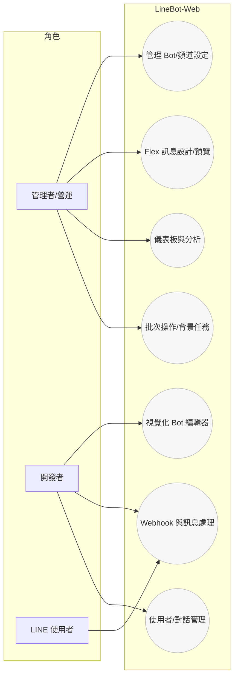

# 使用案例圖（LineBot-Web）

以簡化的 Mermaid 流程圖表達常見角色與使用情境。

```mermaid
flowchart LR
  subgraph Actors[角色]
    Admin[管理者/營運]
    Dev[開發者]
    EndUser[LINE 使用者]
  end

  subgraph System[LineBot-Web]
    UC1((管理 Bot/頻道設定))
    UC2((視覺化 Bot 編輯器))
    UC3((Flex 訊息設計/預覽))
    UC4((Webhook 與訊息處理))
    UC5((使用者/對話管理))
    UC6((儀表板與分析))
    UC7((批次操作/背景任務))
  end

  Admin --> UC1
  Admin --> UC3
  Admin --> UC6
  Admin --> UC7

  Dev --> UC2
  Dev --> UC4
  Dev --> UC5

  EndUser --> UC4

  classDef k fill:#f7f7f7,stroke:#bbb,stroke-width:1px,color:#333;
  class UC1,UC2,UC3,UC4,UC5,UC6,UC7 k;
```

補充說明
- 管理者/營運：偏重內容產製、營運活動與儀表板監控
- 開發者：偏重流程邏輯、Webhook 與資料處理整合
- LINE 使用者：與 Bot 對話互動，系統從 Webhook 事件中觸發後端流程
