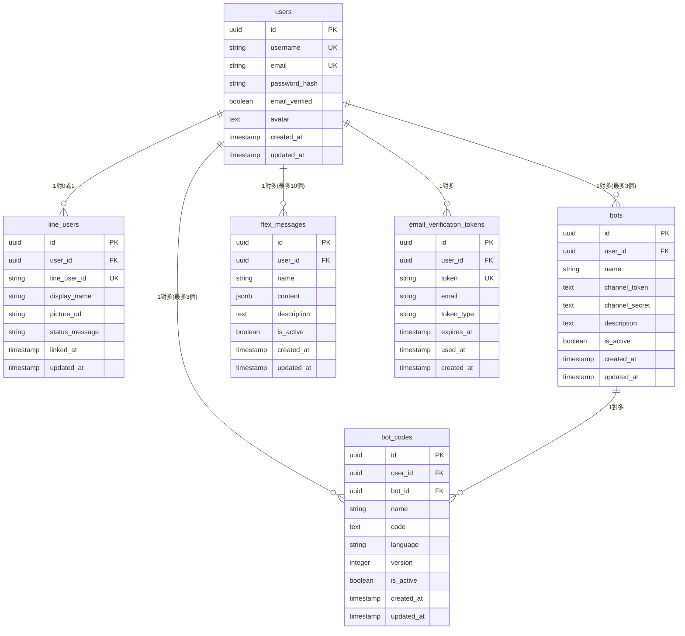

# LineBot-Web 統一 API 整合指令

## 任務目標
將現有的四個獨立微服務 API（LoginAPI、LINEloginAPI、PuzzleAPI、SettingAPI）統整為一個統一的 API 服務，簡化部署流程，同時保持所有功能完整性和架構清晰性。

## 現有架構概覽

### 目前的微服務架構
- **LoginAPI** (Port: 5501) - Flask + psycopg2 - 傳統帳號認證
- **LINEloginAPI** (Port: 5502) - Flask + SQLAlchemy - LINE OAuth 2.0 認證
- **PuzzleAPI** (Port: 5503) - FastAPI + SQLAlchemy - Bot 管理平台
- **SettingAPI** (Port: 5504) - Flask + psycopg2 - 用戶設定管理

### 共享資源
- PostgreSQL 資料庫
- JWT 認證系統
- SMTP 郵件服務
- 統一的 CORS 配置

## 統一 API 技術需求

### 1. 框架選擇
**推薦使用 FastAPI 作為統一框架**
- 支援高性能非同步處理
- 自動生成 OpenAPI 文檔
- 優秀的類型提示支援
- 與現有 PuzzleAPI 技術棧一致

### 2. 專案結構設計
```
unified_api/
├── app/
│   ├── __init__.py
│   ├── main.py                 # 主應用程式入口
│   ├── config.py               # 配置管理
│   ├── database.py             # 資料庫連接
│   ├── dependencies.py         # 依賴注入
│   ├── models/                 # 資料模型
│   │   ├── __init__.py
│   │   ├── user.py
│   │   ├── bot.py
│   │   └── line_user.py
│   ├── schemas/                # Pydantic 模型
│   │   ├── __init__.py
│   │   ├── auth.py
│   │   ├── bot.py
│   │   └── user.py
│   ├── routers/                # 路由模組
│   │   ├── __init__.py
│   │   ├── auth.py             # 整合 LoginAPI 功能
│   │   ├── line_auth.py        # 整合 LINEloginAPI 功能
│   │   ├── bot_management.py   # 整合 PuzzleAPI 功能
│   │   └── user_settings.py    # 整合 SettingAPI 功能
│   ├── services/               # 業務邏輯服務
│   │   ├── __init__.py
│   │   ├── auth_service.py
│   │   ├── line_service.py
│   │   ├── bot_service.py
│   │   ├── user_service.py
│   │   └── email_service.py
│   └── utils/                  # 工具函數
│       ├── __init__.py
│       ├── security.py
│       ├── email.py
│       └── validators.py
├── requirements.txt
├── Dockerfile
└── .env.example
```

## 功能整合要求

### 1. 認證系統整合 (auth.py)
**必須保留的功能：**
- 傳統用戶註冊（用戶名稱/Email）
- Email 驗證流程（24小時時效）
- 密碼重設功能（1小時時效）
- 多元登入方式（用戶名稱或 Email）
- JWT Token 生成、驗證、刷新
- 密碼雜湊安全儲存
- 重送驗證郵件冷卻機制（60秒）

**API 端點設計：**
```python
POST /api/auth/register          # 用戶註冊
POST /api/auth/login             # 用戶登入
POST /api/auth/verify-email      # Email 驗證
POST /api/auth/forgot-password   # 忘記密碼
POST /api/auth/reset-password    # 重設密碼
POST /api/auth/refresh-token     # 刷新 Token
POST /api/auth/logout            # 登出
```

### 2. LINE認證整合 (line_auth.py)
**必須保留的功能：**
- 完整 LINE OAuth 2.0 認證流程
- 用戶首次登入自動創建帳號
- 現有用戶 LINE 帳號連結
- LINE 用戶資料同步（ID、顯示名稱、頭像）
- 雙重認證支援

**API 端點設計：**
```python
GET /api/line-auth/login-url     # 取得 LINE 登入 URL
GET /api/line-auth/callback      # LINE OAuth 回調處理
POST /api/line-auth/link-account # 連結現有帳號
DELETE /api/line-auth/unlink     # 取消連結
GET /api/line-auth/profile       # 取得 LINE 用戶資料
```

### 3. Bot管理整合 (bot_management.py)
**必須保留的功能：**
- Bot CRUD 操作（每用戶限制 3 個）
- Flex Message 管理（每用戶限制 10 個）
- Bot 程式碼管理（每用戶限制 3 個）
- 資源使用限制檢查
- Bot 與程式碼關聯管理

**API 端點設計：**
```python
GET /api/bots                    # 取得用戶所有 Bot
POST /api/bots                   # 創建新 Bot
GET /api/bots/{bot_id}          # 取得特定 Bot
PUT /api/bots/{bot_id}          # 更新 Bot
DELETE /api/bots/{bot_id}       # 刪除 Bot

GET /api/flex-messages          # 取得 Flex Messages
POST /api/flex-messages         # 創建 Flex Message
PUT /api/flex-messages/{id}     # 更新 Flex Message
DELETE /api/flex-messages/{id}  # 刪除 Flex Message

GET /api/bot-codes              # 取得 Bot 程式碼
POST /api/bot-codes             # 創建 Bot 程式碼
PUT /api/bot-codes/{id}         # 更新 Bot 程式碼
DELETE /api/bot-codes/{id}      # 刪除 Bot 程式碼
```

### 4. 用戶設定整合 (user_settings.py)
**必須保留的功能：**
- 個人資料管理（用戶名稱、Email 修改）
- 頭像管理（Base64 上傳、更新、刪除）
- Email 變更重新驗證流程
- 頭像格式驗證（JPEG、PNG、GIF）
- 頭像大小限制（500KB）
- Base64 完整性檢查

**API 端點設計：**
```python
GET /api/user/profile           # 取得用戶資料
PUT /api/user/profile           # 更新用戶資料
PUT /api/user/avatar            # 更新頭像
DELETE /api/user/avatar         # 刪除頭像
PUT /api/user/email             # 更改 Email
PUT /api/user/password          # 更改密碼
```

## 資料庫架構設計

### 1. 資料庫概覽
- **資料庫類型**: PostgreSQL
- **主鍵策略**: UUID (使用 uuid-ossp 擴展)
- **ORM 框架**: SQLAlchemy
- **連接方式**: 連接池管理

### 2. 核心資料表設計

#### User 表 (用戶基本資料)
```sql
CREATE TABLE users (
    id UUID PRIMARY KEY DEFAULT uuid_generate_v4(),
    username VARCHAR(50) UNIQUE NOT NULL,
    email VARCHAR(255) UNIQUE NOT NULL,
    password_hash VARCHAR(255) NOT NULL,
    email_verified BOOLEAN DEFAULT FALSE,
    avatar TEXT NULL,  -- Base64 編碼的頭像資料
    created_at TIMESTAMP WITH TIME ZONE DEFAULT CURRENT_TIMESTAMP,
    updated_at TIMESTAMP WITH TIME ZONE DEFAULT CURRENT_TIMESTAMP
);

-- 索引優化
CREATE INDEX idx_users_username ON users(username);
CREATE INDEX idx_users_email ON users(email);
CREATE INDEX idx_users_email_verified ON users(email_verified);
```

#### LineUser 表 (LINE 帳號關聯)
```sql
CREATE TABLE line_users (
    id UUID PRIMARY KEY DEFAULT uuid_generate_v4(),
    user_id UUID NOT NULL REFERENCES users(id) ON DELETE CASCADE,
    line_user_id VARCHAR(255) UNIQUE NOT NULL,  -- LINE 平台的 user ID
    display_name VARCHAR(255),
    picture_url TEXT,
    status_message TEXT,
    linked_at TIMESTAMP WITH TIME ZONE DEFAULT CURRENT_TIMESTAMP,
    updated_at TIMESTAMP WITH TIME ZONE DEFAULT CURRENT_TIMESTAMP
);

-- 索引優化
CREATE INDEX idx_line_users_user_id ON line_users(user_id);
CREATE INDEX idx_line_users_line_user_id ON line_users(line_user_id);
```

#### Bot 表 (Bot 基本資料)
```sql
CREATE TABLE bots (
    id UUID PRIMARY KEY DEFAULT uuid_generate_v4(),
    user_id UUID NOT NULL REFERENCES users(id) ON DELETE CASCADE,
    name VARCHAR(100) NOT NULL,
    channel_token TEXT NOT NULL,
    channel_secret TEXT NOT NULL,
    description TEXT,
    is_active BOOLEAN DEFAULT TRUE,
    created_at TIMESTAMP WITH TIME ZONE DEFAULT CURRENT_TIMESTAMP,
    updated_at TIMESTAMP WITH TIME ZONE DEFAULT CURRENT_TIMESTAMP
);

-- 索引優化
CREATE INDEX idx_bots_user_id ON bots(user_id);
CREATE INDEX idx_bots_is_active ON bots(is_active);

-- 用戶 Bot 數量限制觸發器
CREATE OR REPLACE FUNCTION check_user_bot_limit()
RETURNS TRIGGER AS $$
BEGIN
    IF (SELECT COUNT(*) FROM bots WHERE user_id = NEW.user_id AND is_active = TRUE) > 3 THEN
        RAISE EXCEPTION 'User cannot have more than 3 active bots';
    END IF;
    RETURN NEW;
END;
$$ LANGUAGE plpgsql;

CREATE TRIGGER trigger_check_user_bot_limit
    BEFORE INSERT OR UPDATE ON bots
    FOR EACH ROW EXECUTE FUNCTION check_user_bot_limit();
```

#### BotCode 表 (Bot 程式碼)
```sql
CREATE TABLE bot_codes (
    id UUID PRIMARY KEY DEFAULT uuid_generate_v4(),
    user_id UUID NOT NULL REFERENCES users(id) ON DELETE CASCADE,
    bot_id UUID NOT NULL REFERENCES bots(id) ON DELETE CASCADE,
    name VARCHAR(100) NOT NULL,
    code TEXT NOT NULL,
    language VARCHAR(20) DEFAULT 'python',
    version INTEGER DEFAULT 1,
    is_active BOOLEAN DEFAULT TRUE,
    created_at TIMESTAMP WITH TIME ZONE DEFAULT CURRENT_TIMESTAMP,
    updated_at TIMESTAMP WITH TIME ZONE DEFAULT CURRENT_TIMESTAMP
);

-- 索引優化
CREATE INDEX idx_bot_codes_user_id ON bot_codes(user_id);
CREATE INDEX idx_bot_codes_bot_id ON bot_codes(bot_id);
CREATE INDEX idx_bot_codes_is_active ON bot_codes(is_active);

-- 用戶 BotCode 數量限制觸發器
CREATE OR REPLACE FUNCTION check_user_botcode_limit()
RETURNS TRIGGER AS $$
BEGIN
    IF (SELECT COUNT(*) FROM bot_codes WHERE user_id = NEW.user_id AND is_active = TRUE) > 3 THEN
        RAISE EXCEPTION 'User cannot have more than 3 active bot codes';
    END IF;
    RETURN NEW;
END;
$$ LANGUAGE plpgsql;

CREATE TRIGGER trigger_check_user_botcode_limit
    BEFORE INSERT OR UPDATE ON bot_codes
    FOR EACH ROW EXECUTE FUNCTION check_user_botcode_limit();
```

#### FlexMessage 表 (Flex Message 範本)
```sql
CREATE TABLE flex_messages (
    id UUID PRIMARY KEY DEFAULT uuid_generate_v4(),
    user_id UUID NOT NULL REFERENCES users(id) ON DELETE CASCADE,
    name VARCHAR(100) NOT NULL,
    content JSONB NOT NULL,  -- 使用 JSONB 儲存 Flex Message 結構
    description TEXT,
    is_active BOOLEAN DEFAULT TRUE,
    created_at TIMESTAMP WITH TIME ZONE DEFAULT CURRENT_TIMESTAMP,
    updated_at TIMESTAMP WITH TIME ZONE DEFAULT CURRENT_TIMESTAMP
);

-- 索引優化
CREATE INDEX idx_flex_messages_user_id ON flex_messages(user_id);
CREATE INDEX idx_flex_messages_is_active ON flex_messages(is_active);
CREATE INDEX idx_flex_messages_content ON flex_messages USING GIN (content);

-- 用戶 FlexMessage 數量限制觸發器
CREATE OR REPLACE FUNCTION check_user_flexmessage_limit()
RETURNS TRIGGER AS $$
BEGIN
    IF (SELECT COUNT(*) FROM flex_messages WHERE user_id = NEW.user_id AND is_active = TRUE) > 10 THEN
        RAISE EXCEPTION 'User cannot have more than 10 active flex messages';
    END IF;
    RETURN NEW;
END;
$$ LANGUAGE plpgsql;

CREATE TRIGGER trigger_check_user_flexmessage_limit
    BEFORE INSERT OR UPDATE ON flex_messages
    FOR EACH ROW EXECUTE FUNCTION check_user_flexmessage_limit();
```

#### EmailVerificationToken 表 (Email 驗證 Token)
```sql
CREATE TABLE email_verification_tokens (
    id UUID PRIMARY KEY DEFAULT uuid_generate_v4(),
    user_id UUID NOT NULL REFERENCES users(id) ON DELETE CASCADE,
    token VARCHAR(255) UNIQUE NOT NULL,
    email VARCHAR(255) NOT NULL,  -- 要驗證的 Email
    token_type VARCHAR(20) NOT NULL CHECK (token_type IN ('verify', 'reset')),
    expires_at TIMESTAMP WITH TIME ZONE NOT NULL,
    used_at TIMESTAMP WITH TIME ZONE NULL,
    created_at TIMESTAMP WITH TIME ZONE DEFAULT CURRENT_TIMESTAMP
);

-- 索引優化
CREATE INDEX idx_email_tokens_user_id ON email_verification_tokens(user_id);
CREATE INDEX idx_email_tokens_token ON email_verification_tokens(token);
CREATE INDEX idx_email_tokens_expires ON email_verification_tokens(expires_at);

-- 自動清理過期 Token
CREATE OR REPLACE FUNCTION cleanup_expired_tokens()
RETURNS void AS $$
BEGIN
    DELETE FROM email_verification_tokens
    WHERE expires_at < NOW() - INTERVAL '7 days';
END;
$$ LANGUAGE plpgsql;
```

### 3. 資料表關聯圖 (ERD)


### 4. SQLAlchemy 模型定義

#### models/user.py
```python
from sqlalchemy import Column, String, Boolean, Text, DateTime, func
from sqlalchemy.dialects.postgresql import UUID
from sqlalchemy.orm import relationship
import uuid

class User(Base):
    __tablename__ = 'users'
    
    id = Column(UUID(as_uuid=True), primary_key=True, default=uuid.uuid4)
    username = Column(String(50), unique=True, nullable=False, index=True)
    email = Column(String(255), unique=True, nullable=False, index=True)
    password_hash = Column(String(255), nullable=False)
    email_verified = Column(Boolean, default=False, index=True)
    avatar = Column(Text, nullable=True)
    created_at = Column(DateTime(timezone=True), server_default=func.now())
    updated_at = Column(DateTime(timezone=True), server_default=func.now(), onupdate=func.now())
    
    # 關聯關係
    line_user = relationship("LineUser", back_populates="user", uselist=False, cascade="all, delete-orphan")
    bots = relationship("Bot", back_populates="user", cascade="all, delete-orphan")
    bot_codes = relationship("BotCode", back_populates="user", cascade="all, delete-orphan")
    flex_messages = relationship("FlexMessage", back_populates="user", cascade="all, delete-orphan")
    email_tokens = relationship("EmailVerificationToken", back_populates="user", cascade="all, delete-orphan")
```

#### models/line_user.py
```python
from sqlalchemy import Column, String, Text, DateTime, ForeignKey, func
from sqlalchemy.dialects.postgresql import UUID
from sqlalchemy.orm import relationship

class LineUser(Base):
    __tablename__ = 'line_users'
    
    id = Column(UUID(as_uuid=True), primary_key=True, default=uuid.uuid4)
    user_id = Column(UUID(as_uuid=True), ForeignKey('users.id', ondelete='CASCADE'), nullable=False, index=True)
    line_user_id = Column(String(255), unique=True, nullable=False, index=True)
    display_name = Column(String(255))
    picture_url = Column(Text)
    status_message = Column(Text)
    linked_at = Column(DateTime(timezone=True), server_default=func.now())
    updated_at = Column(DateTime(timezone=True), server_default=func.now(), onupdate=func.now())
    
    # 關聯關係
    user = relationship("User", back_populates="line_user")
```

### 5. 資料庫初始化腳本
```sql
-- 啟用 UUID 擴展
CREATE EXTENSION IF NOT EXISTS "uuid-ossp";

-- 創建所有表格和索引
-- (包含上述所有 CREATE TABLE 和 CREATE INDEX 語句)

-- 插入系統管理員帳號 (可選)
INSERT INTO users (username, email, password_hash, email_verified)
VALUES ('admin', 'admin@example.com', 'hashed_password_here', TRUE);

-- 設定資料庫連接池參數
ALTER SYSTEM SET max_connections = 200;
ALTER SYSTEM SET shared_buffers = '256MB';
ALTER SYSTEM SET effective_cache_size = '1GB';
```

## 技術實作要求

### 1. 資料庫整合
- 使用 SQLAlchemy ORM 統一資料庫操作
- 實作上述完整的資料模型
- 維持所有外鍵關聯完整性
- 實作資源限制觸發器
- 支援資料庫連接池管理

### 2. 認證授權機制
- 統一的 JWT Token 處理
- 中間件形式的認證檢查
- 支援多種認證方式（傳統登入、LINE 登入）
- 完整的 Token 過期和刷新機制

### 3. 錯誤處理
- 統一的錯誤回應格式
- HTTP 狀態碼規範使用
- 詳細的錯誤信息（開發模式）
- 優雅的異常處理

### 4. 配置管理
- 環境變數配置
- 分環境配置支援（開發、測試、生產）
- 資料庫連接池配置
- CORS 跨域設定

### 5. 郵件服務整合
- SMTP 郵件發送功能
- Email 驗證模板
- 密碼重設郵件模板
- 非同步郵件發送

## 遷移指導

### 1. 資料庫遷移
- 確保現有資料完整性
- 提供資料庫遷移腳本
- 支援平滑升級路徑

### 2. API 相容性
- 保持現有 API 端點相容
- 提供 API 版本管理
- 漸進式遷移支援

### 3. 環境配置
- 簡化環境變數配置
- 統一的 Docker 部署
- 單一服務部署架構

## 性能與安全要求

### 1. 性能優化
- 資料庫查詢優化
- 連接池配置
- 快取機制（如需要）
- 異步處理支援

### 2. 安全機制
- 輸入驗證和清理
- SQL 注入防護
- XSS 防護
- CSRF 保護
- 速率限制

## 部署要求

### 1. 容器化
- 單一 Dockerfile
- 環境變數配置
- 健康檢查端點
- 日誌管理

### 2. 監控與文檔
- 自動生成 API 文檔
- 健康檢查端點
- 日誌結構化輸出
- 錯誤追蹤

## 交付成果

1. **完整的統一 API 服務**
   - 包含所有現有功能
   - 清晰的模組化架構
   - 完整的錯誤處理

2. **部署文檔**
   - Docker 部署指引
   - 環境配置說明
   - 資料庫遷移指引

3. **API 文檔**
   - OpenAPI/Swagger 文檔
   - 端點使用範例
   - 認證方式說明

4. **測試覆蓋**
   - 單元測試
   - 整合測試
   - API 端點測試

## 驗收標準

- [ ] 所有現有功能完整保留
- [ ] API 回應格式與現有系統一致
- [ ] 認證系統完全相容
- [ ] 資料庫操作無資料遺失
- [ ] 部署流程簡化（單一服務）
- [ ] 性能不低於現有系統
- [ ] 完整的錯誤處理機制
- [ ] 清晰的程式碼架構

請根據以上需求，完成 LineBot-Web 統一 API 的整合開發。